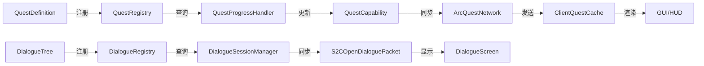

# Arc Quest 模组 - 完整API参考手册

**版本**: 1.0.0  
**适用对象**: 外部AI学习、开发者查阅、系统集成  
**最后更新**: 2026-04-17

---

## 📚 目录

1. [核心架构总览](#核心架构总览)
2. [任务系统API](#任务系统api)
3. [对话系统API](#对话系统api)
4. [视觉系统API](#视觉系统api)
5. [HUD渲染系统API](#hud渲染系统api)
6. [网络同步API](#网络同步api)
7. [数据存储API](#数据存储api)
8. [事件系统API](#事件系统api)
9. [命令系统API](#命令系统api)
10. [工具类API](#工具类api)

---

## 核心架构总览

### 模块依赖关系

```
org.com.arc_quest
├── Arc_quest (主入口)
│   ├── 初始化 Forge 事件总线
│   ├── 注册 Capability
│   ├── 注册网络包
│   └── 注册命令
│
├── quest/ (任务系统 - 核心)
│   ├── api/           → 数据结构定义（不可变记录）
│   ├── builder/       → Builder API（链式调用）
│   ├── registry/      → 任务注册表（单例）
│   ├── capability/    → 玩家数据存储
│   ├── logic/         → 任务进度处理
│   ├── tracking/      → 目标追踪器
│   ├── network/       → 网络同步
│   ├── event/         → 事件总线
│   ├── condition/     → 条件判断
│   └── reward/        → 奖励发放
│
├── dialogue/ (对话系统)
│   ├── api/           → 对话树结构
│   ├── registry/      → 对话注册表
│   ├── runtime/       → 会话管理
│   └── network/       → 对话网络包
│
├── client/ (客户端)
│   ├── gui/           → HUD和界面
│   │   ├── render/    → 立绘/图标渲染器
│   │   ├── QuestHudOverlay      → HUD协调器
│   │   ├── QuestTrackerPanel    → 追踪面板
│   │   ├── PhaseUpdateToast     → 阶段提示
│   │   ├── BranchChoiceToast    → 分支提示
│   │   ├── QuestToastManager    → Toast管理器
│   │   ├── QuestJournalScreen   → 任务日志
│   │   └── DialogueScreen       → 对话界面
│   └── events/        → 客户端事件
│
├── command/ (管理员命令)
├── data/ (DataGen数据生成)
└── npc/ (NPC交互)
```

### 数据流向



---

## 任务系统API

### 1. 数据结构层 (quest/api/)

#### QuestDefinition - 任务定义

**类型**: `record` (不可变)  
**位置**: `org.com.arc_quest.quest.api.QuestDefinition`

**字段**:
```java
private final String questId;                          // 任务ID（唯一标识）
private final QuestCategory category;                  // 任务分类
private final Component displayName;                   // 显示名称（支持翻译）
private final Component description;                   // 描述文本
private final LinkedHashMap<String, PhaseDefinition> phases;  // 阶段映射
private final List<ICondition> unlockConditions;       // 解锁条件
private final List<IReward> completionRewards;         // 完成奖励
private final QuestVisualConfig visualConfig;          // 视觉配置
private final int sortOrder;                           // 排序权重
private final ResourceLocation icon;                   // 默认图标
private final int themeColor;                          // 主题色（ARGB）
private final Set<String> flagsToSetOnComplete;        // 完成时设置的flag
```

**构造方法**:
```java
public QuestDefinition(
    String questId,
    QuestCategory category,
    Component displayName,
    Component description,
    LinkedHashMap<String, PhaseDefinition> phases,
    List<ICondition> unlockConditions,
    List<IReward> completionRewards,
    QuestVisualConfig visualConfig,
    int sortOrder,
    ResourceLocation icon,
    int themeColor,
    Set<String> flagsToSetOnComplete
)
```

**核心方法**:

| 方法 | 返回类型 | 说明 |
|------|---------|------|
| `getQuestId()` | String | 获取任务ID |
| `getCategory()` | QuestCategory | 获取任务分类 |
| `getDisplayName()` | Component | 获取显示名称 |
| `getDescription()` | Component | 获取描述 |
| `getAllPhases()` | List\<PhaseDefinition\> | 获取所有阶段（按插入顺序） |
| `getPhase(String phaseId)` | PhaseDefinition | 根据ID获取阶段 |
| `getFirstPhaseId()` | String | 获取第一个阶段的ID |
| `hasPhase(String phaseId)` | boolean | 检查阶段是否存在 |
| `getUnlockConditions()` | List\<ICondition\> | 获取解锁条件列表 |
| `getCompletionRewards()` | List\<IReward\> | 获取完成奖励列表 |
| `getVisualConfig()` | QuestVisualConfig | 获取视觉配置 |
| `getThemeColor()` | int | 获取主题色（默认0xFFFFFFFF） |
| `getIconFor(IconPosition pos)` | Optional\<ResourceLocation\> | 获取指定位置的图标 |
| `getSplashConfig(SplashType type)` | Optional\<VisualAsset\> | 获取指定类型的立绘 |
| `getFlagsToSetOnComplete()` | Set\<String\> | 获取完成时设置的flag集合 |

**使用示例**:
```java
QuestDefinition quest = QuestRegistry.get(ResourceLocation.tryParse("arc_quest:epic_prologue"));
if (quest != null) {
    String name = quest.getDisplayName().getString();
    int color = quest.getThemeColor();
    quest.getSplashConfig(SplashType.QUEST_ACQUIRED).ifPresent(asset -> {
        LOGGER.info("Acquisition splash: {}", asset.texture());
    });
}
```

---

#### PhaseDefinition - 阶段定义

**类型**: `record` (不可变)  
**位置**: `org.com.arc_quest.quest.api.PhaseDefinition`

**字段**:
```java
private final String phaseId;                          // 阶段ID
private final Component displayName;                   // 显示名称
private final List<ObjectiveEntry> objectives;         // 目标列表
private final List<PhaseTransition> transitions;       // 跳转规则
private final List<ChoiceOption> choices;              // 选择分支
private final QuestVisualConfig visualConfig;          // 视觉配置
private final Set<String> flagsToSetOnEnter;           // 进入时设置的flag
private final Set<String> flagsToSetOnComplete;        // 完成时设置的flag
```

**核心方法**:

| 方法 | 返回类型 | 说明 |
|------|---------|------|
| `getPhaseId()` | String | 获取阶段ID |
| `getDisplayName()` | Component | 获取显示名称 |
| `getObjectives()` | List\<ObjectiveEntry\> | 获取目标列表 |
| `getTransitions()` | List\<PhaseTransition\> | 获取跳转规则 |
| `getChoices()` | List\<ChoiceOption\> | 获取选择分支 |
| `getVisualConfig()` | QuestVisualConfig | 获取视觉配置 |
| `hasChoices()` | boolean | 是否有选择分支 |
| `getFlagsToSetOnEnter()` | Set\<String\> | 获取进入时设置的flag |
| `getFlagsToSetOnComplete()` | Set\<String\> | 获取完成时设置的flag |
| `getNextPhaseIfCompleted()` | Optional\<String\> | 获取完成后的下一阶段 |

**使用示例**:
```java
PhaseDefinition phase = quest.getPhase("gather_wood");
if (phase != null) {
    List<ObjectiveEntry> objectives = phase.getObjectives();
    for (ObjectiveEntry obj : objectives) {
        LOGGER.info("Objective: {} / {}", obj.getDisplayText(), obj.getRequiredCount());
    }
}
```

---

#### ObjectiveEntry - 目标条目

**类型**: `record` (不可变)  
**位置**: `org.com.arc_quest.quest.api.ObjectiveEntry`

**字段**:
```java
private final ObjectiveType type;                      // 目标类型
private final Component displayText;                   // 显示文本
private final int requiredCount;                       // 需求数量
private final Map<String, Object> properties;          // 额外属性
```

**核心方法**:

| 方法 | 返回类型 | 说明 |
|------|---------|------|
| `getType()` | ObjectiveType | 获取目标类型 |
| `getDisplayText()` | Component | 获取显示文本 |
| `getRequiredCount()` | int | 获取需求数量 |
| `getProperty(String key)` | Optional\<Object\> | 获取属性值 |

**目标类型枚举** (`ObjectiveType`):
- `COLLECT` - 收集物品
- `KILL` - 击杀实体
- `CRAFT` - 合成物品
- `INTERACT` - 与方块交互
- `VISIT` - 到达位置

---

#### QuestRuntimeData - 运行时数据

**类型**: `class` (可变，存储在玩家Capability中)  
**位置**: `org.com.arc_quest.quest.capability.QuestRuntimeData`

**字段**:
```java
private String questId;                                // 任务ID
private QuestState state;                              // 当前状态
private String currentPhaseId;                         // 当前阶段ID
private int[] progress;                                // 目标进度数组
private Set<String> flags;                             // 标志位集合
private Map<String, Integer> variables;                // 变量映射
private long lastUpdateTime;                           // 最后更新时间
```

**核心方法**:

| 方法 | 返回类型 | 说明 |
|------|---------|------|
| `getQuestId()` | String | 获取任务ID |
| `getState()` | QuestState | 获取当前状态 |
| `getCurrentPhaseId()` | String | 获取当前阶段ID |
| `getObjectiveProgress(int index)` | int | 获取指定目标的进度 |
| `getAllProgress()` | int[] | 获取所有目标进度 |
| `updateProgress(int index, int amount)` | void | 更新目标进度 |
| `isFlagSet(String flag)` | boolean | 检查flag是否设置 |
| `setFlag(String flag)` | void | 设置flag |
| `clearFlag(String flag)` | void | 清除flag |
| `getVariable(String key)` | int | 获取变量值 |
| `setVariable(String key, int value)` | void | 设置变量值 |
| `writeToNetwork(FriendlyByteBuf buf)` | void | 序列化到网络包 |
| `static readFromNetwork(FriendlyByteBuf buf)` | QuestRuntimeData | 从网络包反序列化 |
| `writeToNBT(CompoundTag tag)` | void | 序列化到NBT |
| `static readFromNBT(CompoundTag tag)` | QuestRuntimeData | 从NBT反序列化 |

**状态枚举** (`QuestState`):
- `ACTIVE` - 进行中
- `COMPLETED` - 已完成
- `FAILED` - 已失败

---

#### QuestVisualConfig - 视觉配置

**类型**: `record` (不可变)  
**位置**: `org.com.arc_quest.quest.api.QuestVisualConfig`

**字段**:
```java
private final EnumMap<SplashType, VisualAsset> splashConfigs;  // 立绘配置
private final EnumMap<IconPosition, VisualAsset> iconConfigs;  // 图标配置
private final int themeColor;                                  // 主题色
```

**核心方法**:

| 方法 | 返回类型 | 说明 |
|------|---------|------|
| `getSplashConfig(SplashType type)` | Optional\<VisualAsset\> | 获取立绘配置 |
| `getIconConfig(IconPosition pos)` | Optional\<VisualAsset\> | 获取图标配置 |
| `getThemeColor()` | int | 获取主题色 |
| `hasSplash(SplashType type)` | boolean | 是否有立绘配置 |
| `hasIcon(IconPosition pos)` | boolean | 是否有图标配置 |
| `static builder()` | Builder | 创建Builder |

**Builder API**:
```java
QuestVisualConfig config = QuestVisualConfig.builder()
    .splash(SplashType.QUEST_ACQUIRED, texture, 1.2f)
    .icon(IconPosition.HUD_TRACKER, iconTexture)
    .themeColor(0xFFFFD700)
    .build();
```

---

#### VisualAsset - 视觉资源

**类型**: `record` (不可变)  
**位置**: `org.com.arc_quest.quest.api.VisualAsset`

**字段**:
```java
private final ResourceLocation texture;   // 纹理路径
private final float scale;                // 缩放比例（默认1.0）
private final float offsetX;              // X轴偏移（像素）
private final float offsetY;              // Y轴偏移（像素）
private final int tintColor;              // 染色颜色（ARGB，0xFFFFFFFF表示不染色）
private final boolean enabled;            // 是否启用
```

**构造方法**:
```java
// 简化构造（常用）
public VisualAsset(ResourceLocation texture, float scale)

// 完整构造
public VisualAsset(
    ResourceLocation texture,
    float scale,
    float offsetX,
    float offsetY,
    int tintColor,
    boolean enabled
)
```

---

### 2. Builder API层 (quest/builder/)

#### QuestBuilder - 任务构建器

**位置**: `org.com.arc_quest.quest.builder.QuestBuilder`

**静态方法**:
```java
public static QuestBuilder create(String questId)
```

**实例方法** (链式调用):

| 方法 | 参数 | 返回 | 说明 |
|------|------|------|------|
| `category()` | QuestCategory | QuestBuilder | 设置任务分类 |
| `displayName()` | Component | QuestBuilder | 设置显示名称 |
| `description()` | Component | QuestBuilder | 设置描述 |
| `icon()` | ResourceLocation | QuestBuilder | 设置默认图标 |
| `sortOrder()` | int | QuestBuilder | 设置排序权重 |
| `phase()` | PhaseDefinition | QuestBuilder | 添加阶段 |
| `unlockCondition()` | ICondition | QuestBuilder | 添加解锁条件 |
| `reward()` | IReward | QuestBuilder | 添加完成奖励 |
| `acquisitionSplash()` | ResourceLocation, float | QuestBuilder | 设置获得任务立绘 |
| `completionSplash()` | ResourceLocation, float | QuestBuilder | 设置完成任务立绘 |
| `listIcon()` | ResourceLocation | QuestBuilder | 设置列表图标 |
| `themeColor()` | ChatFormatting/int | QuestBuilder | 设置主题色 |
| `setFlagOnComplete()` | String | QuestBuilder | 设置完成时的flag |
| `buildAndRegister()` | 无 | QuestDefinition | 构建并注册任务 |

**使用示例**:
```java
QuestBuilder.create("my_quest")
    .category(QuestCategory.ADVENTURE)
    .displayName(Component.translatable("my.quest.title"))
    .description(Component.translatable("my.quest.desc"))
    .icon(ResourceLocation.fromNamespaceAndPath(MOD_ID, "textures/gui/icons/my_quest.png"))
    .sortOrder(100)
    
    // 视觉配置
    .acquisitionSplash(
        ResourceLocation.fromNamespaceAndPath(MOD_ID, "textures/gui/splash/acquire.png"),
        1.2f
    )
    .themeColor(ChatFormatting.GOLD)
    
    // 阶段
    .phase(PhaseBuilder.create("step1")
        .displayName(Component.literal("第一步"))
        .objective(ObjectiveBuilder.collect(Items.OAK_LOG, 10))
        .thenGoTo("step2")
        .build())
    
    // 奖励
    .reward(new ItemReward(Items.DIAMOND, 1))
    .setFlagOnComplete("my_quest_done")
    
    .buildAndRegister();
```

---

#### PhaseBuilder - 阶段构建器

**位置**: `org.com.arc_quest.quest.builder.PhaseBuilder`

**静态方法**:
```java
public static PhaseBuilder create(String phaseId)
```

**实例方法**:

| 方法 | 参数 | 返回 | 说明 |
|------|------|------|------|
| `displayName()` | Component | PhaseBuilder | 设置显示名称 |
| `objective()` | ObjectiveEntry | PhaseBuilder | 添加目标 |
| `thenGoTo()` | String | PhaseBuilder | 设置无条件跳转 |
| `thenGoToIf()` | String, ICondition | PhaseBuilder | 设置条件跳转 |
| `choice()` | Component, String, String | PhaseBuilder | 添加选择分支 |
| `startSplash()` | ResourceLocation, float | PhaseBuilder | 设置阶段开始立绘 |
| `completeSplash()` | ResourceLocation, float | PhaseBuilder | 设置阶段完成立绘 |
| `labelIcon()` | ResourceLocation | PhaseBuilder | 设置标签图标 |
| `trackerIcon()` | ResourceLocation, float, float, float | PhaseBuilder | 设置追踪图标 |
| `setFlagOnEnter()` | String | PhaseBuilder | 设置进入时的flag |
| `setFlagOnComplete()` | String | PhaseBuilder | 设置完成时的flag |
| `build()` | 无 | PhaseDefinition | 构建阶段 |

**使用示例**:
```java
PhaseBuilder.create("gather_wood")
    .displayName(Component.translatable("phase.gather_wood"))
    
    // 目标
    .objective(ObjectiveBuilder.collect(Items.OAK_LOG, 5)
        .display(Component.literal("收集橡木原木")))
    
    // 跳转
    .thenGoToIf("talk_villager", new FlagSetCondition("met_villager"))
    .thenGoTo("default_next")
    
    // 选择分支
    .choice(Component.literal("选择A"), "flag_a", "path_a")
    .choice(Component.literal("选择B"), "flag_b", "path_b")
    
    // 视觉
    .startSplash(texture, 1.1f)
    .labelIcon(iconTexture)
    
    // Flag
    .setFlagOnEnter("phase_started")
    .setFlagOnComplete("phase_done")
    
    .build();
```

---

#### ObjectiveBuilder - 目标构建器

**位置**: `org.com.arc_quest.quest.builder.ObjectiveBuilder`

**静态工厂方法**:

| 方法 | 参数 | 返回 | 说明 |
|------|------|------|------|
| `collect()` | ItemLike, int | ObjectiveBuilder | 创建收集目标 |
| `kill()` | EntityType<?>, int | ObjectiveBuilder | 创建击杀目标 |
| `craft()` | ItemLike, int | ObjectiveBuilder | 创建合成目标 |
| `interact()` | Block, int | ObjectiveBuilder | 创建交互目标 |
| `visit()` | double, double, double, double | ObjectiveBuilder | 创建访问目标 |

**实例方法**:

| 方法 | 参数 | 返回 | 说明 |
|------|------|------|------|
| `display()` | Component | ObjectiveBuilder | 设置显示文本 |
| `build()` | 无 | ObjectiveEntry | 构建目标 |

**使用示例**:
```java
// 收集目标
ObjectiveBuilder.collect(Items.OAK_LOG, 10)
    .display(Component.translatable("objective.collect_logs"))
    .build();

// 击杀目标
ObjectiveBuilder.kill(EntityType.ZOMBIE, 5)
    .display(Component.literal("击杀僵尸"))
    .build();

// 访问目标
ObjectiveBuilder.visit(100.5, 64.0, 200.5, 10.0)
    .display(Component.literal("前往指定地点"))
    .build();
```

---

### 3. 注册表层 (quest/registry/)

#### QuestRegistry - 任务注册表

**类型**: 单例模式  
**位置**: `org.com.arc_quest.quest.registry.QuestRegistry`

**静态方法**:

| 方法 | 参数 | 返回 | 说明 |
|------|------|------|------|
| `register()` | QuestDefinition | void | 注册任务 |
| `get()` | ResourceLocation | QuestDefinition | 根据ID获取任务 |
| `getAll()` | 无 | Collection\<QuestDefinition\> | 获取所有任务 |
| `getByCategory()` | QuestCategory | List\<QuestDefinition\> | 按分类获取任务 |
| `contains()` | ResourceLocation | boolean | 检查任务是否存在 |
| `clear()` | 无 | void | 清空注册表（仅用于reload） |

**使用示例**:
```java
// 注册任务
QuestDefinition quest = QuestBuilder.create("test").build();
QuestRegistry.register(quest);

// 查询任务
QuestDefinition found = QuestRegistry.get(ResourceLocation.tryParse("arc_quest:test"));
if (found != null) {
    LOGGER.info("Found quest: {}", found.getDisplayName().getString());
}

// 遍历所有任务
for (QuestDefinition q : QuestRegistry.getAll()) {
    LOGGER.info("Quest: {} ({})", q.getQuestId(), q.getCategory());
}
```

---

### 4. Capability层 (quest/capability/)

#### IQuestCapability - 能力接口

**类型**: `interface`  
**位置**: `org.com.arc_quest.quest.capability.IQuestCapability`

**方法**:

| 方法 | 参数 | 返回 | 说明 |
|------|------|------|------|
| `getActiveQuests()` | 无 | Map\<String, QuestRuntimeData\> | 获取所有激活的任务 |
| `getCompletedQuests()` | 无 | Set\<String\> | 获取已完成的任务ID集合 |
| `getFailedQuests()` | 无 | Set\<String\> | 获取已失败的任务ID集合 |
| `getQuestData()` | String | QuestRuntimeData | 获取指定任务的数据 |
| `addQuest()` | String | void | 添加新任务 |
| `removeQuest()` | String | void | 移除任务 |
| `completeQuest()` | String | void | 完成任务 |
| `failQuest()` | String | void | 失败任务 |
| `advancePhase()` | String, String | void | 推进阶段 |
| `updateObjectiveProgress()` | String, int, int | void | 更新目标进度 |
| `setFlag()` | String | void | 设置全局flag |
| `clearFlag()` | String | void | 清除全局flag |
| `isFlagSet()` | String | boolean | 检查flag |
| `setVariable()` | String, int | void | 设置变量 |
| `getVariable()` | String | int | 获取变量 |
| `resetAll()` | 无 | void | 重置所有数据 |

---

#### QuestCapabilityImpl - 能力实现

**位置**: `org.com.arc_quest.quest.capability.QuestCapabilityImpl`

实现`IQuestCapability`接口，管理玩家的任务数据。

**内部存储**:
```java
private final Map<String, QuestRuntimeData> activeQuests = new HashMap<>();
private final Set<String> completedQuests = new HashSet<>();
private final Set<String> failedQuests = new HashSet<>();
private final Set<String> globalFlags = new HashSet<>();
private final Map<String, Integer> globalVariables = new HashMap<>();
```

---

### 5. 逻辑处理层 (quest/logic/)

#### QuestProgressHandler - 进度处理器

**类型**: 单例模式  
**位置**: `org.com.arc_quest.quest.logic.QuestProgressHandler`

**核心方法**:

| 方法 | 参数 | 返回 | 说明 |
|------|------|------|------|
| `INSTANCE` | - | QuestProgressHandler | 单例实例 |
| `onObjectiveCompleted()` | ServerPlayer, String, int | void | 目标完成回调 |
| `checkPhaseCompletion()` | ServerPlayer, String | void | 检查阶段完成 |
| `advanceToNextPhase()` | ServerPlayer, String, String | void | 推进到下一阶段 |
| `completeQuest()` | ServerPlayer, String | void | 完成任务 |
| `distributeRewards()` | ServerPlayer, QuestDefinition | void | 发放奖励 |
| `handleBranchChoice()` | ServerPlayer, String, int | void | 处理分支选择 |

**工作流程**:
```
目标完成
  ↓
onObjectiveCompleted(player, questId, objectiveIndex)
  ↓
检查阶段是否完成
  ↓
checkPhaseCompletion(player, questId)
  ↓
查找下一个阶段（检查transitions）
  ↓
advanceToNextPhase(player, questId, nextPhaseId)
  ↓
如果没有下一阶段 → completeQuest(player, questId)
  ↓
发放奖励 + 设置flags
```

---

### 6. 追踪系统 (quest/tracking/)

#### ObjectiveTracker - 目标追踪器

**位置**: `org.com.arc_quest.quest.tracking.ObjectiveTracker`

**职责**: 监听游戏事件，自动更新任务目标进度

**监听的事件**:
- `ItemPickupEvent` - 物品拾取（COLLECT目标）
- `LivingDeathEvent` - 实体死亡（KILL目标）
- `ItemCraftedEvent` - 物品合成（CRAFT目标）
- `BlockEvent.BreakEvent` - 方块破坏（INTERACT目标）
- `PlayerTickEvent` - 玩家移动（VISIT目标）

**注册方法**:
```java
ObjectiveTracker.registerListeners();  // 在FMLCommonSetupEvent中调用
```

---

#### TrackedObjective - 被追踪的目标

**类型**: `record`  
**位置**: `org.com.arc_quest.quest.tracking.TrackedObjective`

**字段**:
```java
private final String questId;
private final String phaseId;
private final int objectiveIndex;
private final ObjectiveType type;
private final Map<String, Object> properties;
```

---

### 7. 条件系统 (quest/condition/)

#### ICondition - 条件接口

**类型**: `interface`  
**位置**: `org.com.arc_quest.quest.api.ICondition`

**方法**:
```java
boolean test(ServerPlayer player, QuestRuntimeData data);
```

**实现类**:

| 类名 | 说明 | 使用场景 |
|------|------|----------|
| `FlagSetCondition` | 检查flag是否设置 | 任务前置条件 |
| `FlagNotSetCondition` | 检查flag未设置 | 互斥任务 |
| `QuestCompletedCondition` | 检查任务是否完成 | 任务链 |
| `VariableCondition` | 检查变量值 | 动态条件 |

**使用示例**:
```java
// 检查flag
new FlagSetCondition("talked_to_villager")

// 检查任务完成
new QuestCompletedCondition("arc_quest:prologue")

// 检查变量
new VariableCondition("reputation", op -> op >= 50)
```

---

### 8. 奖励系统 (quest/reward/)

#### IReward - 奖励接口

**类型**: `interface`  
**位置**: `org.com.arc_quest.quest.api.IReward`

**方法**:
```java
void grant(ServerPlayer player, QuestDefinition quest);
```

**实现类**:

| 类名 | 说明 | 构造参数 |
|------|------|----------|
| `ItemReward` | 给予物品 | ItemLike, count |
| `FlagReward` | 设置flag | String flagName |
| `CommandReward` | 执行命令 | String command |
| `VariableReward` | 设置变量 | String key, int value |

**使用示例**:
```java
new ItemReward(Items.DIAMOND, 5)
new FlagReward("quest_completed")
new CommandReward("/give @p experience_bottle 10")
new VariableReward("reputation", 100)
```

---

## 对话系统API

### 1. 数据结构层 (dialogue/api/)

#### DialogueTree - 对话树

**类型**: `record`  
**位置**: `org.com.arc_quest.dialogue.api.DialogueTree`

**字段**:
```java
private final String dialogueId;
private final String defaultNpc;
private final String startNodeId;
private final Map<String, DialogueNode> nodes;
private final QuestVisualConfig visualConfig;
```

**核心方法**:

| 方法 | 返回类型 | 说明 |
|------|---------|------|
| `getDialogueId()` | String | 获取对话ID |
| `getDefaultNpc()` | String | 获取默认NPC名称 |
| `getStartNodeId()` | String | 获取起始节点ID |
| `getNode()` | String → DialogueNode | 根据ID获取节点 |
| `hasNode()` | String → boolean | 检查节点是否存在 |
| `getVisualConfig()` | QuestVisualConfig | 获取视觉配置 |
| `static builder()` | String → Builder | 创建Builder |

**Builder API**:
```java
DialogueTree tree = DialogueTree.builder("villager_greeting")
    .defaultNpc("村民")
    .startNode("start")
    .addNode(node1)
    .addNode(node2)
    .visualConfig(config)
    .build();
```

---

#### DialogueNode - 对话节点

**类型**: `record`  
**位置**: `org.com.arc_quest.dialogue.api.DialogueNode`

**字段**:
```java
private final String nodeId;
private final String speaker;
private final String text;
private final List<DialogueChoice> choices;
private final String autoNextId;
```

**核心方法**:

| 方法 | 返回类型 | 说明 |
|------|---------|------|
| `getNodeId()` | String | 获取节点ID |
| `getSpeaker()` | String | 获取说话者 |
| `getText()` | String | 获取对话文本 |
| `getChoices()` | List\<DialogueChoice\> | 获取选项列表 |
| `getAutoNextId()` | Optional\<String\> | 获取自动跳转节点 |
| `hasChoices()` | boolean | 是否有选项 |
| `isAutoAdvance()` | boolean | 是否自动跳转 |
| `static builder()` | String → Builder | 创建Builder |

---

#### DialogueChoice - 对话选项

**类型**: `record`  
**位置**: `org.com.arc_quest.dialogue.api.DialogueChoice`

**字段**:
```java
private final String text;
private final String nextNodeId;
private final List<DialogueCondition> conditions;
private final List<DialogueAction> actions;
```

**核心方法**:

| 方法 | 返回类型 | 说明 |
|------|---------|------|
| `getText()` | String | 获取选项文本 |
| `getNextNodeId()` | Optional\<String\> | 获取下一节点ID |
| `getConditions()` | List\<DialogueCondition\> | 获取可见性条件 |
| `getActions()` | List\<DialogueAction\> | 获取执行动作 |
| `isVisible()` | ServerPlayer → boolean | 检查是否可见 |

---

#### DialogueAction - 对话动作

**类型**: `sealed interface`  
**位置**: `org.com.arc_quest.dialogue.api.DialogueAction`

**实现类**:

| 类名 | 说明 | 构造参数 |
|------|------|----------|
| `StartQuest` | 开始任务 | String questId |
| `SetFlag` | 设置flag | String flagName |
| `NotifyInteract` | 通知NPC交互 | String npcId |
| `Close` | 关闭对话 | 无 |

**使用示例**:
```java
new DialogueAction.StartQuest("arc_quest:epic_prologue")
new DialogueAction.SetFlag("talked_to_villager")
new DialogueAction.Close()
```

---

### 2. 注册表层 (dialogue/registry/)

#### DialogueRegistry - 对话注册表

**类型**: 单例模式  
**位置**: `org.com.arc_quest.dialogue.registry.DialogueRegistry`

**静态方法**:

| 方法 | 参数 | 返回 | 说明 |
|------|------|------|------|
| `INSTANCE` | - | DialogueRegistry | 单例实例 |
| `register()` | DialogueTree | void | 注册对话树 |
| `get()` | String | DialogueTree | 根据ID获取对话 |
| `getAll()` | 无 | Collection\<DialogueTree\> | 获取所有对话 |
| `bindNpc()` | String, String | void | 绑定NPC到对话 |
| `getDialogueForNpc()` | String | String | 根据NPC ID获取对话 |
| `clear()` | 无 | void | 清空注册表 |

**使用示例**:
```java
// 注册对话
DialogueTree tree = DialogueTree.builder("test").build();
DialogueRegistry.INSTANCE.register(tree);

// 绑定NPC
DialogueRegistry.INSTANCE.bindNpc("elder_001", "test");

// 查询
DialogueTree found = DialogueRegistry.INSTANCE.get("test");
String npcDialogue = DialogueRegistry.INSTANCE.getDialogueForNpc("elder_001");
```

---

### 3. 运行时层 (dialogue/runtime/)

#### DialogueSession - 对话会话

**位置**: `org.com.arc_quest.dialogue.runtime.DialogueSession`

**字段**:
```java
private final UUID playerId;
private final DialogueTree tree;
private String currentNodeId;
private final List<String> history;
```

**核心方法**:

| 方法 | 参数 | 返回 | 说明 |
|------|------|------|------|
| `getCurrentNode()` | 无 | DialogueNode | 获取当前节点 |
| `selectChoice()` | int, ServerPlayer | void | 选择选项 |
| `executeActions()` | List\<DialogueAction\>, ServerPlayer | void | 执行动作 |
| `advanceTo()` | String | void | 跳转到指定节点 |
| `close()` | 无 | void | 关闭会话 |
| `isFinished()` | 无 | boolean | 是否结束 |

---

#### DialogueSessionManager - 会话管理器

**类型**: 单例模式  
**位置**: `org.com.arc_quest.dialogue.runtime.DialogueSessionManager`

**核心方法**:

| 方法 | 参数 | 返回 | 说明 |
|------|------|------|------|
| `INSTANCE` | - | DialogueSessionManager | 单例实例 |
| `startDialogue()` | ServerPlayer, DialogueTree | void | 开始对话 |
| `endDialogue()` | ServerPlayer | void | 结束对话 |
| `isInDialogue()` | ServerPlayer | boolean | 是否在对话中 |
| `getSession()` | ServerPlayer | Optional\<DialogueSession\> | 获取会话 |
| `handleChoice()` | ServerPlayer, int | void | 处理选项选择 |

---

## 视觉系统API

### 1. 渲染器层 (client/gui/render/)

#### QuestSplashRenderer - 立绘渲染器

**位置**: `org.com.arc_quest.client.gui.render.QuestSplashRenderer`

**职责**: 渲染全屏立绘动画

**动画流程**:
```
入场 (600ms, easeOutQuint) 
  ↓
停留 (2500ms, 呼吸效果)
  ↓
退场 (500ms, easeInQuart)
```

**核心方法**:

| 方法 | 参数 | 返回 | 说明 |
|------|------|------|------|
| `trigger()` | QuestDefinition, SplashType, ResourceLocation | void | 触发展示立绘 |
| `render()` | GuiGraphics, float, int, int | void | 每帧渲染 |
| `isActive()` | 无 | boolean | 是否有活跃立绘 |
| `clear()` | 无 | void | 清除队列 |

**使用示例**:
```java
// 由ClientQuestEvents自动调用
ClientQuestEvents.handleVisualTrigger(quest, SplashType.QUEST_ACQUIRED, null);
```

**内部状态机**:
```java
enum SplashState {
    ENTERING,   // 入场
    HOLDING,    // 停留
    EXITING,    // 退场
    IDLE        // 空闲
}
```

---

#### QuestIconRenderer - 图标渲染器

**位置**: `org.com.arc_quest.client.gui.render.QuestIconRenderer`

**核心方法**:

| 方法 | 参数 | 返回 | 说明 |
|------|------|------|------|
| `renderIcon()` | GuiGraphics, ResourceLocation, int, int, int, int | void | 渲染图标 |
| `renderIcon()` | GuiGraphics, VisualAsset, int, int, int, int | void | 带配置的图标渲染 |

**使用示例**:
```java
// 简单渲染
QuestIconRenderer.renderIcon(g, iconTexture, x, y, 16, 16);

// 带缩放和染色
VisualAsset asset = new VisualAsset(texture, 1.2f, 0, 0, 0xFFFF0000, true);
QuestIconRenderer.renderIcon(g, asset, x, y, 20, 20);
```

---

### 2. HUD组件层 (client/gui/)

#### QuestHudOverlay - HUD协调器

**类型**: `class implements IGuiOverlay`  
**位置**: `org.com.arc_quest.client.gui.QuestHudOverlay`

**单例**:
```java
public static final QuestHudOverlay INSTANCE = new QuestHudOverlay();
```

**核心方法**:

| 方法 | 参数 | 返回 | 说明 |
|------|------|------|------|
| `render()` | GuiGraphics, float, int, int | void | 渲染所有HUD元素 |
| `showBranchChoiceToast()` | String | void | 显示分支选择提示 |
| `clearBranchChoiceToast()` | 无 | void | 清除分支提示 |
| `setTrackedQuest()` | String | void | 设置追踪任务 |

**渲染顺序**:
1. QuestTrackerPanel（右上角）
2. PhaseUpdateToast（左侧）
3. BranchChoiceToast（左侧）
4. QuestToastManager（顶部）

---

#### QuestTrackerPanel - 任务追踪面板

**位置**: `org.com.arc_quest.client.gui.QuestTrackerPanel`

**布局常量**:
```java
PANEL_WIDTH     = 175px
MARGIN_RIGHT    = 6px
MARGIN_TOP      = 30px
ACCENT_WIDTH    = 3px
TITLE_HEIGHT    = 14px
OBJ_ROW_HEIGHT  = 11px
PROGRESS_BAR_H  = 3px
```

**核心方法**:

| 方法 | 参数 | 返回 | 说明 |
|------|------|------|------|
| `render()` | GuiGraphics, int, int, float | void | 渲染面板 |
| `setTrackedQuest()` | String | void | 设置追踪任务 |
| `getTrackedQuestId()` | 无 | String | 获取追踪任务ID |
| `resetPanelAnimation()` | 无 | void | 重置动画 |

**动画参数**:
```java
DISMISS_DELAY      = 2000ms   // 完成/失败后停留时间
DISMISS_SLIDE_TIME = 500ms    // 滑出动画时间
TIME_WIPE_OUT      = 250ms    // 阶段切换擦除时间
TIME_WIPE_IN       = 350ms    // 阶段切换显示时间
```

---

#### PhaseUpdateToast - 阶段推进提示

**位置**: `org.com.arc_quest.client.gui.PhaseUpdateToast`

**布局常量**:
```java
POPUP_W = 220px
POPUP_H = 36px
```

**动画时序**:
```java
PHASE_ENTER = 500ms   // 入场
PHASE_HOLD  = 2800ms  // 停留
PHASE_EXIT  = 400ms   // 退场
```

**核心方法**:

| 方法 | 参数 | 返回 | 说明 |
|------|------|------|------|
| `render()` | GuiGraphics, Font, int, int, float, boolean | boolean | 渲染弹窗 |

**返回值**: `true`表示继续存活，`false`表示应销毁

---

#### BranchChoiceToast - 分支选择提示

**位置**: `org.com.arc_quest.client.gui.BranchChoiceToast`

**布局常量**:
```java
POPUP_W = 220px
POPUP_H = 36px
```

**动画时序**:
```java
TIME_ENTER = 600ms
TIME_EXIT  = 400ms
```

**核心方法**:

| 方法 | 参数 | 返回 | 说明 |
|------|------|------|------|
| `render()` | GuiGraphics, int, int, float, float, boolean | boolean | 渲染弹窗 |
| `dismiss()` | 无 | void | 标记为待销毁 |
| `isExpired()` | 无 | boolean | 是否过期 |
| `getQuestId()` | 无 | String | 获取任务ID |

---

#### QuestToastManager - Toast管理器

**位置**: `org.com.arc_quest.client.gui.QuestToastManager`

**Toast类型枚举**:
```java
enum ToastType {
    QUEST_ACCEPTED(0x4FC3F7, "✦ QUEST ACCEPTED"),
    QUEST_COMPLETED(0x66FF66, "★ QUEST COMPLETED"),
    QUEST_FAILED(0xFF6666, "✘ QUEST FAILED"),
    PHASE_ADVANCED(0xFFCC44, "▸ PHASE ADVANCED"),
    OBJECTIVE_COMPLETE(0x88DDFF, "✔ OBJECTIVE DONE");
}
```

**核心方法**:

| 方法 | 参数 | 返回 | 说明 |
|------|------|------|------|
| `show()` | ToastType, String | void | 显示Toast |
| `show()` | ToastType, Component | void | 显示Toast |
| `clear()` | 无 | void | 清除所有Toast |
| `tick()` | 无 | void | 更新状态（每帧调用） |
| `render()` | GuiGraphics, int, int, boolean | void | 渲染队列 |
| `getPushDownOffset()` | 无 | int | 获取避让高度 |

**队列管理**:
- 最多同时显示3个Toast
- 新Toast从pendingQueue加入activeSlots
- 超时自动移除（ENTER + HOLD + EXIT）

---

## 网络同步API

### 1. 网络包层 (quest/network/)

#### S2CSyncQuestStatePacket - 任务状态同步

**方向**: Server → Client  
**位置**: `org.com.arc_quest.quest.network.S2CSyncQuestStatePacket`

**字段**:
```java
private final QuestRuntimeData data;
```

**静态方法**:

| 方法 | 参数 | 返回 | 说明 |
|------|------|------|------|
| `encode()` | Packet, FriendlyByteBuf | void | 序列化 |
| `decode()` | FriendlyByteBuf | Packet | 反序列化 |
| `handle()` | Packet, Supplier\<Context\> | void | 处理接收 |

**触发时机**:
- 任务状态变更（ACTIVE/COMPLETED/FAILED）
- 阶段推进
- 客户端自动触发对应立绘

---

#### S2CSyncFullDataPacket - 全量数据同步

**方向**: Server → Client  
**用途**: 玩家登录时同步所有任务数据

---

#### S2CSyncObjectivePacket - 目标进度同步

**方向**: Server → Client  
**用途**: 实时更新目标进度

---

#### S2CSyncFlagsVarsPacket - Flags/Variables同步

**方向**: Server → Client  
**用途**: 同步全局flags和variables

---

#### C2SRequestQuestActionPacket - 客户端请求

**方向**: Client → Server  
**用途**: 请求任务操作（选择分支等）

**方法**:
```java
public static void choose(String questId, int choiceIndex)
```

---

### 2. 客户端缓存 (quest/network/)

#### ClientQuestCache - 客户端缓存

**类型**: 单例模式  
**位置**: `org.com.arc_quest.quest.network.ClientQuestCache`

**核心方法**:

| 方法 | 参数 | 返回 | 说明 |
|------|------|------|------|
| `INSTANCE` | - | ClientQuestCache | 单例实例 |
| `updateQuest()` | QuestRuntimeData | void | 更新任务数据 |
| `isQuestActive()` | String | boolean | 检查任务是否激活 |
| `getAllActiveQuests()` | 无 | Map\<String, QuestRuntimeData\> | 获取所有激活任务 |
| `getQuestData()` | String | QuestRuntimeData | 获取任务数据 |
| `clear()` | 无 | void | 清空缓存 |

---

## 数据存储API

### 1. Capability系统

#### QuestCapabilityProvider - 能力提供者

**位置**: `org.com.arc_quest.quest.capability.QuestCapabilityProvider`

**注册方法**:
```java
@SubscribeEvent
public static void onAttachCapabilities(AttachCapabilitiesEvent<Entity> event) {
    if (event.getObject() instanceof Player) {
        event.addCapability(
            ResourceLocation.fromNamespaceAndPath(Arc_quest.MOD_ID, "quests"),
            new QuestCapabilityProvider()
        );
    }
}
```

**持久化**:
- 自动保存到 `player.dat`
- 使用NBT格式存储
- 登录时自动加载

---

## 事件系统API

### 1. 事件总线 (quest/event/)

#### QuestEventBus - 事件总线

**类型**: 单例模式  
**位置**: `org.com.arc_quest.quest.event.QuestEventBus`

**事件类型**:

| 事件类 | 触发时机 | 监听方法 |
|--------|---------|----------|
| `QuestChangeEvent` | 任务状态变更 | `onQuestChange(QuestChangeEvent)` |

**注册监听器**:
```java
QuestEventBus.INSTANCE.addListener(event -> {
    LOGGER.info("Quest {} changed to {}", event.getQuestId(), event.getNewState());
});
```

---

## 命令系统API

### 1. 命令注册 (command/)

#### ArcQuestCommands - 命令注册

**位置**: `org.com.arc_quest.command.ArcQuestCommands`

**注册方法**:
```java
@SubscribeEvent
public static void onRegisterCommands(RegisterCommandsEvent event) {
    ArcQuestCommands.register(event.getDispatcher());
}
```

**命令列表**:

| 子命令 | 权限 | 说明 |
|--------|------|------|
| `give <player> <quest_id>` | OP 2 | 给予任务 |
| `complete <player> <quest_id>` | OP 2 | 强制完成 |
| `fail <player> <quest_id>` | OP 2 | 强制失败 |
| `reset <player> <quest_id>` | OP 2 | 重置任务 |
| `phase <player> <quest> <phase>` | OP 2 | 跳转阶段 |
| `progress <player> <quest> <idx> <amount>` | OP 2 | 修改进度 |
| `list <player>` | OP 2 | 列出任务 |
| `debug <player>` | OP 2 | 调试信息 |
| `registry` | OP 2 | 查看注册表 |
| `reload` | OP 2 | 重载数据 |
| `dialogue <player> <dialogue_id>` | OP 2 | 打开对话 |
| `resetall <player>` | OP 2 | 清空所有数据 |

---

## 工具类API

### 1. 动画工具 (client/gui/)

#### QuestAnimUtil - 动画工具集

**位置**: `org.com.arc_quest.client.gui.QuestAnimUtil`

**插值方法**:

| 方法 | 参数 | 返回 | 说明 |
|------|------|------|------|
| `lerp()` | float, float, float, float | float | 指数平滑插值 |
| `step()` | float, float, float, float | float | 线性步进 |

**缓动函数**:

| 方法 | 公式 | 用途 |
|------|------|------|
| `easeOutCubic()` | `1-(1-t)³` | 快速入场 |
| `easeInCubic()` | `t³` | 慢速入场 |
| `easeInQuartic()` | `t⁴` | 快速退场 |
| `easeOutQuintic()` | `1-(1-t)⁵` | 平滑入场 |
| `easeInSextic()` | `t⁶` | Alpha衰减 |
| `smoothStep()` | `t²(3-2t)` | S形曲线 |
| `easeOutBack()` | 回弹公式 | 弹性效果 |

**颜色工具**:

| 方法 | 参数 | 返回 | 说明 |
|------|------|------|------|
| `withAlpha()` | int, int | int | 合并透明度 |
| `lerpColor()` | int, int, float | int | 颜色插值 |

**绘制工具**:

| 方法 | 参数 | 返回 | 说明 |
|------|------|------|------|
| `drawFrame()` | GuiGraphics, ... | void | 绘制边框矩形 |
| `drawAccentPanel()` | GuiGraphics, ... | void | 绘制强调条面板 |
| `drawProgressBar()` | GuiGraphics, ... | void | 绘制进度条 |
| `drawProgressBarGlow()` | GuiGraphics, ... | void | 绘制发光进度条 |

---

#### QuestRenderUtil - 渲染工具集

**位置**: `org.com.arc_quest.client.gui.QuestRenderUtil`

**面板绘制**:

| 方法 | 参数 | 返回 | 说明 |
|------|------|------|------|
| `drawGlassPanel()` | GuiGraphics, ... | void | 磨砂玻璃面板 |
| `drawToastPanel()` | GuiGraphics, ... | void | Toast面板 |

**文本渲染**:

| 方法 | 参数 | 返回 | 说明 |
|------|------|------|------|
| `drawDualText()` | GuiGraphics, ... | void | 双行文本 |
| `drawTextWithLine()` | GuiGraphics, ... | void | 带装饰线文本 |

**Scissor辅助**:

| 方法 | 参数 | 返回 | 说明 |
|------|------|------|------|
| `applyDynamicScissor()` | GuiGraphics, ... | void | 动态裁剪区域 |

**RenderSystem封装**:

| 方法 | 返回 | 说明 |
|------|------|------|
| `enableBlendNoDepth()` | void | 启用混合+禁用深度 |
| `disableBlendWithDepth()` | void | 禁用混合+启用深度 |

---

## 附录

### A. 枚举类型完整列表

#### QuestCategory - 任务分类
```java
enum QuestCategory {
    MAIN,        // 主线任务
    SIDE,        // 支线任务
    ADVENTURE,   // 冒险任务
    ARCHON,      // 传说任务
    DAILY,       // 日常任务
    HIDDEN       // 隐藏任务
}
```

#### SplashType - 立绘类型
```java
enum SplashType {
    QUEST_DETAIL,      // 任务详情
    QUEST_ACQUIRED,    // 获得任务
    PHASE_START,       // 阶段开始
    PHASE_COMPLETE,    // 阶段完成
    QUEST_COMPLETED,   // 任务完成
    DIALOGUE_START,    // 对话开始
    DIALOGUE_END       // 对话结束
}
```

#### IconPosition - 图标位置
```java
enum IconPosition {
    QUEST_LIST,           // 任务列表
    QUEST_TITLE,          // 任务标题
    QUEST_DETAIL_PANEL,   // 详情面板
    PHASE_LABEL,          // 阶段标签
    HUD_TRACKER,          // HUD追踪
    DIALOGUE_NPC_AVATAR   // 对话头像
}
```

---

### B. 文件结构映射

```
src/main/java/org/com/arc_quest/
├── Arc_quest.java                    # 主入口
├── client/
│   ├── events/
│   │   ├── ClientEventHandler.java   # 客户端事件
│   │   └── ClientQuestEvents.java    # 任务视觉事件
│   └── gui/
│       ├── render/
│       │   ├── QuestIconRenderer.java    # 图标渲染器
│       │   ├── QuestSplashOverlay.java   # 立绘覆盖层
│       │   └── QuestSplashRenderer.java  # 立绘渲染器
│       ├── QuestAnimUtil.java            # 动画工具
│       ├── QuestRenderUtil.java          # 渲染工具
│       ├── QuestHudOverlay.java          # HUD协调器
│       ├── QuestTrackerPanel.java        # 追踪面板
│       ├── PhaseUpdateToast.java         # 阶段提示
│       ├── BranchChoiceToast.java        # 分支提示
│       ├── QuestToastManager.java        # Toast管理器
│       ├── QuestNotificationToast.java   # 通知Toast
│       ├── QuestJournalScreen.java       # 任务日志
│       └── DialogueScreen.java           # 对话界面
├── command/
│   └── ArcQuestCommands.java             # 命令系统
├── data/
│   ├── ArcQuestDataGenerators.java       # DataGen入口
│   ├── ArcQuestLangProvider.java         # 语言提供者基类
│   ├── ArcQuestENLangProvider.java       # 英文翻译
│   ├── ArcQuestZHLangProvider.java       # 中文翻译
│   └── ArcQuestReloadListener.java       # 重载监听器
├── dialogue/
│   ├── api/
│   │   ├── DialogueTree.java             # 对话树
│   │   ├── DialogueNode.java             # 对话节点
│   │   ├── DialogueChoice.java           # 对话选项
│   │   ├── DialogueCondition.java        # 对话条件
│   │   └── DialogueAction.java           # 对话动作
│   ├── network/
│   │   ├── C2SDialogueChoicePacket.java  # 选择选项
│   │   └── S2COpenDialoguePacket.java    # 打开对话
│   ├── registry/
│   │   ├── DialogueRegistry.java         # 对话注册表
│   │   └── TestDialogues.java            # 测试对话
│   └── runtime/
│       ├── DialogueSession.java          # 对话会话
│       └── DialogueSessionManager.java   # 会话管理器
├── npc/
│   └── NpcInteractionHandler.java        # NPC交互
├── quest/
│   ├── api/
│   │   ├── QuestDefinition.java          # 任务定义
│   │   ├── PhaseDefinition.java          # 阶段定义
│   │   ├── ObjectiveEntry.java           # 目标条目
│   │   ├── QuestRuntimeData.java         # 运行时数据
│   │   ├── QuestVisualConfig.java        # 视觉配置
│   │   ├── VisualAsset.java              # 视觉资源
│   │   ├── QuestState.java               # 任务状态
│   │   ├── QuestCategory.java            # 任务分类
│   │   ├── SplashType.java               # 立绘类型
│   │   ├── IconPosition.java             # 图标位置
│   │   ├── ObjectiveType.java            # 目标类型
│   │   ├── ICondition.java               # 条件接口
│   │   ├── IReward.java                  # 奖励接口
│   │   ├── ChoiceOption.java             # 选择选项
│   │   ├── PhaseTransition.java          # 阶段跳转
│   │   └── PhaseBuilder.java             # 阶段构建器
│   ├── builder/
│   │   ├── QuestBuilder.java             # 任务构建器
│   │   ├── PhaseBuilder.java             # 阶段构建器
│   │   └── ObjectiveBuilder.java         # 目标构建器
│   ├── capability/
│   │   ├── IQuestCapability.java         # 能力接口
│   │   ├── QuestCapabilityImpl.java      # 能力实现
│   │   ├── QuestCapabilityProvider.java  # 能力提供者
│   │   ├── QuestRuntimeData.java         # 运行时数据
│   │   └── CapabilityEventHandler.java   # 能力事件
│   ├── condition/
│   │   ├── FlagSetCondition.java         # Flag条件
│   │   ├── FlagNotSetCondition.java      # Flag未设置条件
│   │   ├── QuestCompletedCondition.java  # 任务完成条件
│   │   └── VariableCondition.java        # 变量条件
│   ├── event/
│   │   ├── QuestEventBus.java            # 事件总线
│   │   ├── QuestChangeEvent.java         # 任务变更事件
│   │   └── IQuestChangeListener.java     # 监听器接口
│   ├── logic/
│   │   └── QuestProgressHandler.java     # 进度处理器
│   ├── network/
│   │   ├── ArcQuestNetwork.java          # 网络注册
│   │   ├── ClientQuestCache.java         # 客户端缓存
│   │   ├── S2CSyncQuestStatePacket.java  # 状态同步
│   │   ├── S2CSyncFullDataPacket.java    # 全量同步
│   │   ├── S2CSyncObjectivePacket.java   # 目标同步
│   │   ├── S2CSyncFlagsVarsPacket.java   # Flags同步
│   │   └── C2SRequestQuestActionPacket.java # 客户端请求
│   ├── registry/
│   │   ├── QuestRegistry.java            # 任务注册表
│   │   ├── ArcQuestContent.java          # 内容注册
│   │   └── EpicMainlineDemo.java         # 示例任务
│   ├── reward/
│   │   ├── ItemReward.java               # 物品奖励
│   │   ├── FlagReward.java               # Flag奖励
│   │   ├── CommandReward.java            # 命令奖励
│   │   └── VariableReward.java           # 变量奖励
│   └── tracking/
│       ├── ObjectiveTracker.java         # 目标追踪器
│       ├── TrackedObjective.java         # 被追踪目标
│       ├── ObjectiveKey.java             # 目标键
│       └── QuestEventManager.java        # 事件管理器
└── mixin/
    └── client/
        └── MixinForgeGui.java            # GUI混入
```

---

### C. 关键设计模式

1. **Builder模式**: QuestBuilder, PhaseBuilder, ObjectiveBuilder
2. **单例模式**: QuestRegistry, DialogueRegistry, QuestProgressHandler
3. **观察者模式**: QuestEventBus, ObjectiveTracker
4. **策略模式**: ICondition, IReward, DialogueAction
5. **记录模式**: 所有API数据结构使用Java record
6. **委托模式**: QuestHudOverlay委托给QuestTrackerPanel

---

### D. 性能优化要点

1. **客户端缓存**: ClientQuestCache避免频繁查询Capability
2. **数组复用**: QuestTrackerPanel的动画状态数组
3. **早期退出**: 不可见时跳过渲染
4. **Scissor裁剪**: 只渲染可见区域
5. **时间步长限制**: dt最大100ms防止卡顿跳跃
6. **EnumMap存储**: QuestVisualConfig使用EnumMap提高查询效率

---

**文档结束**

*本API参考手册涵盖Arc Quest模组的所有公共接口、数据结构和使用方法，可供外部AI完整学习模组的架构设计和功能实现。*
