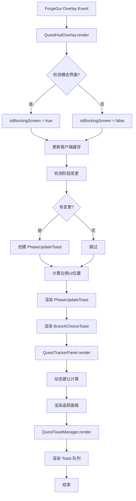

# Arc Quest 模组完整技术文档

**版本**: 1.0.0  
**Minecraft**: 1.20.1 Forge  
**Java**: 17  
**最后更新**: 2026-04-17  
**文档类型**: API参考 + 架构设计 + 使用指南

---

## 📋 目录

### 快速开始
1. [项目概述](#项目概述)
2. [核心架构](#核心架构)
3. [任务系统](#任务系统)
4. [对话系统](#对话系统)
5. [视觉系统](#视觉系统)
6. [HUD系统](#hud-系统)
7. [网络同步](#网络同步)
8. [命令系统](#命令系统)
9. [数据生成](#数据生成)
10. [API使用指南](#api使用指南)
11. [常见问题](#常见问题)

### 深度参考
- **[📘 完整API参考手册](API_REFERENCE.md)** - 事无巨细的类方法接口文档（1593行）
  - 所有公共API的方法签名、参数说明、返回值
  - 数据结构字段详解
  - Builder API完整用法
  - 枚举类型完整列表
  - 文件结构映射
  - 设计模式说明

---

## 项目概述

Arc Quest 是一个纯代码驱动的Minecraft任务系统模组，采用Builder模式定义任务和对话，支持多语言国际化、动态立绘渲染、图标系统和主题色定制。

### 核心特性

- ✅ **纯代码驱动** - 无JSON配置，所有任务通过Java Builder API定义
- ✅ **高可扩展性** - EnumMap存储视觉配置，新增类型无需修改现有代码
- ✅ **多语言支持** - DataGen自动生成中英文翻译文件
- ✅ **视觉系统** - 立绘动画、图标渲染、主题色定制
- ✅ **对话系统** - 分支对话树、条件判断、动作执行
- ✅ **网络同步** - 客户端-服务端数据实时同步
- ✅ **管理员命令** - 10+个调试和管理命令

### 技术栈

- Minecraft 1.20.1
- Forge 47.x
- Java 17
- Gradle 8.8

---

## 核心架构

### 模块结构

```
org.com.arc_quest/
├── client/                    # 客户端模块
│   ├── events/               # 客户端事件监听
│   └── gui/                  # GUI界面和渲染器
│       ├── render/           # 立绘和图标渲染器
│       ├── QuestTrackerPanel.java    # 任务追踪面板（独立类）
│       ├── QuestHudOverlay.java      # HUD覆盖层（协调器）
│       ├── QuestJournalScreen.java   # 任务日志界面
│       ├── DialogueScreen.java       # 对话界面
│       ├── BranchChoiceToast.java    # 分支选择提示
│       └── QuestToastManager.java    # Toast管理器
├── command/                  # 管理员命令
├── data/                     # DataGen数据生成
├── dialogue/                 # 对话系统
│   ├── api/                  # 对话数据结构
│   ├── network/              # 对话网络包
│   ├── registry/             # 对话注册表
│   └── runtime/              # 对话运行时管理
├── quest/                    # 任务系统（核心）
│   ├── api/                  # 任务数据结构
│   ├── builder/              # Builder API
│   ├── capability/           # Forge Capability
│   ├── condition/            # 条件判断
│   ├── event/                # 事件总线
│   ├── logic/                # 任务逻辑处理
│   ├── network/              # 任务网络包
│   ├── registry/             # 任务注册表
│   ├── reward/               # 奖励系统
│   └── tracking/             # 目标追踪
└── npc/                      # NPC交互
```

### 数据流

```
[任务定义] → QuestRegistry → QuestCapability (玩家数据)
                                    ↓
                            QuestProgressHandler (逻辑处理)
                                    ↓
                            ArcQuestNetwork (网络同步)
                                    ↓
                            ClientQuestCache (客户端缓存)
                                    ↓
                            GUI/HUD渲染
```

---

## 任务系统

### 任务生命周期

```
创建 → 激活(ACTIVE) → 完成(COMPLETED) / 失败(FAILED)
         ↓
      阶段流转(PHASE_1 → PHASE_2 → ...)
         ↓
      目标追踪(Objective Tracking)
         ↓
      奖励发放(Reward Distribution)
```

### 核心类说明

#### QuestDefinition
不可变的任务定义，包含：
- 基本信息：ID、分类、名称、描述
- 阶段列表：LinkedHashMap<String, PhaseDefinition>
- 解锁条件：List<ICondition>
- 完成奖励：List<IReward>
- 视觉配置：QuestVisualConfig

#### PhaseDefinition
不可变的阶段定义，包含：
- 目标列表：List<ObjectiveEntry>
- 跳转规则：List<PhaseTransition>
- 选择分支：List<ChoiceOption>
- 视觉配置：QuestVisualConfig

#### QuestRuntimeData
玩家的任务运行时数据：
- 当前状态：QuestState
- 当前阶段：String currentPhaseId
- 目标进度：int[] progress
- 标志位：Set<String> flags
- 变量：Map<String, Integer> variables

### Builder API示例

```java
QuestBuilder.create("epic_prologue")
    .category(QuestCategory.ARCHON)
    .displayName(Component.translatable("arc_quest.quest.epic_prologue.title"))
    .description(Component.translatable("arc_quest.quest.epic_prologue.desc"))
    
    // 视觉配置
    .acquisitionSplash(
        ResourceLocation.fromNamespaceAndPath(Arc_quest.MOD_ID, "textures/gui/splash/prologue_acquire.png"),
        1.2f
    )
    .listIcon(ResourceLocation.fromNamespaceAndPath(Arc_quest.MOD_ID, "textures/gui/icons/prologue_list.png"))
    .themeColor(ChatFormatting.GOLD)
    
    // 阶段定义
    .phase(PhaseBuilder.create("gather_wood")
        .displayName(Component.translatable("arc_quest.phase.epic_prologue.gather_wood"))
        .startSplash(
            ResourceLocation.fromNamespaceAndPath(Arc_quest.MOD_ID, "textures/gui/splash/gather_start.png"),
            1.1f
        )
        .labelIcon(ResourceLocation.fromNamespaceAndPath(Arc_quest.MOD_ID, "textures/gui/icons/wood_icon.png"))
        .objective(ObjectiveBuilder.collect(Items.OAK_LOG, 5)
            .display(Component.translatable("arc_quest.objective.epic_prologue.gather_wood.0")))
        .thenGoTo("talk_villager")
        .build())
    
    .reward(new ItemReward(Items.DIAMOND, 1))
    .setFlagOnComplete("prologue_done")
    .buildAndRegister();
```

### 目标类型

| 类型 | 说明 | 构建方法 |
|------|------|----------|
| COLLECT | 收集物品 | `ObjectiveBuilder.collect(item, count)` |
| KILL | 击杀实体 | `ObjectiveBuilder.kill(entityType, count)` |
| CRAFT | 合成物品 | `ObjectiveBuilder.craft(item, count)` |
| INTERACT | 与方块交互 | `ObjectiveBuilder.interact(block, count)` |
| VISIT | 到达位置 | `ObjectiveBuilder.visit(x, y, z, radius)` |

---

## 对话系统

### 对话树结构

```
DialogueTree
├── dialogueId: String
├── defaultNpc: String
├── startNodeId: String
├── nodes: Map<String, DialogueNode>
└── visualConfig: QuestVisualConfig

DialogueNode
├── nodeId: String
├── speaker: String
├── text: String
├── choices: List<DialogueChoice>
└── autoNextId: String (可选)

DialogueChoice
├── text: String
├── nextNodeId: String
├── conditions: List<DialogueCondition>
└── actions: List<DialogueAction>
```

### 对话动作

| 动作类型 | 说明 | 示例 |
|---------|------|------|
| StartQuest | 开始任务 | `new DialogueAction.StartQuest("arc_quest:epic_prologue")` |
| SetFlag | 设置标志位 | `new DialogueAction.SetFlag("talked_to_villager")` |
| NotifyInteract | 通知NPC交互 | `new DialogueAction.NotifyInteract("villager_npc")` |
| Close | 关闭对话 | `new DialogueAction.Close()` |

### 对话示例

```java
DialogueTree tree = DialogueTree.builder("test_villager")
    .defaultNpc("村民")
    .startNode("start")
    .addNode(DialogueNode.builder("start")
        .speaker("村民")
        .text("你好，冒险者！村庄最近不太平……")
        .choices(
            new DialogueChoice("发生了什么事？", "ask_problem", List.of(), List.of()),
            new DialogueChoice("再见", null, List.of(), List.of(new DialogueAction.Close()))
        )
        .build())
    .addNode(DialogueNode.builder("ask_problem")
        .speaker("村民")
        .text("僵尸在夜晚袭击村庄，我们需要帮助！")
        .choices(
            new DialogueChoice("我会帮忙的！", null, List.of(), List.of(
                new DialogueAction.StartQuest("arc_quest:epic_prologue"),
                new DialogueAction.Close()
            ))
        )
        .build())
    .visualConfig(QuestVisualConfig.builder()
        .splash(SplashType.DIALOGUE_START, 
            ResourceLocation.fromNamespaceAndPath(Arc_quest.MOD_ID, "textures/gui/splash/villager.png"),
            1.0f)
        .themeColor(ChatFormatting.GREEN)
        .build())
    .build();

DialogueRegistry.INSTANCE.register(tree);
```

---

## 视觉系统

### 立绘类型（SplashType）

| 类型 | 触发时机 | 说明 |
|------|---------|------|
| QUEST_DETAIL | 打开任务详情 | 静态显示在详情界面 |
| QUEST_ACQUIRED | 获得新任务 | 弹窗动画 |
| PHASE_START | 阶段开始 | 弹窗动画 |
| PHASE_COMPLETE | 阶段完成 | 弹窗动画 |
| QUEST_COMPLETED | 任务完全完成 | 弹窗动画 |
| DIALOGUE_START | 对话开始 | 弹窗动画 |
| DIALOGUE_END | 对话结束 | 弹窗动画 |

### 图标位置（IconPosition）

| 位置 | 说明 |
|------|------|
| QUEST_LIST | 任务列表中的缩略图标 |
| QUEST_TITLE | 任务标题旁的装饰图标 |
| QUEST_DETAIL_PANEL | 任务详情面板内的主图标 |
| PHASE_LABEL | 阶段名称旁的图标 |
| HUD_TRACKER | HUD追踪栏的图标 |
| DIALOGUE_NPC_AVATAR | 对话界面的NPC头像 |

### VisualAsset属性

```java
public record VisualAsset(
    ResourceLocation texture,   // 纹理路径
    float scale,                // 缩放比例（默认1.0）
    float offsetX,              // X轴偏移（像素）
    float offsetY,              // Y轴偏移（像素）
    int tintColor,              // 染色颜色（ARGB）
    boolean enabled             // 是否启用
)
```

### QuestVisualConfig使用

```java
QuestVisualConfig config = QuestVisualConfig.builder()
    // 添加立绘
    .splash(SplashType.QUEST_ACQUIRED, texture, 1.2f)
    .splash(SplashType.PHASE_START, texture, 1.1f)
    
    // 添加图标
    .icon(IconPosition.QUEST_LIST, iconTexture)
    .icon(IconPosition.PHASE_LABEL, iconTexture)
    
    // 设置主题色
    .themeColor(0xFFFFD700)  // 金色
    
    .build();
```

### 渲染器

#### QuestSplashRenderer
- **职责**：渲染切出立绘动画
- **动画曲线**：easeOutQuint（入场）、sin呼吸（待机）、easeInQuart（退场）
- **队列管理**：支持多个立绘排队显示
- **触发时机**：由网络包处理器自动调用

**工作流程**：
```
服务端任务状态变更
    ↓
发送 S2CSyncQuestStatePacket
    ↓
客户端接收并处理
    ↓
ClientQuestEvents.handleVisualTrigger()
    ↓
QuestSplashRenderer.trigger() 加入队列
    ↓
每帧渲染 (RenderGuiOverlayEvent.Post)
    ↓
播放立绘动画（600ms入场 + 2500ms停留 + 500ms退场）
```

**调用示例**（在 S2CSyncQuestStatePacket.handle() 中）：
```java
case ACTIVE -> {
    boolean isNewQuest = !ClientQuestCache.INSTANCE.isQuestActive(questId);
    
    if (isNewQuest) {
        // 获得新任务 → 触发 QUEST_ACQUIRED 立绘
        ClientQuestEvents.handleVisualTrigger(def, SplashType.QUEST_ACQUIRED, null);
    } else {
        // 阶段推进 → 触发 PHASE_START 立绘
        String phaseName = def.getPhase(currentPhaseId).getDisplayName().getString();
        ClientQuestEvents.handleVisualTrigger(def, SplashType.PHASE_START, phaseName);
    }
}

case COMPLETED -> {
    // 任务完成 → 触发 QUEST_COMPLETED 立绘
    ClientQuestEvents.handleVisualTrigger(def, SplashType.QUEST_COMPLETED, null);
}
```

#### QuestIconRenderer
- **职责**：在UI各处渲染图标
- **功能**：支持缩放、偏移、染色
- **调用方式**：手动在GUI渲染中调用

**使用示例**：
```java
// 在 QuestJournalScreen 中渲染任务列表图标
QuestDefinition quest = ...;
quest.getIconFor(IconPosition.QUEST_LIST).ifPresent(iconTexture -> {
    QuestIconRenderer.renderIcon(guiGraphics, iconTexture, x, y, 16, 16);
});
```

---

## HUD 系统

### 架构概览

Arc Quest 的 HUD（Head-Up Display）系统采用**模块化设计**，由多个独立组件协同工作：

```
QuestHudOverlay (协调器)
├── QuestTrackerPanel      # 右上角任务追踪面板
├── PhaseUpdateToast       # 左侧阶段推进提示
├── BranchChoiceToast      # 左侧分支选择提示
└── QuestToastManager      # 顶部 Toast 通知管理器
```

**核心设计理念**：
- ✅ **职责分离** - 每个组件独立管理自己的状态和渲染
- ✅ **动态避让** - UI元素自动避让，避免重叠
- ✅ **时空冻结** - 模态界面打开时HUD暂停动画但保持可见
- ✅ **主题色适配** - 自动使用任务定义的主题色

---

### QuestHudOverlay - HUD 协调器

**职责**：协调所有 HUD 元素的渲染和交互

**位置**：`org.com.arc_quest.client.gui.QuestHudOverlay`

**核心功能**：

1. **模态界面检测**
   ```java
   boolean isBlockingScreen = mc.screen instanceof QuestJournalScreen 
                           || mc.screen instanceof DialogueScreen;
   ```
   - 当玩家打开任务日志或对话界面时，HUD进入“时空冻结”状态
   - Toast 等元素保持可见但暂停动画

2. **左侧 UI 智能布局**
   ```
   单个元素：居中显示
   两个元素：垂直堆叠，间距8px
   ```
   - PhaseUpdateToast 和 BranchChoiceToast 自动计算位置
   - 使用缓动函数平滑移动（lerp, 0.15f系数）

3. **阶段变更检测**
   ```java
   if (lastKnownPhaseId != null && !lastKnownPhaseId.equals(curPhaseId)) {
       // 触发 PhaseUpdateToast
       this.phaseUpdateToast = new PhaseUpdateToast(phaseName, themeColor);
   }
   ```

4. **委托渲染**
   ```java
   trackerPanel.render(g, screenWidth, screenHeight, partialTick);
   QuestToastManager.render(g, screenWidth, screenHeight, isBlockingScreen);
   ```

---

### QuestTrackerPanel - 任务追踪面板

**职责**：渲染右上角的任务追踪信息

**位置**：`org.com.arc_quest.client.gui.QuestTrackerPanel`

#### 📐 布局参数

```java
PANEL_WIDTH     = 175px   // 面板宽度
MARGIN_RIGHT    = 6px     // 右边距
MARGIN_TOP      = 30px    // 基础顶边距（会动态调整）
ACCENT_WIDTH    = 3px     // 左侧强调条宽度
TITLE_HEIGHT    = 14px    // 标题高度
OBJ_ROW_HEIGHT  = 11px    // 目标行高度
PROGRESS_BAR_H  = 3px     // 进度条高度
PADDING         = 5px     // 内边距
```

#### 🎨 视觉特性

1. **动态主题色**
   - 从任务定义的 `themeColor` 提取
   - 应用于：左侧强调条、进度条填充、高亮效果
   - 默认色：`0xFF4FC3F7`（天蓝色）

2. **图标支持**
   - 在标题旁渲染任务图标（IconPosition.HUD_TRACKER）
   - 尺寸：12x12 像素
   - 支持缩放、偏移、染色

3. **阶段名称显示**
   - 优先使用 `phase.getDisplayName()`（翻译后的名称）
   - 回退到 `phaseId`（如果displayName为空）
   - 格式：`▸ {阶段名称}`

#### ✨ 动画系统

**1. 面板滑入/滑出**
```java
// 滑入：从右侧滑入屏幕
panelSlide: 1f → 0f （easeOutCubic）

// 滑出：完成/失败后延迟滑出
DISMISS_DELAY = 2000ms  // 停留时间
DISMISS_SLIDE_TIME = 500ms  // 滑出动画时间
```

**2. 淡入/淡出**
```java
panelReveal: 0f → 1f （lerp, 0.15f系数）
```

**3. 高度自适应**
```java
currentPanelH = lerp(currentPanelH, targetH, 0.15f, dt);
```
- 根据目标数量动态调整高度
- 平滑过渡，避免突兀变化

**4. 阶段切换擦除动画**
```java
TIME_WIPE_OUT = 250ms  // 擦除旧内容
ease = t^4  // easeInQuart

TIME_WIPE_IN = 350ms  // 显示新内容
ease = 1 - (1-t)^5  // easeOutQuint
```
- 旧内容向右擦除 + 淡出
- 新内容从左侧滑入 + 淡入
- 产生流畅的转场效果

**5. 目标动画**
- **揭示动画**：逐个显示目标（ staggered reveal）
  ```java
  objReveal[i] = lerp(objReveal[i], 1f, 0.12f + i * 0.02f, dt);
  ```
- **脉冲效果**：进度更新时闪烁
  ```java
  if (progress != lastKnownProgress[i]) objPulse[i] = 1f;
  objPulse[i] = lerp(objPulse[i], 0f, 0.12f, dt);
  ```
- **完成特效**：目标完成时放大+发光
  ```java
  cScale = 1f + 0.15f * easeOutCubic(t) * sin(t * π);
  cGlow = 255 * t * objAlpha;
  ```

#### 🎯 目标渲染

每个目标包含：
1. **前缀图标**：
   - 完成：`§a✔ `
   - 进行中：`§7○ `
2. **目标文本**：
   - 智能截断（plainSubstrByWidth）
   - 最大宽度自适应
3. **进度数字**：
   - 格式：`{当前}/{需求}`
   - 缩放：0.75x
   - 右对齐
4. **进度条**：
   - 背景：半透明白色
   - 填充：主题色（完成时为绿色）
   - 发光效果：脉冲时增强

#### 🔄 动态避让系统

**问题**：顶部的 Toast 通知会与追踪面板重叠

**解决方案**：
```java
float targetY = MARGIN_TOP + QuestToastManager.getPushDownOffset();
currentPanelY = lerp(currentPanelY, targetY, 0.12f, dt);
```

- 实时查询 Toast 队列的总高度
- 平滑下移追踪面板
- 缓动系数：0.12f（极其丝滑）

---

### PhaseUpdateToast - 阶段推进提示

**职责**：在左侧显示阶段变更通知

**位置**：`org.com.arc_quest.client.gui.PhaseUpdateToast`

#### 📐 布局参数

```java
POPUP_W = 220px   // 弹窗宽度
POPUP_H = 36px    // 弹窗高度
```

#### ✨ 动画流程

**三阶段动画**：
```
ENTER (500ms) → HOLD (2200ms) → EXIT (400ms)
```

**1. 入场动画**
- **遮罩展开**：从左到右展开裁剪区域
- **透明度**：0 → 1（easeOutQuint）
- **位移动画**：向左漂移 10px
- **强调线**：从 0 扩展到完整宽度

**2. 停留阶段**
- **呼吸效果**：轻微上下浮动（sin波）
- **完全可见**：alpha = 1.0
- **装饰线**：完整显示

**3. 退场动画**
- **遮罩收缩**：从右到左收起
- **透明度**：1 → 0（easeInQuart，快速消失）
- **位移动画**：向右飞出 10px
- **强调线**：收缩至 0

#### 🎨 视觉元素

```
┌─────────────────────────────┐
│█ ARC QUEST // 新阶段        │  ← 副标题（0.7x缩放）
│                             │
│  收集情报                    │  ← 阶段名称（1.0x缩放）
│  ─────────                   │  ← 装饰线（主题色）
└─────────────────────────────┘
  ↑
  左侧强调条（4px宽，主题色）
```

**颜色方案**：
- 背景：`0x121212`（深灰，90%不透明度）
- 副标题：`0xAAAAAA`（浅灰）
- 主标题：`0xFFFFFF`（纯白）
- 强调条：主题色（从任务定义提取）

---

### BranchChoiceToast - 分支选择提示

**职责**：提示玩家有可用的分支选项

**位置**：`org.com.arc_quest.client.gui.BranchChoiceToast`

#### 📐 布局参数

```java
POPUP_W = 240px   // 弹窗宽度
POPUP_H = 40px    // 弹窗高度
```

#### ✨ 动画流程

与 PhaseUpdateToast 类似，但文本不同：
```
ARES SYSTEM // BRANCH AVAILABLE
New Path Unlocked: {任务名称}
```

#### 🎯 交互逻辑

1. **触发条件**：
   - 任务阶段完成且有多个 choices
   - 通过 `QuestHudOverlay.showBranchChoiceToast(questId)` 触发

2. **点击行为**：
   - 打开 QuestJournalScreen
   - 自动滚动到该任务
   - 显示分支选择区域

3. **清除方式**：
   - 手动点击关闭
   - 打开任务日志后自动清除
   - 调用 `clearBranchChoiceToast()`

---

### QuestToastManager - Toast 通知管理器

**职责**：管理顶部的任务通知队列

**位置**：`org.com.arc_quest.client.gui.QuestToastManager`

#### 📋 Toast 类型

| 类型 | 前缀 | 颜色 | 触发时机 |
|------|------|------|----------|
| QUEST_ACCEPTED | `§a任务已接受` | 绿色 | 获得新任务 |
| PHASE_ADVANCED | `阶段推进` | 蓝色 | 进入新阶段 |
| QUEST_COMPLETED | `§2任务已完成` | 深绿 | 任务完成 |
| QUEST_FAILED | `§c任务失败` | 红色 | 任务失败 |

#### 🎬 动画特性

**队列管理**：
- 最多同时显示 3 个 Toast
- 新 Toast 从顶部滑入
- 旧 Toast 向上推移
- 超时自动消失（3000ms）

**动态避让**：
```java
public static float getPushDownOffset() {
    // 返回当前 Toast 队列的总高度
    // QuestTrackerPanel 会根据此值下移
}
```

**时空冻结**：
```java
render(g, screenWidth, screenHeight, isBlockingScreen)
```
- `isBlockingScreen = true` 时：
  - Toast 保持当前状态
  - 暂停计时器
  - 不消失、不移动

#### 🎨 视觉设计

```
┌──────────────────────────┐
│█ §a任务已接受             │  ← 前缀（彩色）
│  史诗序章                  │  ← 任务名称（白色）
└──────────────────────────┘
  ↑
  左侧强调条（3px，主题色）
```

**尺寸**：
- 宽度：180px
- 高度：24px（单行）
- 间距：4px

**动画**：
- 入场：从上滑入（300ms）
- 停留：3000ms
- 退场：向上滑出（250ms）

---

### HUD 渲染流程



---

### HUD 配置示例

#### 自定义主题色

```java
QuestBuilder.create("my_quest")
    .themeColor(0xFFFFD700)  // 金色主题
    // ... 其他配置
```

#### 自定义追踪图标

```java
.phase(PhaseBuilder.create("step1")
    .trackerIcon(
        ResourceLocation.fromNamespaceAndPath(MOD_ID, "textures/gui/icons/tracker.png"),
        1.2f,  // 缩放
        2f,    // X偏移
        -1f    // Y偏移
    )
    // ... 其他配置
)
```

#### 禁用追踪面板

目前无法完全禁用，但可以通过不设置追踪任务来隐藏：
```java
QuestHudOverlay.INSTANCE.setTrackedQuest(null);
```

---

### 常见问题

#### Q1: HUD 不显示？

**排查步骤**：
1. 检查是否有激活的任务
   ```bash
   /arcquest list @p
   ```
2. 确认任务状态为 ACTIVE
3. 检查是否打开了任务日志或对话界面（会隐藏HUD）
4. 查看控制台是否有渲染错误

#### Q2: 追踪面板被 Toast 遮挡？

**不会发生** - 动态避让系统会自动下移追踪面板。

如果仍有问题，检查：
```java
QuestToastManager.getPushDownOffset()  // 应返回正确的高度
```

#### Q3: 阶段提示不显示？

**原因**：
1. 阶段没有 displayName
2. 主题色为默认值且不明显

**解决**：
```java
.phase(PhaseBuilder.create("my_phase")
    .displayName(Component.translatable("my.mod.phase.name"))  // 必须设置
    // ...
)
```

#### Q4: Toast 太多影响游戏？

**调整显示时间**（需修改源码）：
```java
// QuestToastManager.java
private static final float TOAST_DURATION = 3000f;  // 改为 2000f
```

#### Q5: 如何自定义 HUD 位置？

**修改常量**（需修改源码）：
```java
// QuestTrackerPanel.java
private static final int MARGIN_RIGHT = 6;   // 调整右边距
private static final int MARGIN_TOP = 30;    // 调整顶边距

// QuestHudOverlay.java
private static final int POPUP_W = 220;      // 调整弹窗宽度
```

---

### 性能优化

#### 渲染优化

1. **裁剪区域**
   ```java
   g.enableScissor(scX1, panelY - 5, scX2, panelY + panelH + 5);
   // ... 渲染代码
   g.disableScissor();
   ```
   - 只渲染可见区域
   - 减少过度绘制

2. **混合模式管理**
   ```java
   RenderSystem.enableBlend();
   RenderSystem.defaultBlendFunc();
   // ... 渲染
   RenderSystem.disableBlend();
   ```
   - 仅在需要时启用混合
   - 避免全局状态污染

3. **数组复用**
   ```java
   ensureArraySize(objCount);  // 只在大小变化时重新分配
   ```
   - 避免每帧创建新数组
   - 减少 GC 压力

#### 动画优化

1. **时间步长限制**
   ```java
   dt = Math.min((now - lastRenderTime) / 1000f, 0.1f);
   ```
   - 防止卡顿后动画跳跃
   - 最大步长：100ms

2. **缓动函数预计算**
   - 使用简单的多项式近似
   - 避免复杂的三角函数

3. **早期退出**
   ```java
   if (panelReveal < 0.01f && !shouldShow) return;
   ```
   - 不可见时跳过渲染
   - 节省 GPU 资源

---

## 网络同步

### 网络包列表

| 包名 | 方向 | 用途 |
|------|------|------|
| S2CSyncFullDataPacket | S→C | 全量同步任务数据 |
| S2CSyncQuestStatePacket | S→C | 同步单个任务状态 |
| S2CSyncObjectivePacket | S→C | 同步目标进度 |
| S2CSyncFlagsVarsPacket | S→C | 同步标志位和变量 |
| S2COpenDialoguePacket | S→C | 打开对话界面 |
| C2SRequestQuestActionPacket | C→S | 请求任务操作 |
| C2SDialogueChoicePacket | C→S | 发送对话选择 |

### 同步策略

1. **登录时**：发送S2CSyncFullDataPacket全量同步
2. **任务状态变更**：发送S2CSyncQuestStatePacket（触发立绘）
3. **目标进度更新**：发送S2CSyncObjectivePacket
4. **标志位/变量变更**：发送S2CSyncFlagsVarsPacket

### 立绘触发机制

当客户端收到`S2CSyncQuestStatePacket`时，会根据任务状态自动触发对应的立绘：

| 任务状态 | SplashType | 触发条件 |
|---------|-----------|----------|
| ACTIVE (新任务) | QUEST_ACQUIRED | 客户端缓存中不存在该任务 |
| ACTIVE (阶段推进) | PHASE_START | 客户端缓存中已存在该任务 |
| COMPLETED | QUEST_COMPLETED | 状态变为COMPLETED |
| FAILED | (预留) | 状态变为FAILED |

**实现位置**：`S2CSyncQuestStatePacket.handle()` 第59-110行

```java
public static void handle(S2CSyncQuestStatePacket pkt, Supplier<NetworkEvent.Context> ctx) {
    ctx.get().enqueueWork(() -> {
        // 1. 更新客户端缓存
        ClientQuestCache.INSTANCE.updateQuest(pkt.data);
        
        // 2. 获取任务定义
        QuestDefinition def = QuestRegistry.get(ResourceLocation.tryParse(pkt.data.getQuestId()));
        
        // 3. 根据状态触发立绘
        switch (pkt.data.getState()) {
            case ACTIVE -> {
                boolean isNewQuest = !ClientQuestCache.INSTANCE.isQuestActive(pkt.data.getQuestId());
                if (isNewQuest) {
                    // 获得新任务立绘
                    ClientQuestEvents.handleVisualTrigger(def, SplashType.QUEST_ACQUIRED, null);
                } else {
                    // 阶段开始立绘
                    String phaseName = def.getPhase(pkt.data.getCurrentPhaseId())
                        .getDisplayName().getString();
                    ClientQuestEvents.handleVisualTrigger(def, SplashType.PHASE_START, phaseName);
                }
            }
            case COMPLETED -> {
                // 任务完成立绘
                ClientQuestEvents.handleVisualTrigger(def, SplashType.QUEST_COMPLETED, null);
            }
        }
    });
}
```

**注意事项**：
- ✅ 只在客户端调用（通过`enqueueWork`保证主线程执行）
- ✅ 防御性检查（def可能为null）
- ✅ 与Toast通知同步触发
- ❌ 不要在服务端调用（无法渲染）
- ❌ 不要在GUI渲染循环中调用（会重复触发）

### 客户端缓存

ClientQuestCache维护客户端本地的任务数据副本，避免频繁查询Capability。

### 分支选择机制

任务的分支选择功能集成在**QuestJournalScreen**中：

1. **触发条件**：
   - 当前阶段有choices定义
   - 玩家打开任务日志界面
   - 在“进行中”标签页看到“选择你的道路”区域

2. **显示逻辑**：
   - 检查每个choice的visibleCondition（如果有）
   - 只显示符合条件的选项
   - 悬停时高亮显示

3. **选择流程**：
   ```
   玩家点击选项 → C2SRequestQuestActionPacket.choose() → 服务端处理 → 跳转到对应phase
   ```

4. **UI特点**：
   - 集成在任务详情中，可查看完整信息
   - 支持动态可见性条件
   - 非模态界面，可自由切换任务

**注意**：已删除废代码PhaseChoiceScreen和S2CShowPhaseChoicePacket，所有分支选择统一通过QuestJournalScreen进行。

---

## 命令系统

### 命令列表

```
/arcquest <子命令>

子命令：
├── give <player> <quest_id>          # 给予任务
├── complete <player> <quest_id>      # 强制完成任务
├── fail <player> <quest_id>          # 强制失败任务
├── reset <player> <quest_id>         # 重置任务
├── phase <player> <quest_id> <phase> # 跳转到指定阶段
├── progress <player> <quest> <idx> <amount>  # 修改进度
├── list <player>                     # 列出玩家任务
├── debug <player>                    # 调试信息
├── registry                          # 查看注册表
├── reload                            # 重载数据
├── dialogue <player> <dialogue_id>   # 打开对话
└── resetall <player>                 # 清空所有数据
```

### 使用示例

```bash
# 给予任务
/arcquest give @p epic_prologue

# 跳转到指定阶段
/arcquest phase @p epic_prologue gather_wood

# 修改进度
/arcquest progress @p epic_prologue 0 5

# 打开测试对话
/arcquest dialogue @p test_villager
# 或
/arcquest dialogue @p arc_quest:test_villager

# 清空所有数据
/arcquest resetall @p
```

### 权限要求

所有命令需要OP权限（permission level 2）。

---

## 数据生成

### DataGen流程

```bash
./gradlew runData
```

生成的文件：
- `assets/arc_quest/lang/en_us.json` - 英文翻译
- `assets/arc_quest/lang/zh_cn.json` - 中文翻译

### 语言提供者

#### ArcQuestENLangProvider
- 史诗奇幻风格翻译
- 示例：`"Greetings, adventurer!"`

#### ArcQuestZHLangProvider
- 二次元轻小说风格翻译
- 示例：`"你好，冒险者！"`

### 翻译键规范

```
arc_quest.{category}.{sub_category}.{key}

示例：
arc_quest.quest.epic_prologue.title
arc_quest.phase.epic_prologue.gather_wood
arc_quest.objective.epic_prologue.gather_wood.0
arc_quest.dialogue.test_villager.start.text
arc_quest.command.give.success
```

---

## API使用指南

### 快速开始

#### 1. 创建任务

```java
@Mod.EventBusSubscriber(modid = Arc_quest.MOD_ID, bus = Mod.EventBusSubscriber.Bus.MOD)
public class ArcQuestContent {
    
    @SubscribeEvent
    public static void registerQuests(FMLCommonSetupEvent event) {
        event.enqueueWork(() -> {
            QuestBuilder.create("my_first_quest")
                .category(QuestCategory.ADVENTURE)
                .displayName("我的第一个任务")
                .description("这是一个示例任务")
                
                .phase(PhaseBuilder.create("step1")
                    .displayName("第一步")
                    .objective(ObjectiveBuilder.collect(Items.OAK_LOG, 10))
                    .thenGoTo("step2")
                    .build())
                
                .phase(PhaseBuilder.create("step2")
                    .displayName("第二步")
                    .objective(ObjectiveBuilder.kill(EntityType.ZOMBIE, 5))
                    .build())
                
                .reward(new ItemReward(Items.DIAMOND, 1))
                .buildAndRegister();
        });
    }
}
```

#### 2. 创建对话

```java
DialogueTree tree = DialogueTree.builder("my_dialogue")
    .defaultNpc("NPC")
    .startNode("start")
    .addNode(DialogueNode.builder("start")
        .speaker("NPC")
        .text("你好！")
        .choices(
            new DialogueChoice("再见", null, List.of(), List.of(new DialogueAction.Close()))
        )
        .build())
    .build();

DialogueRegistry.INSTANCE.register(tree);
```

#### 3. 绑定NPC

```java
DialogueRegistry.INSTANCE.bindNpc("npc_entity_id", "my_dialogue");
```

### 高级用法

#### 条件跳转

```java
PhaseBuilder.create("branch")
    .objective(...)
    .thenGoToIf("path_a", new FlagSetCondition("chose_a"))
    .thenGoToIf("path_b", new FlagSetCondition("chose_b"))
    .thenGoTo("default_path")  // 默认分支
    .build();
```

#### 选择分支

```java
PhaseBuilder.create("choice_phase")
    .objective(...)
    .choice(Component.literal("选择A"), "flag_a", "phase_a")
    .choice(Component.literal("选择B"), "flag_b", "phase_b")
    .build();
```

#### 复合奖励

```java
QuestBuilder.create("rich_reward_quest")
    // ...
    .reward(new ItemReward(Items.DIAMOND, 5))
    .reward(new FlagReward("quest_completed"))
    .reward(new CommandReward("/give @p experience_bottle 10"))
    .buildAndRegister();
```

---

## 常见问题

### Q1: dialogue指令提示"找不到对话"

**原因**：对话ID格式不正确  
**解决**：使用纯字符串ID或带命名空间的完整ID

```bash
# 正确
/arcquest dialogue @p test_villager
/arcquest dialogue @p arc_quest:test_villager

# 错误
/arcquest dialogue @p minecraft:test_villager
```

### Q2: 任务完成后没有触发奖励

**检查清单**：
1. 确认任务状态变为COMPLETED
2. 检查Reward是否正确添加到QuestDefinition
3. 查看日志是否有错误信息

### Q3: 立绘不显示

**排查步骤**：
1. **确认纹理文件存在且路径正确**
   ```java
   // 检查纹理是否在以下目录
   src/main/resources/assets/arc_quest/textures/gui/splash/
   src/main/resources/assets/arc_quest/textures/gui/icons/
   ```

2. **检查QuestVisualConfig是否正确配置**
   ```java
   // 调试：打印视觉配置
   quest.getSplashConfig(SplashType.QUEST_ACQUIRED).ifPresentOrElse(
       asset -> LOGGER.info("Splash configured: {}", asset.texture()),
       () -> LOGGER.warn("No splash configured for QUEST_ACQUIRED")
   );
   ```

3. **确认ClientQuestEvents已注册**
   - 检查`@Mod.EventBusSubscriber`注解是否存在
   - 确认`value = Dist.CLIENT`

4. **查看控制台是否有纹理加载错误**
   ```
   [RenderSystem] Failed to load texture: arc_quest:textures/gui/splash/xxx.png
   ```

5. **验证网络包是否正常发送**
   - 在服务端日志中查找：`[ArcQuest] Player xxx advanced to phase`
   - 在客户端日志中查找：`[ClientCache] Quest updated`

6. **检查任务是否配置了立绘**
   ```java
   // 在 EpicMainlineDemo 或其他任务定义中
   .acquisitionSplash(texture, 1.2f)  // ← 确保调用了此方法
   ```

### Q4: Reload后对话丢失

**已修复**：ArcQuestReloadListener现在会自动重新注册TestDialogues

### Q5: 如何自定义立绘动画时间

修改 `QuestSplashRenderer.java` 中的常量：

```java
private static final float TIME_ENTER = 600f;   // 入场时间（毫秒）
private static final float TIME_HOLD  = 2500f;  // 停留时间
private static final float TIME_EXIT  = 500f;   // 退场时间
```

### Q6: 如何添加新的立绘类型

1. 在 `SplashType.java` 枚举中添加新类型
2. 在 `ClientQuestEvents.handleVisualTrigger()` 中添加处理逻辑
3. 无需修改其他代码（EnumMap自动支持）

---

## 开发者指南

### 编译项目

```bash
# 编译
./gradlew build

# 清理
./gradlew clean

# 运行开发环境
./gradlew runClient
./gradlew runServer
```

### 代码规范

1. **命名规范**：
   - 类名：PascalCase（如QuestDefinition）
   - 方法/变量：camelCase（如getThemeColor）
   - 常量：UPPER_SNAKE_CASE（如TIME_ENTER）

2. **注释规范**：
   - 公共API必须有Javadoc
   - 复杂逻辑添加行内注释
   - 使用中文注释

3. **导包规范**：
   - 禁止使用全限定类名（除必要情况）
   - 按字母顺序组织import

### 调试技巧

1. **启用调试日志**：
   ```properties
   # gradle.properties
   org.gradle.logging.level=DEBUG
   ```

2. **查看任务数据**：
   ```bash
   /arcquest debug @p
   ```

3. **查看注册表**：
   ```bash
   /arcquest registry
   ```

---

## 更新日志

### v1.0.0 (2026-04-17)

**新增**：
- ✅ 完整的任务系统（Builder模式）
- ✅ 对话系统（分支对话树）
- ✅ 视觉系统（立绘、图标、主题色）
  - QuestVisualConfig 数据结构（EnumMap存储）
  - SplashType 枚举（7种立绘类型）
  - IconPosition 枚举（6种图标位置）
  - VisualAsset 记录（纹理、缩放、偏移、染色）
  - QuestSplashRenderer 渲染器（弹幕队列、三阶段动画）
  - QuestIconRenderer 渲染器（支持缩放/偏移/染色）
  - ClientQuestEvents.handleVisualTrigger() 触发机制
- ✅ 多语言支持（中英文）
- ✅ 管理员命令（10+个子命令）
- ✅ 网络同步（6个网络包）
- ✅ 目标追踪系统
- ✅ 事件总线

**修复**：
- ✅ dialogue指令无法找到对话的问题（改用StringArgumentType + 自动命名空间补全）
- ✅ Reload后对话丢失的问题（ArcQuestReloadListener重新注册）
- ✅ 任务阶段重置进度追踪问题（ObjectiveTracker重新注册）
- ✅ 立绘触发逻辑集成到S2CSyncQuestStatePacket
- ✅ GUI文本换行支持（QuestJournalScreen和DialogueScreen的wrapText方法支持`\n`）
- ✅ Phase displayName在GUI中正确显示（QuestJournalScreen和QuestHudOverlay）
- ✅ 分支选项翻译键格式统一（arc_quest.choice.{questId}.{phaseId}.{index}）

**优化**：
- ✅ ClientQuestEvents.handleVisualTrigger() 防御性检查（null安全）
- ✅ 阶段立绘优先级（Phase配置优先于Quest配置）
- ✅ 文档完善（添加立绘工作流程和排查指南）
- ✅ **代码重构**：QuestTrackerPanel独立类提取（从QuestHudOverlay分离，提升可维护性）
- ✅ **代码清理**：删除废代码PhaseChoiceScreen和S2CShowPhaseChoicePacket（功能已整合到QuestJournalScreen）
- ✅ **架构简化**：QuestHudOverlay现在只负责协调多个HUD元素，任务追踪逻辑委托给QuestTrackerPanel

**架构改进**：
```
重构前：
QuestHudOverlay (521行)
├── 任务追踪面板 (~250行)
├── 阶段弹窗 (~100行)
└── 分支Toast (~50行)

重构后：
QuestHudOverlay (317行)          QuestTrackerPanel (388行)
├── 阶段弹窗 (~100行)            ├── 完整的面板渲染逻辑
├── 分支Toast (~50行)            ├── 目标动画管理
├── 协调渲染 (~80行)             ├── 进度条绘制
└── 工具方法 (~87行)             └── 工具方法 (~100行)
```

---

### v1.0.0 (2026-04-16)

**新增**：
- ✅ 完整的任务系统（Builder模式）
- ✅ 对话系统（分支对话树）
- ✅ 视觉系统（立绘、图标、主题色）
  - QuestVisualConfig 数据结构（EnumMap存储）
  - SplashType 枚举（7种立绘类型）
  - IconPosition 枚举（6种图标位置）
  - VisualAsset 记录（纹理、缩放、偏移、染色）
  - QuestSplashRenderer 渲染器（弹幕队列、三阶段动画）
  - QuestIconRenderer 渲染器（支持缩放/偏移/染色）
  - ClientQuestEvents.handleVisualTrigger() 触发机制
- ✅ 多语言支持（中英文）
- ✅ 管理员命令（10+个子命令）
- ✅ 网络同步（7个网络包）
- ✅ 目标追踪系统
- ✅ 事件总线

**修复**：
- ✅ dialogue指令无法找到对话的问题（改用StringArgumentType + 自动命名空间补全）
- ✅ Reload后对话丢失的问题（ArcQuestReloadListener重新注册）
- ✅ 任务阶段重置进度追踪问题（ObjectiveTracker重新注册）
- ✅ 立绘触发逻辑集成到S2CSyncQuestStatePacket

**优化**：
- ✅ ClientQuestEvents.handleVisualTrigger() 防御性检查（null安全）
- ✅ 阶段立绘优先级（Phase配置优先于Quest配置）
- ✅ 文档完善（添加立绘工作流程和排查指南）

---

## 📘 完整API参考

本文档提供了模组的高层架构和使用指南。如需查阅**所有类的方法接口、参数说明、返回值类型、数据结构字段**等详细信息，请参阅：

👉 **[API_REFERENCE.md](API_REFERENCE.md)** - 1593行完整API参考手册

### API参考包含内容：

✅ **任务系统API**
- QuestDefinition、PhaseDefinition、ObjectiveEntry 所有方法
- QuestBuilder、PhaseBuilder、ObjectiveBuilder 链式调用API
- QuestRegistry、QuestCapability 注册和存储接口
- QuestProgressHandler、ObjectiveTracker 逻辑处理

✅ **对话系统API**
- DialogueTree、DialogueNode、DialogueChoice 数据结构
- DialogueRegistry、DialogueSessionManager 运行时管理
- DialogueAction 动作系统

✅ **视觉系统API**
- QuestVisualConfig、VisualAsset 配置结构
- QuestSplashRenderer、QuestIconRenderer 渲染器
- SplashType、IconPosition 枚举

✅ **HUD渲染系统API**
- QuestHudOverlay、QuestTrackerPanel 协调器和面板
- PhaseUpdateToast、BranchChoiceToast 弹窗组件
- QuestToastManager Toast队列管理
- QuestAnimUtil、QuestRenderUtil 工具类

✅ **网络同步API**
- S2CSyncQuestStatePacket 等6个网络包
- ClientQuestCache 客户端缓存
- ArcQuestNetwork 网络注册

✅ **数据存储API**
- QuestCapabilityProvider Capability系统
- NBT序列化/反序列化

✅ **事件系统API**
- QuestEventBus 事件总线
- QuestChangeEvent 事件类型

✅ **命令系统API**
- ArcQuestCommands 12个子命令
- 权限要求和用法

✅ **工具类API**
- QuestAnimUtil 动画函数（lerp、缓动、颜色）
- QuestRenderUtil 渲染辅助（面板、文本、Scissor）

✅ **附录**
- 所有枚举类型完整列表
- 文件结构映射
- 关键设计模式说明
- 性能优化要点

---

## 许可证

本项目采用 MIT 许可证。

---

## 联系方式

- **项目地址**: D:\Arc Quest
- **技术支持**: 查看本文档或源代码注释

---

**🎉 感谢使用 Arc Quest！**
