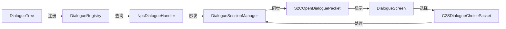

# 对话系统 API 参考

**模块**: dialogue/  
**适用对象**: 开发者、外部AI学习  
**最后更新**: 2026-04-20  
**版本**: v3.3（新增CustomCondition、PresetActions、EntityDialogueExtension、VariableCheck）

---

## 📚 目录

1. [数据结构层](#数据结构层)
2. [Builder API](#builder-api)
3. [注册表层](#注册表层)
4. [运行时层](#运行时层)
5. [网络包](#网络包)

---

## 数据结构层

### DialogueTree - 对话树

**类型**: `record`  
**位置**: `org.com.arc_quest.dialogue.api.DialogueTree`

**字段**:
```java
private final String dialogueId;
private final String defaultNpc;
private final String startNodeId;
private final Map<String, DialogueNode> nodes;
private final QuestVisualConfig visualConfig;
private final boolean repeatable;              // 是否可重复对话
private final long cooldownSeconds;            // 冷却时间（秒，SECONDS类型）
private final CooldownType cooldownType;       // ⭐ 新增：冷却类型（NONE/SECONDS/GAME_DAY/GAME_TICK）
private final int cooldownResetTick;           // ⭐ 新增：GAME_TICK类型的重置时间点（0-23999）
```

**核心方法**:

| 方法 | 返回类型 | 说明 |
|------|---------|------|
| `getDialogueId()` | String | 获取对话ID |
| `getDefaultNpc()` | String | 获取默认NPC名称 |
| `getStartNodeId()` | String | 获取起始节点ID |
| `getNode(String nodeId)` | DialogueNode | 根据ID获取节点 |
| `hasNode(String nodeId)` | boolean | 检查节点是否存在 |
| `getVisualConfig()` | QuestVisualConfig | 获取视觉配置 |
| `static builder(String id)` | Builder | 创建Builder |

**Builder API**:
```java
DialogueTree tree = DialogueTree.builder("villager_greeting")
    .defaultNpc("村民")
    .startNode("start")
    .addNode(node1)
    .addNode(node2)
    .visualConfig(config)
    .build();
```

---

### DialogueNode - 对话节点

**类型**: `record`  
**位置**: `org.com.arc_quest.dialogue.api.DialogueNode`

**字段**:
```java
private final String nodeId;
private final String speaker;
private final String text;
private final List<DialogueChoice> choices;
private final String autoNextId;
private final int delayMs;
private final boolean repeatable;              // 节点是否可重复访问
private final long cooldownSeconds;            // 冷却时间（秒，SECONDS类型）
private final CooldownType cooldownType;       // ⭐ 新增：冷却类型
private final int cooldownResetTick;           // ⭐ 新增：GAME_TICK类型的重置时间点
```

**核心方法**:

| 方法 | 返回类型 | 说明 |
|------|---------|------|
| `getNodeId()` | String | 获取节点ID |
| `getSpeaker()` | String | 获取说话者 |
| `getText()` | String | 获取对话文本 |
| `getChoices()` | List\<DialogueChoice\> | 获取选项列表 |
| `getAutoNextId()` | Optional\<String\> | 获取自动跳转节点 |
| `hasChoices()` | boolean | 是否有选项 |
| `isAutoAdvance()` | boolean | 是否自动跳转 |
| `static builder(String id)` | Builder | 创建Builder |

---

### DialogueChoice - 对话选项

**类型**: `record`  
**位置**: `org.com.arc_quest.dialogue.api.DialogueChoice`

**字段**:
```java
private final String text;
private final String nextNodeId;
private final List<DialogueCondition> conditions;   // 可见性条件
private final List<DialogueAction> actions;          // 执行动作
private final boolean repeatable;                    // 是否可重复选择
private final long cooldownSeconds;                  // 冷却时间（秒）
private final CooldownType cooldownType;             // 冷却类型
private final int cooldownResetTick;                 // GAME_TICK重置时间点
private final int priority;                          // ⭐ 新增：显示优先级（越高越靠前）
```

**核心方法**:

| 方法 | 返回类型 | 说明 |
|------|---------|------|
| `getText()` | String | 获取选项文本 |
| `getNextNodeId()` | Optional\<String\> | 获取下一节点ID |
| `getConditions()` | List\<DialogueCondition\> | 获取可见性条件 |
| `getActions()` | List\<DialogueAction\> | 获取执行动作 |
| `isVisible(ServerPlayer player)` | boolean | 检查是否可见 |
| `getPriority()` | int | 获取优先级（默认0） |

---

### DialogueAction - 对话动作

**类型**: `sealed interface`  
**位置**: `org.com.arc_quest.dialogue.api.DialogueAction`

**实现类**:

| 类名 | 说明 | 构造参数 |
|------|------|----------|
| `StartQuest` | 开始任务 | String questId |
| `SetFlag` | 设置flag | String flagName |
| `NotifyInteract` | 通知NPC交互 | String npcId |
| `Close` | 关闭对话 | 无 |

**使用示例**:
```java
new DialogueAction.StartQuest("arc_quest:epic_prologue")
new DialogueAction.SetFlag("talked_to_villager")
new DialogueAction.Close()
```

---

### DialogueCondition - 对话条件

**类型**: `sealed interface`  
**位置**: `org.com.arc_quest.dialogue.api.DialogueCondition`

**方法**:
```java
boolean test(ServerPlayer player);
```

**实现类**:

#### 任务相关条件

| 类名 | 构造参数 | 说明 |
|------|---------|------|
| `HasQuest` | String questId | 玩家拥有指定任务（任何状态） |
| `QuestActive` | String questId | 任务处于 ACTIVE 状态 |
| `QuestCompleted` | String questId | 任务已完成 |
| `QuestPhase` | String questId, String phaseId | 任务处于特定阶段 |
| `QuestPhaseRange` | String questId, String startPhase, String endPhase, ... | Phase 区间检查 |

---

#### 等级相关条件

| 类名 | 构造参数 | 说明 |
|------|---------|------|
| `MinLevel` | int level | 玩家等级 >= level |

---

#### 历史状态条件 ⭐ **新增**

| 类名 | 构造参数 | 说明 |
|------|---------|------|
| `NodeVisited` | String nodeId | 节点是否被访问过 |
| `ChoiceSelected` | String choiceKey | 选项是否被选择过 |
| `DialogueCompleted` | String dialogueId | 对话树是否已完成 |

**使用示例**:
```java
// 检查节点是否被访问过
new DialogueCondition.NodeVisited("intro_story")

// 检查选项是否被选择过
new DialogueCondition.ChoiceSelected("start:0")

// 检查对话树是否已完成
new DialogueCondition.DialogueCompleted("epic_village_elder")
```

---

#### 冷却状态条件 ⭐ **新增**

| 类名 | 构造参数 | 说明 |
|------|---------|------|
| `NodeOnCooldown` | String nodeId, long cooldownSeconds | 节点是否在冷却中 |
| `ChoiceOnCooldown` | String choiceKey, long cooldownSeconds | 选项是否在冷却中 |
| `DialogueOnCooldown` | String dialogueId, long cooldownSeconds | 对话树是否在冷却中 |

**使用示例**:
```java
// 检查节点冷却（24小时）
new DialogueCondition.NodeOnCooldown("daily_quest", 86400)

// 检查选项冷却（1小时）
new DialogueCondition.ChoiceOnCooldown("start:hint", 3600)

// 检查对话树冷却（2小时）
new DialogueCondition.DialogueOnCooldown("epic_village_elder", 7200)
```

⚠️ **注意**: 冷却条件需要手动指定冷却时间，必须与定义中的 `cooldownSeconds` 一致。

---

#### 游戏时间区间条件 ⭐ **新增 v3.2**

| 类名 | 构造参数 | 说明 |
|------|---------|------|
| `GameTimeInRange` | int startTick, int endTick | 检查游戏时间是否在指定区间 |
| `IsMorning` | 无 | 检查是否是早晨（6:00-12:00） |
| `IsAfternoon` | 无 | 检查是否是下午（12:00-18:00） |
| `IsNight` | 无 | 检查是否是夜晚（18:00-次日6:00，跨天） |

**Minecraft 时间系统**:
- 1 游戏日 = 24000 tick = 20 分钟（现实时间）
- 0 = 早上6点（日出）
- 6000 = 中午12点
- 12000 = 晚上6点（日落）
- 18000 = 午夜12点

**使用示例**:
```java
// 自定义时间区间（9:00-17:00）
new DialogueCondition.GameTimeInRange(3000, 11000)

// 跨天区间（22:00-凌晨6:00）
new DialogueCondition.GameTimeInRange(16000, 0)

// 使用内置时间段
new DialogueCondition.IsMorning()   // 6:00-12:00
new DialogueCondition.IsAfternoon() // 12:00-18:00
new DialogueCondition.IsNight()     // 18:00-次日6:00
```

⚠️ **注意**: 当 `startTick > endTick` 时，系统自动识别为跨天区间。

---

#### Flag / Variable 条件

| 类名 | 构造参数 | 说明 |
|------|---------|------|
| `HasFlag` | String flag | 检查flag是否已设置 |
| `VariableCheck` | String key, String op, int value | 变量数值比较（op: "==", "!=", ">", ">=", "<", "<="） |

**VariableCheck使用示例**:
```java
// 检查变量 reputation >= 50
new DialogueCondition.VariableCheck("reputation", ">=", 50)

// 检查变量 coins == 100
new DialogueCondition.VariableCheck("coins", "==", 100)

// 检查变量 level > 10
new DialogueCondition.VariableCheck("level", ">", 10)
```

---

#### 自定义条件 ⭐ **重要**

| 类名 | 构造方式 | 说明 |
|------|---------|------|
| `CustomCondition` | `create(BiPredicate)` 或 `new CustomCondition(name)` | Lambda自定义条件 |

**两种使用方式**:

**方式1：直接内联（推荐）**
```java
.sayIf(
    DialogueCondition.CustomCondition.create((player, npc) -> {
        return player.getHealth() > 10.0f;
    }),
    "生命值充足"
)

.choiceIf(
    DialogueCondition.CustomCondition.create((player, npc) -> {
        return player.getInventory().contains(new ItemStack(Items.DIAMOND));
    }),
    "我有钻石",
    choice -> choice.goTo("diamond_branch")
)
```

**方式2：手动注册（可复用）**
```java
// 在模组初始化时注册
RegisteredConditions.register("has_diamond", (player, npc) -> {
    return player.getInventory().contains(new ItemStack(Items.DIAMOND));
});

// 在对话中使用
.sayIf(new DialogueCondition.CustomCondition("has_diamond"), "你有钻石")
```

⚠️ **注意**: CustomCondition会自动注册到`RegisteredConditions`，支持Lambda表达式。

| 类名 | 构造参数 | 说明 |
|------|---------|------|
| `Not` | DialogueCondition inner | 逻辑取反 |
| `All` | List\<DialogueCondition\> conditions | 所有条件均满足 (AND) |
| `Any` | List\<DialogueCondition\> conditions | 任一条件满足 (OR) |
| `Always` | 无 | 无条件通过 |

**使用示例**:
```java
// NOT
new DialogueCondition.Not(new DialogueCondition.HasQuest("quest_id"))

// AND
new DialogueCondition.All(List.of(
    new DialogueCondition.QuestCompleted("quest_a"),
    new DialogueCondition.MinLevel(10)
))

// OR
new DialogueCondition.Any(List.of(
    new DialogueCondition.QuestCompleted("quest_b"),
    new DialogueCondition.QuestCompleted("quest_c")
))
```

---

### DialogueContext - 上下文容器

**位置**: `org.com.arc_quest.dialogue.api.DialogueContext`

**职责**: 存储对话运行时的上下文变量，支持动态文本替换

**核心方法**:

| 方法 | 参数 | 返回 | 说明 |
|------|------|------|------|
| `put()` | String, Object | void | 存储变量 |
| `get()` | String | Object | 获取变量 |
| `replaceVariables()` | String | String | 替换文本中的变量 |

**使用示例**:
```java
DialogueContext context = new DialogueContext();
context.put("player_name", player.getName().getString());
context.put("quest_name", "史诗序章");

String text = context.replaceVariables("你好，${player_name}！你的任务是：${quest_name}");
// 输出：你好，Steve！你的任务是：史诗序章
```

---

### IDialogueNpc - NPC实体接口

**类型**: `interface`  
**位置**: `org.com.arc_quest.dialogue.api.IDialogueNpc`

**方法**:

| 方法 | 返回类型 | 说明 |
|------|---------|------|
| `getDialogueId()` | String | 获取绑定的对话ID |
| `getNpcName()` | String | 获取NPC显示名称 |

**实现方式**:
通过Capability附加到实体上，支持任意Entity类型

---

## Builder API

### DialogueTreeBuilder - 流式构建器

**位置**: `org.com.arc_quest.dialogue.builder.DialogueTreeBuilder`

**静态方法**:
```java
public static DialogueTreeBuilder create(String dialogueId)
```

**实例方法** (链式调用):

| 方法 | 参数 | 返回 | 说明 |
|------|------|------|------|
| `npc()` | String | DialogueTreeBuilder | 设置默认NPC名称 |
| `node()` | String | NodeBuilder | 开始定义节点 |
| `visualConfig()` | QuestVisualConfig | DialogueTreeBuilder | 设置视觉配置 |
| `oneTime()` | 无 | DialogueTreeBuilder | 设置为一次性对话 |
| `cooldown()` | long seconds | DialogueTreeBuilder | SECONDS类型冷却 |
| `cooldownGameDay()` | 无 | DialogueTreeBuilder | GAME_DAY类型冷却 |
| `cooldownGameTick()` | int resetTick | DialogueTreeBuilder | GAME_TICK类型冷却 |
| `repeatable()` | boolean | DialogueTreeBuilder | 显式设置可重复性 |
| `build()` | 无 | DialogueTree | 构建对话树 |
| `buildAndRegister()` | 无 | DialogueTree | 构建并注册 |

**NodeBuilder内部类方法**:

| 方法 | 参数 | 返回 | 说明 |
|------|------|------|------|
| `say()` | String | NodeBuilder | 设置对话文本 |
| `sayIf()` | DialogueCondition, String | NodeBuilder | 添加条件文本 |
| `sayIf()` | DialogueCondition, String, int priority | NodeBuilder | 添加带优先级的条件文本 |
| `speaker()` | String | NodeBuilder | 设置说话者 |
| `choice()` | String, Consumer\<ChoiceBuilder\> | NodeBuilder | 添加选项 |
| `choiceIf()` | DialogueCondition, String, Consumer\<ChoiceBuilder\> | NodeBuilder | 添加带条件的选项 |
| `autoNext()` | String | NodeBuilder | 设置自动跳转 |
| `delay()` | int delayMs | NodeBuilder | 设置延迟（毫秒） |
| `nodeOneTime()` | 无 | NodeBuilder | 设置为一次性节点 |
| `nodeCooldown()` | long seconds | NodeBuilder | 节点SECONDS冷却 |
| `nodeCooldownGameDay()` | 无 | NodeBuilder | 节点GAME_DAY冷却 |
| `nodeCooldownGameTick()` | int resetTick | NodeBuilder | 节点GAME_TICK冷却 |
| `endNode()` | 无 | DialogueTreeBuilder | 结束节点定义 |

**ChoiceBuilder内部类方法**:

| 方法 | 参数 | 返回 | 说明 |
|------|------|------|------|
| `goTo()` | String | ChoiceBuilder | 跳转到节点 |
| `startQuest()` | String | ChoiceBuilder | 开始任务 |
| `setFlag()` | String | ChoiceBuilder | 设置flag |
| `close()` | 无 | ChoiceBuilder | 关闭对话 |
| `onlyIf()` | DialogueCondition | ChoiceBuilder | 添加可见性条件 |
| `priority()` | int | ChoiceBuilder | 设置显示优先级 |
| `cooldown()` | long seconds | ChoiceBuilder | 选项SECONDS冷却 |
| `cooldownGameDay()` | 无 | ChoiceBuilder | 选项GAME_DAY冷却 |
| `cooldownGameTick()` | int resetTick | ChoiceBuilder | 选项GAME_TICK冷却 |
| `endChoice()` | 无 | NodeBuilder | 结束选项定义 |

**使用示例**:
```java
DialogueTreeBuilder.create("test_villager")
    .npc(Component.translatable("dialogue.villager.name").getString())

    // 起始节点
    .node("start")
        .say(Component.translatable("dialogue.villager.start").getString())
        .choice("询问问题", c -> c.goTo("ask_problem"))
        .choice("离开", c -> c.close())

    // 询问问题节点
    .node("ask_problem")
        .say("村庄需要帮助！")
        .choice("接受任务", c -> c
            .startQuest("arc_quest:epic_prologue")
            .close())
        .choice("拒绝", c -> c.goTo("decline"))

    // 拒绝节点
    .node("decline")
        .say("好吧，如果你改变主意...")
        .choice("再见", c -> c.close())

    .buildAndRegister();
```

---

### CooldownType - 冷却类型枚举 ⭐ **重要**

**类型**: `enum`  
**位置**: `org.com.arc_quest.dialogue.api.CooldownType`

**枚举值**:

| 值 | 说明 | 重置时机 |
|----|------|----------|
| `NONE` | 无冷却 | - |
| `SECONDS` | 基于现实时间的秒级冷却 | 经过指定秒数后 |
| `GAME_DAY` | 基于游戏日的冷却 | 每天一次，默认tick 0重置 |
| `GAME_TICK` | 基于游戏日内固定刻的冷却 | 到达指定tick时重置（0-23999） |

**Minecraft时间系统**:
- 1游戏日 = 24000 tick = 20分钟（现实时间）
- tick 0 = 早上6点（日出）
- tick 6000 = 中午12点
- tick 12000 = 晚上6点（日落）
- tick 18000 = 凌晨0点

**Builder API使用示例**:
```java
// 对话树级别冷却
DialogueTreeBuilder.create("daily_npc")
    .cooldown(3600)              // SECONDS: 1小时冷却
    .cooldownGameDay()           // GAME_DAY: 每天一次
    .cooldownGameTick(6000)      // GAME_TICK: 每天中午12点重置

// 节点级别冷却
.node("daily_quest")
    .nodeCooldown(7200)          // SECONDS: 2小时
    .nodeCooldownGameDay()       // GAME_DAY: 每天
    .nodeCooldownGameTick(0)     // GAME_TICK: 每天早上6点

// 选项级别冷却（ChoiceBuilder内部）
.choice("获取奖励", choice -> choice
    .goTo("end")
    .cooldown(86400)             // SECONDS: 24小时
    .cooldownGameDay()           // GAME_DAY: 每天
    .cooldownGameTick(12000)     // GAME_TICK: 每天晚上6点
)
```

⚠️ **注意**: GAME_TICK类型的resetTick范围是0-23999，超出范围会自动裁剪。

---

## 注册表层

### DialogueRegistry - 对话注册表

**类型**: 单例模式  
**位置**: `org.com.arc_quest.dialogue.registry.DialogueRegistry`

**静态方法**:

| 方法 | 参数 | 返回 | 说明 |
|------|------|------|------|
| `INSTANCE` | - | DialogueRegistry | 单例实例 |
| `register()` | DialogueTree | void | 注册对话树 |
| `get()` | String | DialogueTree | 根据ID获取对话 |
| `getAll()` | 无 | Collection\<DialogueTree\> | 获取所有对话 |
| `bindNpc()` | String, String | void | 绑定NPC到对话 |
| `getDialogueForNpc()` | String | String | 根据NPC ID获取对话 |
| `clear()` | 无 | void | 清空注册表 |

**使用示例**:
```java
// 注册对话
DialogueTree tree = DialogueTree.builder("test").build();
DialogueRegistry.INSTANCE.register(tree);

// 绑定NPC
DialogueRegistry.INSTANCE.bindNpc("elder_001", "test");

// 查询
DialogueTree found = DialogueRegistry.INSTANCE.get("test");
String npcDialogue = DialogueRegistry.INSTANCE.getDialogueForNpc("elder_001");
```

---

### DialogueActionTypes - 动作处理器注册表

**位置**: `org.com.arc_quest.dialogue.registry.DialogueActionTypes`

**职责**: 注册自定义对话动作处理器

**核心方法**:

| 方法 | 参数 | 返回 | 说明 |
|------|------|------|------|
| `register()` | ResourceLocation, BiConsumer | void | 注册动作处理器 |
| `execute()` | ResourceLocation, ServerPlayer, CompoundTag | void | 执行动作 |

**使用示例**:
```java
// 注册自定义动作
DialogueActionTypes.register(
    new ResourceLocation("mymod", "give_coins"),
    (player, data) -> {
        int amount = data.getInt("amount");
        EconomyAPI.addCoins(player, amount);
    }
);

// 在对话中使用
CompoundTag actionData = new CompoundTag();
actionData.putInt("amount", 500);
new DialogueAction.Custom(new ResourceLocation("mymod", "give_coins"), actionData)
```

---

## 运行时层

### DialogueSession - 对话会话

**位置**: `org.com.arc_quest.dialogue.runtime.DialogueSession`

**字段**:
```java
private final UUID playerId;
private final DialogueTree tree;
private String currentNodeId;
private final List<String> history;
private final DialogueContext context;
private final String entityId;
```

**核心方法**:

| 方法 | 参数 | 返回 | 说明 |
|------|------|------|------|
| `getCurrentNode()` | 无 | DialogueNode | 获取当前节点 |
| `selectChoice()` | int, ServerPlayer | void | 选择选项 |
| `executeActions()` | List\<DialogueAction\>, ServerPlayer | void | 执行动作 |
| `advanceTo()` | String | void | 跳转到指定节点 |
| `close()` | 无 | void | 关闭会话 |
| `isFinished()` | 无 | boolean | 是否结束 |

---

### DialogueSessionManager - 会话管理器

**类型**: 单例模式  
**位置**: `org.com.arc_quest.dialogue.runtime.DialogueSessionManager`

**核心方法**:

| 方法 | 参数 | 返回 | 说明 |
|------|------|------|------|
| `INSTANCE` | - | DialogueSessionManager | 单例实例 |
| `startDialogue()` | ServerPlayer, DialogueTree | void | 开始对话 |
| `startDialogueWithNpc()` | ServerPlayer, String, Entity | void | 与NPC开始对话 |
| `endDialogue()` | ServerPlayer | void | 结束对话 |
| `isInDialogue()` | ServerPlayer | boolean | 是否在对话中 |
| `getSession()` | ServerPlayer | Optional\<DialogueSession\> | 获取会话 |
| `handleChoice()` | ServerPlayer, int | void | 处理选项选择 |

---

### NpcDialogueHandler - NPC对话触发桥梁

**位置**: `org.com.arc_quest.dialogue.runtime.NpcDialogueHandler`

**职责**: 监听玩家右键点击实体事件，自动触发对话

**注册方法**:
```java
NpcDialogueHandler.registerListeners();  // 在FMLCommonSetupEvent中调用
```

**工作流程**:
```
玩家右键点击实体
  ↓
检查实体是否实现IDialogueNpc或有DialogueNpcPatch
  ↓
获取绑定的对话ID
  ↓
从DialogueRegistry查询对话树
  ↓
调用DialogueSessionManager.startDialogueWithNpc()
  ↓
发送S2COpenDialoguePacket到客户端
```

---

## 网络包

### S2COpenDialoguePacket - 打开对话

**方向**: Server → Client  
**位置**: `org.com.arc_quest.dialogue.network.S2COpenDialoguePacket`

**字段**:
```java
private final String dialogueId;
private final String startNodeId;
private final CompoundTag contextTag;
private final int entityId;
```

**静态方法**:

| 方法 | 参数 | 返回 | 说明 |
|------|------|------|------|
| `encode()` | Packet, FriendlyByteBuf | void | 序列化 |
| `decode()` | FriendlyByteBuf | Packet | 反序列化 |
| `handle()` | Packet, Supplier\<Context\> | void | 处理接收 |

**触发时机**:
- 玩家与NPC交互
- 管理员命令 `/dialogue`
- 任务动作触发

---

### C2SDialogueChoicePacket - 选择对话选项

**方向**: Client → Server  
**位置**: `org.com.arc_quest.dialogue.network.C2SDialogueChoicePacket`

**字段**:
```java
private final int choiceIndex;
```

**静态方法**:

| 方法 | 参数 | 返回 | 说明 |
|------|------|------|------|
| `send()` | int | void | 发送选择 |
| `encode()` | Packet, FriendlyByteBuf | void | 序列化 |
| `decode()` | FriendlyByteBuf | Packet | 反序列化 |
| `handle()` | Packet, Supplier\<Context\> | void | 处理接收 |

**使用示例**:
```java
// 客户端选择第2个选项（索引从0开始）
C2SDialogueChoicePacket.send(1);
```

---

## Capability层 (dialogue/capability/)

### DialogueNpcPatch - NPC数据补丁

**位置**: `org.com.arc_quest.dialogue.capability.DialogueNpcPatch`

**字段**:
```java
private String dialogueId;
private String npcName;
```

**核心方法**:

| 方法 | 返回类型 | 说明 |
|------|---------|------|
| `getDialogueId()` | String | 获取对话ID |
| `setDialogueId()` | String | 设置对话ID |
| `getNpcName()` | String | 获取NPC名称 |
| `setNpcName()` | String | 设置NPC名称 |

---

### DialogueNpcPatchProvider - Capability提供者

**位置**: `org.com.arc_quest.dialogue.capability.DialogueNpcPatchProvider`

**注册方法**:
```java
@SubscribeEvent
public static void onAttachCapabilities(AttachCapabilitiesEvent<Entity> event) {
    event.addCapability(
        ResourceLocation.fromNamespaceAndPath(Arc_quest.MOD_ID, "dialogue_npc"),
        new DialogueNpcPatchProvider()
    );
}
```

---

## 扩展系统 (dialogue/extension/)

### EntityDialogueExtension - 实体对话扩展注解 ⭐ **新增**

**类型**: `@interface`  
**位置**: `org.com.arc_quest.dialogue.api.EntityDialogueExtension`

**用途**: 标记实体对话扩展类，用于自动扫描和注册

**字段**:
```java
String modId();  // 模组ID
```

**使用示例**:
```java
@EntityDialogueExtension(modId = "arc_quest")
public class VillagerDialogueExtension implements IEntityDialogueExtension<Villager> {
    @Override
    public EntityType<Villager> getEntityType() {
        return EntityType.VILLAGER;
    }

    @Override
    public String getDefaultDialogueId(Villager entity) {
        return "villager_greeting";
    }

    @Override
    public String getNpcName(Villager entity) {
        return entity.getCustomName() != null ? 
            entity.getCustomName().getString() : "村民";
    }
}
```

⚠️ **注意**: 扩展类必须实现`IEntityDialogueExtension<T>`接口，并添加此注解才能被自动扫描。

---

### IEntityDialogueExtension - 实体对话扩展接口

**类型**: `interface`  
**位置**: `org.com.arc_quest.dialogue.api.IEntityDialogueExtension`

**方法**:

| 方法 | 返回类型 | 说明 |
|------|---------|------|
| `getEntityType()` | EntityType\<T\> | 获取目标实体类型 |
| `getDefaultDialogueId(T entity)` | String | 获取默认对话ID |
| `getNpcName(T entity)` | String | 获取NPC显示名称 |
| `shouldOpenDialogue(T entity, ServerPlayer player)` | boolean | 是否应该打开对话（可选） |

**已实现的扩展类**:
- `VillageElderExtension` - 村庄长老
- `BlacksmithExtension` - 铁匠
- `GuardExtension` - 守卫
- `TraderExtension` - 流浪商人
- `MysteriousTraderExtension` - 神秘商人

---

### EntityDialogueExtensionManager - 扩展管理器

**类型**: 单例模式  
**位置**: `org.com.arc_quest.dialogue.registry.EntityDialogueExtensionManager`

**核心方法**:

| 方法 | 参数 | 返回 | 说明 |
|------|------|------|------|
| `INSTANCE` | - | EntityDialogueExtensionManager | 单例实例 |
| `scanAndRegister()` | String modId | void | 扫描并注册指定模组的扩展 |
| `getExtension(EntityType<?>)` | EntityType\<?> | Optional\<IEntityDialogueExtension\> | 获取实体的扩展 |
| `clear()` | 无 | void | 清空所有扩展 |

**使用时机**:
```java
// 在FMLCommonSetupEvent中调用
@SubscribeEvent
public void onCommonSetup(FMLCommonSetupEvent event) {
    event.enqueueWork(() -> {
        EntityDialogueExtensionManager.INSTANCE.scanAndRegister(Arc_quest.MOD_ID);
    });
}
```

---

## 预设动作系统 (dialogue/action/)

### PresetActions - 预设动作工具类 ⭐ **新增**

**位置**: `org.com.arc_quest.dialogue.action.PresetActions`

**职责**: 提供常用的对话动作快捷方法

**静态方法**:

| 方法 | 参数 | 返回 | 说明 |
|------|------|------|------|
| `awardItem()` | ServerPlayer, Item, int | void | 玩家获得物品 |
| `giveItem()` | ServerPlayer, Item | void | 玩家失去物品 |
| `exChangeItem()` | ServerPlayer, Item, Item | void | 玩家交换物品 |
| `addEffects()` | ServerPlayer, MobEffect, int duration, int amplifier | void | 玩家获得效果 |
| `triggerInteraction()` | ServerPlayer, String targetId | void | 触发任务交互标识 |
| `addEvents()` | ServerPlayer, Entity, BiConsumer | void | 执行自定义事件处理器 |

**使用示例**:
```java
// 在DialogueAction中使用
new DialogueAction.Custom(
    new ResourceLocation("arc_quest", "award_sword"),
    data -> {
        PresetActions.awardItem(player, Items.DIAMOND_SWORD, 1);
    }
)

// 触发电影交云
PresetActions.triggerInteraction(player, "arc_quest:blacksmith_001");

// 添加自定义逻辑
PresetActions.addEvents(player, npc, (p, n) -> {
    // 自定义交互逻辑
    p.sendMessage(Component.literal("你与" + n.getName().getString() + "进行了特殊互动"), Util.NIL_UUID);
});
```

---

## 条件注册系统 (dialogue/api/)

### RegisteredConditions - 命名条件注册表 ⭐ **新增**

**位置**: `org.com.arc_quest.dialogue.api.RegisteredConditions`

**职责**: 管理命名的自定义条件，支持跨对话复用

**核心方法**:

| 方法 | 参数 | 返回 | 说明 |
|------|------|------|------|
| `register()` | String name, BiPredicate | void | 注册命名条件 |
| `autoRegister()` | BiPredicate | String | 自动注册并返回名称 |
| `get()` | String name | BiPredicate | 获取已注册的条件 |
| `isRegistered()` | String name | boolean | 检查是否已注册 |
| `clear()` | 无 | void | 清空所有注册 |

**使用示例**:
```java
// 手动注册（可复用）
RegisteredConditions.register("has_diamond", (player, npc) -> {
    return player.getInventory().contains(new ItemStack(Items.DIAMOND));
});

RegisteredConditions.register("high_reputation", (player, npc) -> {
    IQuestCapability cap = player.getCapability(QuestCapabilityProvider.QUEST_CAP).orElse(null);
    return cap != null && cap.getVariable("reputation") >= 50;
});

// 在对话中使用
.sayIf(new DialogueCondition.CustomCondition("has_diamond"), "你有钻石")
.choiceIf(new DialogueCondition.CustomCondition("high_reputation"), 
    "高声望选项",
    choice -> choice.goTo("special_branch"))

// 自动注册（一次性使用）
.sayIf(
    DialogueCondition.CustomCondition.create((player, npc) -> {
        return player.getHealth() > 10.0f;
    }),
    "生命值充足"
)
```

⚠️ **注意**: `autoRegister()`会生成唯一名称（格式：`auto_xxx`），适合一次性使用的Lambda条件。

---

## 进度追踪系统 (dialogue/runtime/)

### ProgressKey - 进度键 ⭐ **新增**

**位置**: `org.com.arc_quest.dialogue.runtime.ProgressKey`

**职责**: 统一管理对话进度的键值格式

**静态方法**:

| 方法 | 参数 | 返回 | 说明 |
|------|------|------|------|
| `nodeVisited()` | String namespace, String nodeId | String | 节点访问键 |
| `choiceSelected()` | String namespace, String nodeId, int index | String | 选项选择键 |
| `dialogueCompleted()` | String namespace, String dialogueId | String | 对话完成键 |
| `nodeCooldown()` | String namespace, String nodeId | String | 节点冷却键 |
| `choiceCooldown()` | String namespace, String nodeId, int index | String | 选项冷却键 |
| `dialogueCooldown()` | String namespace, String dialogueId | String | 对话树冷却键 |

**使用示例**:
```java
// 内部使用，开发者通常不需要直接调用
String key = ProgressKey.nodeVisited("arc_quest", "intro_story");
// 返回："arc_quest:node:intro_story"
```

---

### ProgressScope - 进度作用域枚举 ⭐ **新增**

**类型**: `enum`  
**位置**: `org.com.arc_quest.dialogue.api.ProgressScope`

**枚举值**:

| 值 | 说明 |
|----|------|
| `GLOBAL` | 全局进度（所有对话共享） |
| `NAMESPACE` | 命名空间级别（同一模组内共享） |
| `DIALOGUE` | 对话树级别（仅当前对话） |

**使用场景**:
- 目前主要用于内部进度管理
- 未来可能开放给开发者自定义进度作用域

---

## 附录

### 对话系统数据流



### 关键设计模式

1. **Builder模式**: DialogueTreeBuilder提供流式API
2. **单例模式**: DialogueRegistry, DialogueSessionManager
3. **策略模式**: DialogueAction, DialogueCondition
4. **观察者模式**: NpcDialogueHandler监听实体交互事件
5. **记录模式**: 所有数据结构使用Java record

---

**文档结束**

*本API参考涵盖对话系统的所有公共接口、数据结构和使用方法。*
