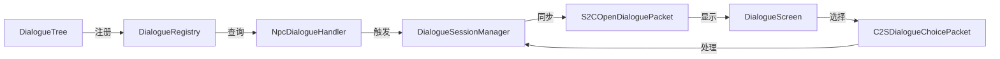

# 对话系统 API 参考

**模块**: dialogue/  
**适用对象**: 开发者、外部AI学习  
**最后更新**: 2026-04-17

---

## 📚 目录

1. [数据结构层](#数据结构层)
2. [Builder API](#builder-api)
3. [注册表层](#注册表层)
4. [运行时层](#运行时层)
5. [网络包](#网络包)

---

## 数据结构层 (dialogue/api/)

### DialogueTree - 对话树

**类型**: `record`  
**位置**: `org.com.arc_quest.dialogue.api.DialogueTree`

**字段**:
```java
private final String dialogueId;
private final String defaultNpc;
private final String startNodeId;
private final Map<String, DialogueNode> nodes;
private final QuestVisualConfig visualConfig;
```

**核心方法**:

| 方法 | 返回类型 | 说明 |
|------|---------|------|
| `getDialogueId()` | String | 获取对话ID |
| `getDefaultNpc()` | String | 获取默认NPC名称 |
| `getStartNodeId()` | String | 获取起始节点ID |
| `getNode(String nodeId)` | DialogueNode | 根据ID获取节点 |
| `hasNode(String nodeId)` | boolean | 检查节点是否存在 |
| `getVisualConfig()` | QuestVisualConfig | 获取视觉配置 |
| `static builder(String id)` | Builder | 创建Builder |

**Builder API**:
```java
DialogueTree tree = DialogueTree.builder("villager_greeting")
    .defaultNpc("村民")
    .startNode("start")
    .addNode(node1)
    .addNode(node2)
    .visualConfig(config)
    .build();
```

---

### DialogueNode - 对话节点

**类型**: `record`  
**位置**: `org.com.arc_quest.dialogue.api.DialogueNode`

**字段**:
```java
private final String nodeId;
private final String speaker;
private final String text;
private final List<DialogueChoice> choices;
private final String autoNextId;
```

**核心方法**:

| 方法 | 返回类型 | 说明 |
|------|---------|------|
| `getNodeId()` | String | 获取节点ID |
| `getSpeaker()` | String | 获取说话者 |
| `getText()` | String | 获取对话文本 |
| `getChoices()` | List\<DialogueChoice\> | 获取选项列表 |
| `getAutoNextId()` | Optional\<String\> | 获取自动跳转节点 |
| `hasChoices()` | boolean | 是否有选项 |
| `isAutoAdvance()` | boolean | 是否自动跳转 |
| `static builder(String id)` | Builder | 创建Builder |

---

### DialogueChoice - 对话选项

**类型**: `record`  
**位置**: `org.com.arc_quest.dialogue.api.DialogueChoice`

**字段**:
```java
private final String text;
private final String nextNodeId;
private final List<DialogueCondition> conditions;
private final List<DialogueAction> actions;
```

**核心方法**:

| 方法 | 返回类型 | 说明 |
|------|---------|------|
| `getText()` | String | 获取选项文本 |
| `getNextNodeId()` | Optional\<String\> | 获取下一节点ID |
| `getConditions()` | List\<DialogueCondition\> | 获取可见性条件 |
| `getActions()` | List\<DialogueAction\> | 获取执行动作 |
| `isVisible(ServerPlayer player)` | boolean | 检查是否可见 |

---

### DialogueAction - 对话动作

**类型**: `sealed interface`  
**位置**: `org.com.arc_quest.dialogue.api.DialogueAction`

**实现类**:

| 类名 | 说明 | 构造参数 |
|------|------|----------|
| `StartQuest` | 开始任务 | String questId |
| `SetFlag` | 设置flag | String flagName |
| `NotifyInteract` | 通知NPC交互 | String npcId |
| `Close` | 关闭对话 | 无 |

**使用示例**:
```java
new DialogueAction.StartQuest("arc_quest:epic_prologue")
new DialogueAction.SetFlag("talked_to_villager")
new DialogueAction.Close()
```

---

### DialogueCondition - 对话条件

**类型**: `interface`  
**位置**: `org.com.arc_quest.dialogue.api.DialogueCondition`

**方法**:
```java
boolean test(ServerPlayer player);
```

**常见用途**:
- 检查任务完成状态
- 检查flag设置
- 检查变量值

---

### DialogueContext - 上下文容器

**位置**: `org.com.arc_quest.dialogue.api.DialogueContext`

**职责**: 存储对话运行时的上下文变量，支持动态文本替换

**核心方法**:

| 方法 | 参数 | 返回 | 说明 |
|------|------|------|------|
| `put()` | String, Object | void | 存储变量 |
| `get()` | String | Object | 获取变量 |
| `replaceVariables()` | String | String | 替换文本中的变量 |

**使用示例**:
```java
DialogueContext context = new DialogueContext();
context.put("player_name", player.getName().getString());
context.put("quest_name", "史诗序章");

String text = context.replaceVariables("你好，${player_name}！你的任务是：${quest_name}");
// 输出：你好，Steve！你的任务是：史诗序章
```

---

### IDialogueNpc - NPC实体接口

**类型**: `interface`  
**位置**: `org.com.arc_quest.dialogue.api.IDialogueNpc`

**方法**:

| 方法 | 返回类型 | 说明 |
|------|---------|------|
| `getDialogueId()` | String | 获取绑定的对话ID |
| `getNpcName()` | String | 获取NPC显示名称 |

**实现方式**:
通过Capability附加到实体上，支持任意Entity类型

---

## Builder API

### DialogueTreeBuilder - 流式构建器

**位置**: `org.com.arc_quest.dialogue.builder.DialogueTreeBuilder`

**静态方法**:
```java
public static DialogueTreeBuilder create(String dialogueId)
```

**实例方法** (链式调用):

| 方法 | 参数 | 返回 | 说明 |
|------|------|------|------|
| `npc()` | String | DialogueTreeBuilder | 设置默认NPC名称 |
| `node()` | String | NodeBuilder | 开始定义节点 |
| `visualConfig()` | QuestVisualConfig | DialogueTreeBuilder | 设置视觉配置 |
| `build()` | 无 | DialogueTree | 构建对话树 |
| `buildAndRegister()` | 无 | DialogueTree | 构建并注册 |

**NodeBuilder内部类方法**:

| 方法 | 参数 | 返回 | 说明 |
|------|------|------|------|
| `say()` | String | NodeBuilder | 设置对话文本 |
| `speaker()` | String | NodeBuilder | 设置说话者 |
| `choice()` | String, Consumer\<ChoiceBuilder\> | NodeBuilder | 添加选项 |
| `autoNext()` | String | NodeBuilder | 设置自动跳转 |
| `endNode()` | 无 | DialogueTreeBuilder | 结束节点定义 |

**ChoiceBuilder内部类方法**:

| 方法 | 参数 | 返回 | 说明 |
|------|------|------|------|
| `goTo()` | String | ChoiceBuilder | 跳转到节点 |
| `startQuest()` | String | ChoiceBuilder | 开始任务 |
| `setFlag()` | String | ChoiceBuilder | 设置flag |
| `close()` | 无 | ChoiceBuilder | 关闭对话 |
| `endChoice()` | 无 | NodeBuilder | 结束选项定义 |

**使用示例**:
```java
DialogueTreeBuilder.create("test_villager")
    .npc(Component.translatable("dialogue.villager.name").getString())

    // 起始节点
    .node("start")
        .say(Component.translatable("dialogue.villager.start").getString())
        .choice("询问问题", c -> c.goTo("ask_problem"))
        .choice("离开", c -> c.close())

    // 询问问题节点
    .node("ask_problem")
        .say("村庄需要帮助！")
        .choice("接受任务", c -> c
            .startQuest("arc_quest:epic_prologue")
            .close())
        .choice("拒绝", c -> c.goTo("decline"))

    // 拒绝节点
    .node("decline")
        .say("好吧，如果你改变主意...")
        .choice("再见", c -> c.close())

    .buildAndRegister();
```

---

## 注册表层 (dialogue/registry/)

### DialogueRegistry - 对话注册表

**类型**: 单例模式  
**位置**: `org.com.arc_quest.dialogue.registry.DialogueRegistry`

**静态方法**:

| 方法 | 参数 | 返回 | 说明 |
|------|------|------|------|
| `INSTANCE` | - | DialogueRegistry | 单例实例 |
| `register()` | DialogueTree | void | 注册对话树 |
| `get()` | String | DialogueTree | 根据ID获取对话 |
| `getAll()` | 无 | Collection\<DialogueTree\> | 获取所有对话 |
| `bindNpc()` | String, String | void | 绑定NPC到对话 |
| `getDialogueForNpc()` | String | String | 根据NPC ID获取对话 |
| `clear()` | 无 | void | 清空注册表 |

**使用示例**:
```java
// 注册对话
DialogueTree tree = DialogueTree.builder("test").build();
DialogueRegistry.INSTANCE.register(tree);

// 绑定NPC
DialogueRegistry.INSTANCE.bindNpc("elder_001", "test");

// 查询
DialogueTree found = DialogueRegistry.INSTANCE.get("test");
String npcDialogue = DialogueRegistry.INSTANCE.getDialogueForNpc("elder_001");
```

---

### DialogueActionTypes - 动作处理器注册表

**位置**: `org.com.arc_quest.dialogue.registry.DialogueActionTypes`

**职责**: 注册自定义对话动作处理器

**核心方法**:

| 方法 | 参数 | 返回 | 说明 |
|------|------|------|------|
| `register()` | ResourceLocation, BiConsumer | void | 注册动作处理器 |
| `execute()` | ResourceLocation, ServerPlayer, CompoundTag | void | 执行动作 |

**使用示例**:
```java
// 注册自定义动作
DialogueActionTypes.register(
    new ResourceLocation("mymod", "give_coins"),
    (player, data) -> {
        int amount = data.getInt("amount");
        EconomyAPI.addCoins(player, amount);
    }
);

// 在对话中使用
CompoundTag actionData = new CompoundTag();
actionData.putInt("amount", 500);
new DialogueAction.Custom(new ResourceLocation("mymod", "give_coins"), actionData)
```

---

## 运行时层 (dialogue/runtime/)

### DialogueSession - 对话会话

**位置**: `org.com.arc_quest.dialogue.runtime.DialogueSession`

**字段**:
```java
private final UUID playerId;
private final DialogueTree tree;
private String currentNodeId;
private final List<String> history;
private final DialogueContext context;
private final String entityId;
```

**核心方法**:

| 方法 | 参数 | 返回 | 说明 |
|------|------|------|------|
| `getCurrentNode()` | 无 | DialogueNode | 获取当前节点 |
| `selectChoice()` | int, ServerPlayer | void | 选择选项 |
| `executeActions()` | List\<DialogueAction\>, ServerPlayer | void | 执行动作 |
| `advanceTo()` | String | void | 跳转到指定节点 |
| `close()` | 无 | void | 关闭会话 |
| `isFinished()` | 无 | boolean | 是否结束 |

---

### DialogueSessionManager - 会话管理器

**类型**: 单例模式  
**位置**: `org.com.arc_quest.dialogue.runtime.DialogueSessionManager`

**核心方法**:

| 方法 | 参数 | 返回 | 说明 |
|------|------|------|------|
| `INSTANCE` | - | DialogueSessionManager | 单例实例 |
| `startDialogue()` | ServerPlayer, DialogueTree | void | 开始对话 |
| `startDialogueWithNpc()` | ServerPlayer, String, Entity | void | 与NPC开始对话 |
| `endDialogue()` | ServerPlayer | void | 结束对话 |
| `isInDialogue()` | ServerPlayer | boolean | 是否在对话中 |
| `getSession()` | ServerPlayer | Optional\<DialogueSession\> | 获取会话 |
| `handleChoice()` | ServerPlayer, int | void | 处理选项选择 |

---

### NpcDialogueHandler - NPC对话触发桥梁

**位置**: `org.com.arc_quest.dialogue.runtime.NpcDialogueHandler`

**职责**: 监听玩家右键点击实体事件，自动触发对话

**注册方法**:
```java
NpcDialogueHandler.registerListeners();  // 在FMLCommonSetupEvent中调用
```

**工作流程**:
```
玩家右键点击实体
  ↓
检查实体是否实现IDialogueNpc或有DialogueNpcPatch
  ↓
获取绑定的对话ID
  ↓
从DialogueRegistry查询对话树
  ↓
调用DialogueSessionManager.startDialogueWithNpc()
  ↓
发送S2COpenDialoguePacket到客户端
```

---

## 网络包 (dialogue/network/)

### S2COpenDialoguePacket - 打开对话

**方向**: Server → Client  
**位置**: `org.com.arc_quest.dialogue.network.S2COpenDialoguePacket`

**字段**:
```java
private final String dialogueId;
private final String startNodeId;
private final CompoundTag contextTag;
private final int entityId;
```

**静态方法**:

| 方法 | 参数 | 返回 | 说明 |
|------|------|------|------|
| `encode()` | Packet, FriendlyByteBuf | void | 序列化 |
| `decode()` | FriendlyByteBuf | Packet | 反序列化 |
| `handle()` | Packet, Supplier\<Context\> | void | 处理接收 |

**触发时机**:
- 玩家与NPC交互
- 管理员命令 `/dialogue`
- 任务动作触发

---

### C2SDialogueChoicePacket - 选择对话选项

**方向**: Client → Server  
**位置**: `org.com.arc_quest.dialogue.network.C2SDialogueChoicePacket`

**字段**:
```java
private final int choiceIndex;
```

**静态方法**:

| 方法 | 参数 | 返回 | 说明 |
|------|------|------|------|
| `send()` | int | void | 发送选择 |
| `encode()` | Packet, FriendlyByteBuf | void | 序列化 |
| `decode()` | FriendlyByteBuf | Packet | 反序列化 |
| `handle()` | Packet, Supplier\<Context\> | void | 处理接收 |

**使用示例**:
```java
// 客户端选择第2个选项（索引从0开始）
C2SDialogueChoicePacket.send(1);
```

---

## Capability层 (dialogue/capability/)

### DialogueNpcPatch - NPC数据补丁

**位置**: `org.com.arc_quest.dialogue.capability.DialogueNpcPatch`

**字段**:
```java
private String dialogueId;
private String npcName;
```

**核心方法**:

| 方法 | 返回类型 | 说明 |
|------|---------|------|
| `getDialogueId()` | String | 获取对话ID |
| `setDialogueId()` | String | 设置对话ID |
| `getNpcName()` | String | 获取NPC名称 |
| `setNpcName()` | String | 设置NPC名称 |

---

### DialogueNpcPatchProvider - Capability提供者

**位置**: `org.com.arc_quest.dialogue.capability.DialogueNpcPatchProvider`

**注册方法**:
```java
@SubscribeEvent
public static void onAttachCapabilities(AttachCapabilitiesEvent<Entity> event) {
    event.addCapability(
        ResourceLocation.fromNamespaceAndPath(Arc_quest.MOD_ID, "dialogue_npc"),
        new DialogueNpcPatchProvider()
    );
}
```

---

## 附录

### 对话系统数据流



### 关键设计模式

1. **Builder模式**: DialogueTreeBuilder提供流式API
2. **单例模式**: DialogueRegistry, DialogueSessionManager
3. **策略模式**: DialogueAction, DialogueCondition
4. **观察者模式**: NpcDialogueHandler监听实体交互事件
5. **记录模式**: 所有数据结构使用Java record

---

**文档结束**

*本API参考涵盖对话系统的所有公共接口、数据结构和使用方法。*
