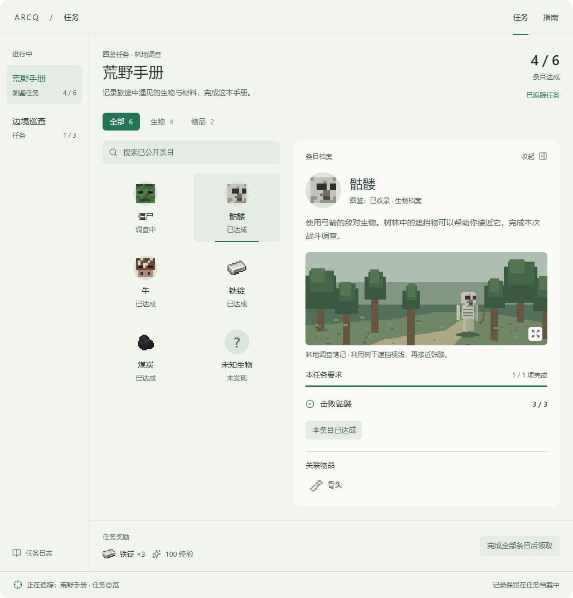
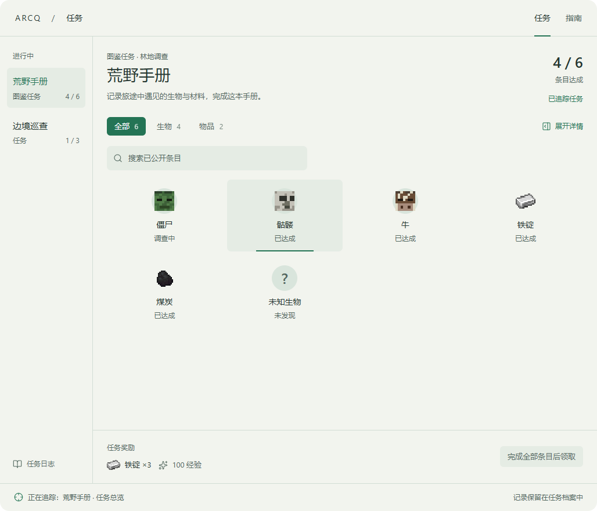

# ArcQ 图鉴模式 Quest 系统详细设计

日期：2026-10-02

状态：设计已落实为代码。本文保留方案讨论时的架构说明；实际配置字段、API、Demo 入口和验证范围分别以 [使用说明](compendium-quest-usage.md)、[可玩范例](compendium-quest-demos.md) 与 [实现验收](compendium-quest-verification.md) 为准。

适用版本：Forge 1.20.1、NeoForge 1.21.1；两个版本应采用相同内容语义。

设计基准：最新确认的「任务面板内嵌标本陈列 + 可收纳详情 + Guide 式配图」。

## 阅读说明

本文整合本轮已经确定的设计，并替代早期方案中以下结论：

- 取消 `QuestMode.COLLECTION`。
- 单独增加图鉴 Screen 或任务面板顶部的独立图鉴入口。
- 将图鉴研究作为脱离 Quest 的第二套常驻追踪目标。
- 每一个图鉴条目必须对应一个 Phase。

新的方案保留图鉴模式 Quest，以任务面板作为统一浏览入口。长期图鉴记录可以在内部独立保存，但不会因此增加另一个图鉴界面。

本文中的部分命名是设计阶段建议，不能直接复制为最终接口。已落盘接口与可复制配置见使用说明和可玩范例；本文描述的首版范围仍作为实现审查依据。

## 目录

1. [目标与已确认原则](#1-目标与已确认原则)
2. [现有实现与重构边界](#2-现有实现与重构边界)
3. [任务与图鉴的数据模型](#3-任务与图鉴的数据模型)
4. [检测、计数与完成规则](#4-检测计数与完成规则)
5. [Phase 与并行调查](#5-phase-与并行调查)
6. [任务面板布局](#6-任务面板布局)
7. [详情收纳与交互状态](#7-详情收纳与交互状态)
8. [Guide 式图文与图片配置](#8-guide-式图文与图片配置)
9. [图标、物品 Tag 与 JEI](#9-图标物品-tag-与-jei)
10. [游戏内任务追踪器](#10-游戏内任务追踪器)
11. [通知、奖励与历史记录](#11-通知奖励与历史记录)
12. [存档、同步与热重载](#12-存档同步与热重载)
13. [性能设计](#13-性能设计)
14. [内容配置与编辑器](#14-内容配置与编辑器)
15. [旧系统迁移](#15-旧系统迁移)
16. [分批实施与提交](#16-分批实施与提交)
17. [验收清单](#17-验收清单)

## 1. 目标与已确认原则

### 1.1 产品目标

让图鉴任务成为一本能够在冒险中逐步完成的调查手册。玩家打开任务面板，就能看清这份手册包含什么、自己还需要做什么、某个条目有什么资料，以及完成后能获得什么奖励。

图鉴任务需要同时提供两种体验：浏览标本与知识，执行任务目标。两者共用入口，但不混用进度和交互。

### 1.2 已确认的设计约束

| 项目 | 确定方案 |
| --- | --- |
| 任务模式 | 保留 `QuestMode.COLLECTION`，作为真正的 Quest |
| 浏览入口 | 图鉴内容直接放入现有任务面板，不增加独立图鉴 Screen |
| 主布局 | 标本陈列；保留左侧任务列表，右侧展示图鉴任务内容 |
| 条目详情 | 右侧详情可收纳，收起后目录获得可用宽度 |
| 图文内容 | 与 Guide 一样可以配置图片与说明，图片可点击放大 |
| 生物展示 | 统一二维头像，不使用实体模型预览 |
| 无头像降级 | 已知生物没有有效头像时保留文字，不强行换成刷怪蛋或问号 |
| 物品 Tooltip | 复用任务奖励栏样式，保持简洁 |
| JEI | 有有效物品绑定就支持左键配方、右键用途，不显示快捷键说明 |
| 追踪 | 仍然追踪 Quest；条目只是该 Quest 的可选聚焦目标 |
| 通知 | 使用现有左侧统一通知，不恢复右上角通知，不显示阶段加入通知 |
| 待确认提示 | 短暂显示后淡出，领奖或回报待办保留在任务面板 |
| 实施方式 | 分批实现、分批验证、分批提交 |

### 1.3 首版范围

首版应完成任务结构、条目要求、长期记录与本轮计数、面板、收纳详情、图片、图标、Tag、JEI、追踪、奖励与旧数据迁移，形成完整可用闭环。

团队共享档案、自动生成整个模组包的百科、附近全部生物扫描、图鉴内嵌 Ponder 等能力不作为首版完成条件。它们可以通过预留接口扩展，不应拖住已确认的玩家体验。

## 2. 现有实现与重构边界

### 2.1 已核对的代码事实

以下内容依据当前工作区源码，不是新增接口：

| 现有代码 | 当前职责或限制 | 新设计处理 |
| --- | --- | --- |
| `QuestMode` | 已有 `PROGRESSION`、`COLLECTION` | 保留模式和正常任务生命周期 |
| `CollectionQuestConfig` | 已有分类、完成规则、奖励节点和表现配置 | 扩展或经兼容编译转换为新的任务配置 |
| `CollectionEntryConfig` | 作为 Phase 的图鉴条目配置，混合可见性、计数和奖励 | 将条目绑定从 Phase 中分离 |
| `CollectionRuntimeData` | 按 Phase ID 保存发现、计数、唯一项和奖励状态 | 迁移到稳定条目/绑定 ID，不直接丢弃旧字段 |
| `JournalDetailCollection` | 卡片 `56×52`，固定四列，布局大量依赖 248 宽度，详情依赖 Tooltip | 改为自适应陈列及独立、可收纳的详情区域 |
| `TrackerCollectionProgressAdapter` | 将图鉴进度包装为临时 `CUSTOM` Objective 行 | 改为专门的 Collection 追踪视图数据 |
| `QuestTrackingSnapshot` | 服务端快照保存 Quest ID、追踪状态和 revision | 保持服务端 Quest 追踪权威 |
| `QuestTrackingPresentationState` | 客户端维护任务与 Phase 的表现聚焦 | 在此类表现层扩展条目聚焦，避免生成假任务 |
| `GuidePageSpec` / `GuideMediaSpec` | 已有文字与媒体配置，媒体含纹理和宽高 | 复用可用数据结构，增加图鉴内容包装 |
| `GuideMediaRenderer` | 包内可见，当前图片使用 Cover 裁切 | 提取共用媒体能力或增加适配器，补充完整图片显示 |
| `ObjectiveBuilder` | 已有 `iconItem`，`iconTexture(ItemLike)` 委托到 `iconItem` | 沿用现有物品图标绑定能力 |
| `JournalTooltipRenderer` | 任务面板已有自绘物品 Tooltip | 继续复用 |

当前 Guide 媒体支持 `NONE`、`IMAGE`、`PONDER`。本设计首先接入图片，并不意味着图鉴详情已经能够直接调用现有包内 renderer，或拥有图片放大与新的适应方式。

### 2.2 保留与替换

保留 Quest 注册、接取条件、运行时、阶段推进、完成/失败/放弃、重复接取、奖励类型和任务历史入口。普通 `COLLECT`、`CRAFT`、`OFFER`、`DELIVER` 等 Objective 的含义保持原有语义。

重构 Collection 的内部组织、进度投影、详情渲染和追踪适配。旧的条目 Phase 需要兼容读取和显式迁移，不以删除旧类作为功能完成标准。

相关源码入口见文末「源码索引」。

## 3. 任务与图鉴的数据模型

### 3.1 四个核心对象

| 对象 | 建议名称 | 职责 | 标识 |
| --- | --- | --- | --- |
| 图鉴条目定义 | `CollectionEntryDefinition` | 名称、主体、头像、正文、图片、发现和研究规则 | `entryId` |
| 玩家长期记录 | `CollectionRecordState` | 已发现、研究步骤、内容已读状态 | 玩家 + `entryId` |
| 图鉴任务配置 | `CollectionSheetSpec` | 某个真实 Phase 的条目清单、完成门槛、表现配置 | `questId + phaseId` |
| 任务条目绑定 | `EntryRequirementBinding` | 该条目在本任务里具体需要完成什么 | `questId + runId + phaseId + bindingId` |

`entryId` 标识知识对象，`bindingId` 标识这一次任务要求。两者不能互相代替。

同一个僵尸 Entry 可以在不同调查任务里被引用：一次要求发现，一次要求收集样本，一次要求本轮击败 5 只。知识资料可以共用，任务进度必须分别计算。

### 3.2 图鉴记录不等于任务完成

例如：

| 信息 | 当前状态 |
| --- | --- |
| 僵尸图鉴记录 | 已发现 |
| 本任务要求：击败僵尸 | `2/5` |
| 本任务要求：获得腐肉样本 | `1/1` |
| 本任务僵尸条目 | 调查中 |

条目目录的主状态读取本任务绑定；详情中的「图鉴：已发现」作为知识状态单独展示。

如果作者只要求「发现僵尸」，那么发现即可完成该绑定。如果作者要求两个动作都完成，已经发现并不会自动满足后续动作。

### 3.3 长期记录与任务生命周期

长期记录属于玩家档案，不随放弃、失败或重复接取某份任务而清空。已注册且满足记录资格的条目可以在玩家未接取相关任务时继续记录。

这些记录通过当前任务、可浏览的已完成任务和任务档案访问，不增加独立图鉴 Screen。打开某份手册只展示它引用的条目，而不是将所有注册条目无差别列出。

已完成任务的完成数与奖励事实保存为历史快照。其条目知识可以继续更新，但应明确区分「当次任务结果」与「当前图鉴记录」，不能让新的研究使旧任务重新变成未完成。

首版记录所有者为个人玩家。团队共享必须另行定义所有者、加入/退出和奖励归属，不能隐式复用个人记录。

### 3.4 定义数据与运行时数据分离

条目定义保存名称、纹理、说明和规则；运行时只保存必要事实。运行时不复制整段图文、纹理内容或每帧计算出的目录。

任务局部计数不能反写成长期研究计数。图鉴研究可以由同一次真实事件更新，但两个计数器各有作用域和消费规则。

### 3.5 长期记录的状态

| 状态 | 判定 | 玩家用语 |
| --- | --- | --- |
| 未发现 | 没有合格发现事实 | 未发现 |
| 已发现、研究未完成 | 已满足发现规则，仍有必需研究步骤未达成 | 已发现 |
| 已发现、无研究要求 | 已满足发现规则，条目没有额外必需研究 | 已收录 |
| 已发现、研究完成 | 已满足发现规则，必需研究步骤全部达成 | 研究完成 |

发现规则默认 ANY；长期必需研究步骤默认 ALL。无研究要求的条目不显示 `0/0` 研究目标，也不强制增加击杀或提交来凑进度。

未读、目录选中、详情展开、正在追踪和奖励已领取都是独立状态，不改变发现或研究判定。

一次事件可以同时构成发现事实并推进相应研究步骤，各规则只消费一次。研究默认在具备记录资格时累计；需要发现后才开始累计时由作者显式配置。系统不能根据目前未保存的行为猜测历史计数。

## 4. 检测、计数与完成规则

### 4.1 条目要求类型

| 要求 | 例子 | 数据来源 |
| --- | --- | --- |
| 已发现 | 记录过僵尸 | 长期记录 |
| 研究完成 | 完成僵尸全部必需研究步骤 | 长期记录 |
| 指定研究步骤完成 | 完成 `defeat_five` | 长期步骤记录 |
| 本轮行动 | 本轮击败骷髅 3 次 | 本任务 Objective |
| 本轮提交 | 向营地交付 8 个样本 | 本任务 OFFER / DELIVER 类规则 |
| 自定义验证 | 调用服务端 API 登记遗迹 | 作者配置的服务端事实 |

每个绑定可以包含多个要求。默认 ALL；需要 ANY 时由作者显式配置。可选要求可以展示，但不进入必需完成条件。

「获取」「制作」「提交」「持有」不是同一种动作。文案和事件源必须对应，不能用检查背包数量冒充累计制作或消耗式交付。

### 4.2 记录认可策略

| 建议策略名 | 含义 | 默认使用场景 |
| --- | --- | --- |
| `EXISTING_RECORDS` | 认可当前长期发现/研究事实 | 非重复调查任务中的记录型要求 |
| `RUN_EVENTS` | 统计本次任务的合格行动 | 重复委托及明确要求重新执行的动作 |
| `NEW_DISCOVERIES` | 仅认可接取后首次发现的不同条目 | 明确写着「新发现」的任务 |

策略由任务默认值与绑定覆盖值共同决定。记录型要求和行动型要求不能被一个笼统默认值错误转换。

非重复任务接取时，应立即计算可认可的已有记录。重复委托默认采用本轮行动要求，避免反复用终身记录直接领取奖励。

如果重复任务全部引用长期记录且奖励可重复，应要求作者显式选择这种行为，并提供配置诊断；不能把它作为普通重复调查的默认模板。

`NEW_DISCOVERIES` 在接取时保存发现基线。如果剩余候选少于目标，配置或接取检查必须报告不可完成，不能悄悄用旧发现补足。

### 4.3 本轮计数的起点

每次接取产生新的 `runId`。本轮行动默认在对应真实 Phase 激活后开始接收，尚未激活的后续阶段不提前累计本轮动作。

需要「任务接取后就一直累计」的内容，应显式指定接取起算；不能依赖旧条目 Phase 恰好全部活跃的副作用。

长期记录独立接收符合资格的事件。因此玩家在第一章发现的生物，进入第二章时可以满足第二章的记录型要求；是否认可由该绑定的策略决定。

### 4.4 完成门槛与进度表达

| 规则 | 示例 | 玩家看到的进度 |
| --- | --- | --- |
| 全部绑定完成 | 6 个条目完成 4 个 | `4/6 条目达成` |
| 候选中达到配额 | 12 个候选任意完成 5 个，已完成 3 个 | `3/5 条目达成`，另标候选 12 |
| 多个分类全部达标 | 生物 2/4，材料 3/3 | 主进度「1/2 分类目标达成」，详情列分类计数 |
| 分类任选一组达标 | 生物或材料任一组满足 | 展示两组要求及各自状态，不拼接成假总数 |

一个条目要求击败 5 次、提交 3 个物品，不能把 `5+3` 当成 8 个条目。条目完成一次只贡献一个符合规则的绑定结果。

按「不同对象种类」计数时使用唯一 `entryId`；同一条目重复出现不能算多个物种。按「不同任务要求」计数时可以使用不同 `bindingId`，但必须以「目标/条目要求」表述，不能叫不同种类。

分类重叠时，各分类可独立计数，任务主进度不能直接把分类数量求和。零必需目标视为配置错误或显式纯档案模式，不能默默用 `max(1, total)` 伪造一个未完成目标。

### 4.5 完成后的稳定性

已达成并进入正常任务确认/完成流程的要求保留达成事实。热重载新增条目、Tag 扩张或知识更新不能撤回已发奖励，也不能自动重开已完成任务。

可选目标在目录明确标为「可选」，不增加必需进度分母。达到配额后仍可浏览剩余候选，但不会要求玩家继续清空整个目录才能领奖。

### 4.6 事件规范化与去重

服务端真实事实驱动记录与任务进度：物品获得、实际制作、击败、交互、消耗式提交和显式自定义事件。打开 JEI、查看贴图、点击头像不算发现或研究。

同一动作可能产生制作与背包变化等底层通知。适配层应根据规则语义规范化，并避免同一动作被同一个要求消费两次；不同规则可按配置各消费一次。

发现标志天然幂等。累计获得类研究需要明确允许再次拾取同一物品的语义；不宣称仅凭普通拾取事件就能识别所有物品循环。要求防止反复捡回刷数时，优先使用真实制作或消耗式提交。

自动化机器制作必须有对应事件或 API 适配，不能承诺原版 CRAFT 监听覆盖所有机器。

## 5. Phase 与并行调查

### 5.1 Phase 表示调查章节

示例组织：

```text
荒野手册（COLLECTION Quest）
├─ 林地调查 Phase
│  ├─ 僵尸条目绑定
│  ├─ 骷髅条目绑定
│  └─ 牛条目绑定
├─ 矿物采样 Phase
│  ├─ 铁锭条目绑定
│  └─ 煤炭条目绑定
└─ 向营地回报 Phase
   └─ 既有交付或对白目标
```

条目不是 Phase。真正的章节继续使用现有前置、串行/并行和确认逻辑。

### 5.2 并行 Phase 的面板

任务标题下面先显示真实阶段选择层，再显示当前阶段的条目分类。生物、材料等分类只是目录分组，不能混成阶段选择。

玩家切换阶段时展示该阶段的目录、门槛与详情。每个阶段分别记住分类、选择、展开状态和滚动位置。

如果任务只有一个实际阶段，不展示只有一个选项的阶段切换器。

### 5.3 聚焦身份

完整表现定位使用 `questId + runId + phaseId + bindingId + objectiveId?`。同一个 Entry 在两个并行阶段中出现时，选择与追踪必须仍然落到正确绑定。

阶段结束导致聚焦失效时返回仍有效的任务总览；不将某个条目完成错误通知成整个阶段完成。

## 6. 任务面板布局

### 6.1 展开状态视觉基准



图中配图与像素头像用于展示布局；原生实现需要使用实际资源和已注册适配器。图中的 `4/6` 指任务条目达成数，不是全局已发现数。

### 6.2 页面层级

| 区域 | 内容 | 主要交互 |
| --- | --- | --- |
| 任务面板外壳 | 现有导航、任务列表、任务状态页签 | 切换任务，不离开任务面板 |
| 任务头部 | 标题、简介、实际阶段、任务主进度 | 追踪任务总览 |
| 分类与搜索 | 全部、生物、物品及作者定义分类 | 本任务范围内检索 |
| 标本陈列 | 头像/物品图标、名称、任务状态、必要的聚焦标记 | 选择条目或查询物品 |
| 条目详情 | 简介、图文、任务要求、关联物品 | 收纳、放大图片、追踪条目、JEI |
| 奖励与操作 | 常规任务奖励和正常确认/领取入口 | 提交现有任务操作请求 |

图鉴 Quest 与普通 Quest 共用任务列表和外壳。切换普通任务时恢复其正常任务详情，不需要另一套导航。

放弃、失败说明和剧情操作沿用已有任务能力。它们不进入每张标本卡片，也不挤进物品 Tooltip。

### 6.3 条目卡片信息

卡片常驻内容保持简洁：图标或头像、名称、一个任务状态。当前追踪项可以增加很小的主题色标记。

| 条目情况 | 卡片展示 |
| --- | --- |
| 已知、任务未完成 | 正常头像/物品图标 + 名称 +「调查中」或关键进度 |
| 本任务已完成 | 保持图标与名称可读 +「已达成」 |
| 神秘、未发现 | 问号 + 作者公开线索名称 +「未发现」 |
| 完全隐藏 | 不产生可见卡片 |
| 可选 | 明确标为可选，不加入必需计数 |

问号用于遮蔽未知信息，不用于替代没有适配头像的已知生物。

选择态采用轻微背景变化与细主题色标记；不为每张卡片增加持续发光、扫光或闪烁动画。

### 6.4 自适应与阅读

以真实右侧可用宽度和当前任务字号计算列数，不能继续使用固定 248 宽度或固定四列。

初始卡片建议最小约 `92×72` 逻辑像素，结合名称长度、字号和图标调整；它是原生排版起点，不是将网页尺寸直接照搬进 Minecraft。

宽面板可以将目录与详情并排；不足时将详情放到目录下方或作为同一区域的第二级视图。收纳行为仍有效，不通过缩小全部文本强行保持三列。

窄屏隐藏或收纳辅助布局，保留名称、任务进度和操作可读。长标题、翻译文本和大字号都必须参与高度测量。

### 6.5 搜索与筛选

搜索只处理玩家已获准看到的名称、公开关键词与摘要。不用真实主体 ID 搜索出神秘条目，不对尚未下发的隐藏正文建立客户端索引。

切换分类不自动改变追踪焦点。若当前选中条目被筛选排除，详情可以保留并显示其所属分类；不能偷偷选择一个新条目并改变玩家上下文。

无结果时显示简洁空状态。目录进度来自整个任务规则，不能因搜索只剩一项而变成 `1/1`。

## 7. 详情收纳与交互状态

### 7.1 收纳状态视觉基准



### 7.2 明确交互约定

| 操作 | 结果 |
| --- | --- |
| 点击生物卡片、条目名称或可选空白区域 | 选中条目并展开详情，不修改追踪 |
| 点击「收起」 | 隐藏详情正文，目录重新计算列数 |
| 点击「展开详情」 | 恢复上次选中条目及其详情滚动位置 |
| 收纳时点击另一条目名称 | 选中该条目并重新展开 |
| 点击物品图标 | 优先执行 JEI 查询，不自动展开、选择或追踪 |
| 点击「追踪此条目」 | 聚焦本任务中的该绑定 |
| 点击「追踪任务总览」 | 清空条目聚焦，仍追踪同一个 Quest |
| 点击图片 | 打开图片放大层，不改变任务或条目状态 |

收起后详情不再占用透明命中区。展开入口放在分类行右侧或等效位置，不叠在卡片正文上。

已达成条目仍可查看资料和物品。原型中的追踪按钮为「本条目已达成」不可点击；需要继续追踪可选研究时应有真实未完成要求，不能虚构一个任务目标。

### 7.3 UI 状态保存

建议按 `questId + runId + phaseId` 保存面板状态：

| 字段 | 内容 |
| --- | --- |
| `selectedBindingId` | 当前检查的任务条目 |
| `categoryId` | 当前分类 |
| `searchText` | 当前搜索文字 |
| `detailExpanded` | 详情是否展开 |
| `directoryScrollAnchor` | 首个可见条目 ID 及偏移 |
| `detailScrollOffset` | 当前条目正文滚动 |
| `focusBindingId` | 追踪表现聚焦；与选中条目分别保存 |

目录优先保存稳定 ID 锚点，而不只保存行号，避免列数变化后回到完全不同的位置。详情滚动可以按绑定分别记忆，并在正文变化时夹紧到合法范围。

JEI 返回、关闭后重开、字号调整、分辨率变化和阶段切换都应保留仍有效的状态。新一轮任务不盲目沿用旧 `runId` 的焦点与计数。

### 7.4 动画、遮挡和输入优先级

输入顺序从上到下为：图片放大/字号等模态层、JEI 有效物品命中区、详情按钮、条目选择、目录滚动。

一个点击只执行一个操作。物品图标不能同时打开 JEI、切换条目或领取奖励。

收纳/展开时重新计算有效布局；正文过渡期间暂不接收点击，防止旧矩形命中。鼠标命中依据可见裁切后的区域，不能只用动画前的矩形。

任务面板关闭时，头像、物品、图片、文字、搜索框、边线与 Tooltip 统一使用面板有效透明度，并停止生成新的可点击目标。

字号面板和图片放大层有自己的不透明内容背景以及更高绘制层级。下层文字和图标不能从模态内容面板透出来，也不能透过它响应点击。

### 7.5 滚动边界

目录与详情分别保存滚动状态。原生面板可以复用现有滚动容器，但不要形成卡片列表、详情正文和图片三层嵌套滚动。

鼠标在详情内时先滚动详情，在目录内时滚动目录；没有可滚动内容时交给所属任务详情容器。滚动命中与绘制使用同一坐标转换和裁切区域。

## 8. Guide 式图文与图片配置

### 8.1 复用范围

复用 Guide 的媒体定义、资源纹理、宽高信息和文本解析能力。根据原生容器需要提取共同 renderer，而不是复制 GuideScreen 到图鉴详情里。

图片放大、可配置 Fit、段落解锁和图鉴内容包装是本次新增设计。当前 `GuideMediaRenderer` 的图片是 Cover 裁切，不能直接声称它已满足完整图示展示需求。

图鉴正文可以使用本地内容块，也可以显式引用已有 Guide 的获准内容。引用不会自动授予该 Guide、改变最后阅读页或触发 Guide 完成事件。

### 8.2 内容块

建议条目正文使用有序内容块：

| 类型 | 主要字段 | 用途 |
| --- | --- | --- |
| `TEXT` | 稳定块 ID、文本或翻译键、解锁条件 | 简介和知识说明 |
| `IMAGE` | 稳定块 ID、Guide 媒体定义、说明、Fit、可放大 | 作者配置的截图、示意图和插图 |
| `GUIDE_CONTENT_REF` | Guide ID、稳定页/内容定位、授权要求 | 引用已有知识内容 |

多个文字和图片可以按顺序交替展示。默认简介与任务要求优先可读；只有获得授权的正文参与布局。

首版不自动播放 Ponder 或新增实体模型预览。以后扩展媒体类型时，应按需激活和释放资源，不让收纳或不可见内容持续运行。

### 8.3 图片字段

| 字段 | 规则 |
| --- | --- |
| `texture` | 资源纹理 `ResourceLocation`，使用资源包/模组已有加载流程 |
| `width`、`height` | 原始图片尺寸或明确资源尺寸，必须为正数 |
| `caption` | 可选的说明文字，支持既有翻译能力 |
| `fit` | `CONTAIN` / `COVER`，建议正文默认 CONTAIN |
| `maxDisplayHeight` | 可选显示上限；不会改变原始图像比例 |
| `zoomable` | 是否允许点击放大，默认允许 |
| `revealCondition` | 公开、发现后或指定研究步骤完成后可见 |

`fit`、`caption`、放大和解锁字段属于图鉴包装的新增建议，不是当前 `GuideMediaSpec` 已存在的字段。

CONTAIN 保留完整图像，适合有文字的攻略图片；COVER 保持容器饱满但会裁切，适合作者明确选择的装饰配图。两种方式都不拉伸图像。

资源未配置时不显示空图片框。资源配置无效时移除该媒体块并记录一次诊断，正文、任务要求和其他内容继续可用。

### 8.4 放大层

点击图片打开任务面板内的模态查看层，展示完整图片、说明和明确的返回按钮。原生实现必须使用 GUI 坐标与屏幕边界，不能把网页弹层尺寸直接搬进游戏。

图片按可用宽高等比缩放。首版提供放大查看即可，不强制增加平移、缩放滑杆或编辑功能。超宽、超高图片不应挤出关闭按钮。

关闭图片层后恢复选中条目、详情滚动及展开状态。Escape 优先关闭顶层图片/模态界面，然后再按现有任务面板规则关闭面板。

### 8.5 内容权限

图片、说明和关联物品使用同一授权投影。未发现神秘条目不下发真实内容引用，也不通过空白布局高度暗示隐藏段落。

引用 Guide 时遵守既有解锁策略，不因为图鉴详情存在就绕过 Guide 访问限制。将资源打包在客户端本身并不能保证资产保密；此处保证的是 ArcQ 的正常界面与数据投影不主动泄露隐藏内容。

## 9. 图标、物品 Tag 与 JEI

### 9.1 统一复用 Objective ICON

图鉴条目与其要求复用已有图标规格、注册扩展、帧选择和透明度能力。不要再增加一个只能支持少数原版实体的独立头像系统。

表现策略沿用作者明确配置优先，再使用已适配默认策略：指定二维纹理、有效物品图标、生物纹理脸部裁切、头颅正面二维图像等。具体优先级应与现有 Objective ICON 解析结果一致，避免两个模块对同一配置得出不同结果。

生物纹理裁切须逐生物适配脸部区域和附加部位。没有适配就不渲染额外头像。头颅来源也不等于在界面里旋转或预览三维实体模型。

已知条目缺图时采用文字布局。神秘条目才显示问号；这两个降级场景不能混用。

### 9.2 有效物品绑定

以下入口都需要支持 JEI：

- 条目主物品图标。
- 详情头部具有有效物品绑定的图标。
- 每一项 Objective 的实际物品及 Tag 当前候选。
- 关联物品和样本。
- 任务、阶段或里程碑的物品奖励。
- 与真实目标无关但作者明确配置的有效 `iconItem`。

视觉纹理与 JEI 查询对象分别解析。纯纹理、生物主体或图片不能凭空转换为物品；生物头颅头像也不自动意味着查询头颅物品。

已有 `ObjectiveBuilder.iconTexture(ItemLike)` 按 `iconItem` 处理，因此应获得同样的查询能力。

### 9.3 Tag 的两种语义

| 配置意图 | 条目/绑定结构 | 图标与计数 |
| --- | --- | --- |
| Tag 内任意一种即可 | 一个任务绑定 | 合法候选自动轮换；满足一次就是该绑定达成 |
| Tag 内每一种都要收录 | 显式生成多个稳定 Entry / binding | 按不同条目去重，接取时冻结本轮候选 |

Tag 轮换次数不算发现数量。当前图标、Tooltip 和 JEI 点击必须使用同一帧候选，避免图上是 A，查询却变成 B。

悬停/点击时使用现有候选冻结规则；候选列表缓存跟随 Tag/注册表版本失效。空 Tag 提供作者诊断和玩家可理解的不可完成说明，不创建无效 ItemStack。

### 9.4 点击与 Tooltip

左键查询配方，右键查询用途。ArcQ 的主按钮路由和 JEI ingredient 注册必须一致，防止左键被条目选择、奖励按钮或任务面板吞掉。

Tooltip 复用 `JournalTooltipRenderer` 及奖励栏的内容/动画流程。只展示对应物品的正常信息，不加入内部计数枚举、图鉴完成规则、长篇说明或 JEI 快捷键。

名称可作为关联物品的辅助命中区。图标悬停使用轻微缩放或主题色反馈；不要为每个物品都增加厚重方框。

未安装 JEI 时，查看条目、图片、任务要求、物品 Tooltip 和追踪全部可用。有效物品查询才交给可选集成桥接。

### 9.5 返回与授权

JEI 关闭/返回后恢复任务面板状态。打开 JEI 期间不重复触发条目选择、完成、已读或领奖。

ArcQ 提供给 JEI 的资料目录仅包含玩家获准阅读的内容，资源/授权变化后同步失效。ArcQ 不承担隐藏其他模组独立注册配方与物品的职责。

## 10. 游戏内任务追踪器

### 10.1 Overlay 与外观

继续使用正式 `QuestTrackerPanel` overlay 和布局编辑器，沿用大小、位置与样式切换。新增的是 Collection 内容投影，不是又一个常驻 HUD。

外观样式与内容状态是两个维度：某个追踪器样式可以同时承载任务总览或条目聚焦。不要用某个样式枚举代替「当前正在追踪什么」。

原生尺寸应以实际 GUI 逻辑坐标和字号测量。视觉设计可参考总览约 `300×100`、聚焦约 `300×165` 的比例，但不能固定占用这些物理像素或为了塞下文字把字号缩小。

### 10.2 总览状态

显示任务标题、必要的当前真实章节、任务完成门槛，以及最多两条有意义的分类摘要。

```text
荒野手册                     4/6
林地调查
生物 2/4 · 物品 2/2
```

示例数值来自当前阶段规则；任务有其他完成规则时使用相应投影。没有真实章节就省略章节行。

### 10.3 条目聚焦状态

保留任务标题和总体进度，显示条目二维头像、名称及最多两项未完成要求。已经完成的要求可折叠为「另 1 项已完成」。

```text
荒野手册                     4/6
僵尸
击败僵尸                     2/5
另 1 项已完成
```

要求多于两项时显示简短剩余提示，详细信息留在任务面板。不把正文、图片、掉落清单或全部研究步骤常驻到游戏视野里。

### 10.4 聚焦行为

选中条目只是检查。只有「追踪此条目」改变焦点；「追踪任务总览」清空焦点。新发现和进度更新不会抢走手动聚焦。

保持服务端追踪的 Quest ID，客户端表现层扩展 `phaseId`、`bindingId` 和可选 `objectiveId`。当前服务端快照没有这些条目字段，不应假装它已经能够同步新焦点。

首版焦点可保存在客户端表现状态与按服务器/存档隔离的本地记忆中；任务事实和奖励仍由服务端决定。如果以后需要跨设备焦点同步，再显式扩展协议。

聚焦条目达成后显示约 1.2 秒短反馈，默认返回任务总览。可配置按照目录顺序聚焦下一条；不伪造世界距离或自动宣称下一条是最近目标。

### 10.5 完成、确认与领奖

所有要求达成但还需回报/确认时，显示与真实任务流程一致的短提示；任务可领奖时显示可领奖提示。建议约 3–5 秒后淡出，禁止永续「等待确认」。

任务面板继续保留待办与奖励按钮。重新打开面板可以查到状态，登录初始同步和每次 render 不重新启动完成提示计时。

追踪器的淡出只影响显示，不自动领取奖励、不伪造任务完成，也不删除服务端追踪事实。切换任务或阶段时按既有追踪控制器规则处理。

### 10.6 输入与异常

游戏内 HUD 不捕获物品 JEI 点击，不抢游戏鼠标。查询物品时打开任务面板。

焦点绑定被移除、任务换轮、Phase 结束或授权撤回时清除失效焦点并回到合法总览。未更新的本地缓存不能一直展示已无权限的条目。

## 11. 通知、奖励与历史记录

### 11.1 左侧统一通知

首次发现、条目达成、真实阶段完成和任务完成使用现有左侧通知入口。阶段加入不产生新通知。

同一事件同时触发发现、研究完成和条目达成时，合并成玩家最需要知道的一条，而不是同时弹三条。短时间多个条目变化可以汇总。

登录快照、热重载、历史导入与重复事件不会逐条刷通知。导入需要反馈时，最多展示一次汇总。

通知只放名称、小图标和简短结果，长内容放在任务面板。当前未聚焦条目更新时不自动更换追踪目标。

### 11.2 奖励层级

默认使用任务/真实阶段奖励。分类里程碑和可选条目奖励可以配置，但不要求每个发现都发奖，也不在每张卡片下放一个领取按钮。

任务奖励、某次重复任务奖励和长期记录里程碑奖励分别使用对应所有者与稳定 ID。共用一个 Entry 不等于共用所有任务的已领取状态。

### 11.3 发放事实

领取请求由服务端验证任务轮次、资格、节点和已发放状态。重复点击、重连及同一请求重试不能重复发奖。

建议奖励键包含 `owner + questId + runId + nodeId + rewardVersion`；长期里程碑没有任务轮次，应使用对应的长期所有者键。普通内容 reload revision 不作为奖励版本。

背包满、发放部分失败和崩溃恢复需要与实际奖励交付/保存机制共同设计。仅增加内存 `claimed` 布尔值不能保证跨崩溃幂等；实施阶段必须验证保存顺序、交付回执或补偿边界。

### 11.4 历史与继续阅读

完成、失败和放弃记录保留当次任务结果。已完成图鉴任务仍能打开手册，查看当次要求、结果与当前获准知识。

历史页默认只读，不重新发放奖励或将当前长期计数写回旧任务。已完成的卡片仍可查看配图、关联物品和 JEI。

未读标记属于内容阅读状态，不是发现或任务完成状态。只有真正查看到已解锁内容后才标记已读，不能因为经过卡片或打开 JEI 就清掉全部新内容提示。

## 12. 存档、同步与热重载

### 12.1 服务端持久化

| 数据 | 最少保存内容 |
| --- | --- |
| 长期记录 | Entry ID、发现事实、研究步骤计数、必要唯一键、已读内容版本 |
| 任务轮次 | Quest ID、runId、真实 Phase、冻结候选、各 binding 要求结果 |
| 历史快照 | 当次完成条件、结果、定义版本或历史展示摘要 |
| 奖励凭证 | 稳定节点 ID、奖励版本及实际发放结果 |
| 迁移信息 | 保存格式版本、迁移完成标识、未映射旧数据 |

不保存图像字节、完整注册表、每帧头像或可重算的渲染列表。计数封顶；唯一键选择与语义相关的稳定对象 ID，避免无界保存所有被击败实体 UUID。

### 12.2 网络投影

服务端负责记录与任务事实，客户端负责表现。客户端请求可以选择阅读、追踪或领奖，不能直接提交「我已经研究完成」。

登录/打开任务时下发当前授权快照，后续用带 epoch/revision 的进度增量更新。客户端丢弃过期更新，缺失基础版本时请求重同步。

任务定义、冻结候选和进度应有一致的版本关系。不能先用新目录解释旧数组位置，再靠下一包碰巧纠正。

隐藏条目只下发获准的占位信息。任务公开门槛可作为委托说明单独公开，但不能自动从客户端总数推导所有 SECRET 条目数量。

### 12.3 可见性与记录资格

| 模式 | 未发现时界面 | 事件记录 |
| --- | --- | --- |
| PUBLIC | 公开名字、图标及配置的说明 | 按独立资格规则接收 |
| MYSTERY | 公开线索与问号 | 按独立资格规则接收 |
| SECRET | 不显示条目 | 按独立资格规则接收 |

可见性不决定是否接收事件。剧情确实需要禁用记录时配置独立记录条件。任务局部动作仍遵守任务/阶段激活要求。

### 12.4 热重载

Tag/注册表生成的候选在任务接取时冻结本轮 ID、门槛和引用版本。新增内容不会让活动任务突然从 `4/6` 变成 `4/60`。

说明文字和纹理可以在有效资源更新后刷新；改变计数意义、删除绑定或更换研究步骤需要显式迁移，而不是默默把旧计数移给新目标。

已删除但仍被活动任务引用的条目，应提供兼容定义或明确的迁移诊断。不能将「找不到定义」当成自动完成。

资源 reload 会使图片、头像、Tag 候选和 JEI 授权目录缓存失效；单纯进度变化不需要重载整个资源目录。

## 13. 性能设计

### 13.1 服务端

按事件种类与目标 ID 建立发现/研究规则索引，再按 Entry、研究步骤和任务 binding 定位受影响目标。一次僵尸击败不应遍历全服所有玩家的全部任务。

事件只访问与该玩家、该目标和当前激活规则相关的候选。已完成的一次性规则跳过重复计算；分类与总体达成数随事实变化增量维护。

位置类触发器使用有界、低频检测；首版不逐 tick 扫描每个玩家附近所有实体。

同一服务端事实用于长期记录和局部计数时分别消费一次，不能通过两个旧新 dispatcher 各加一次来完成迁移。

### 13.2 客户端

目录支持可见区裁切和行范围定位。只有可见卡片渲染物品/头像，滚出区域的图标不继续建立 Tooltip 和 JEI 命中区。

缓存分类列表、搜索结果、文本测量、资源解析和候选列表；根据定义版本、进度 revision、字号、可用宽度与资源 epoch 精确失效。

详情收起时不继续绘制正文、图片或媒体。图片仅加载当前可见内容，放大查看复用纹理，不每帧读取资源或解码图片。

二维头像可以缓存裁切结果。动态或自定义渲染物品继续走已有受控管线，不能把所有物品永久截成静态图片，导致动画和特殊模型表现改变。

动画期间只更新必要表现状态。分类计数、全文搜索与规则判定不放进每一张卡片的 render。

### 13.3 性能验收方法

| 场景 | 记录指标 |
| --- | --- |
| 100 / 1000 条目目录 | 可见图标数、布局耗时、帧时间、内存 |
| 详情展开、收纳、放大图片 | 纹理加载次数、帧时间峰值、缓存回收 |
| 10 / 50 / 100 名模拟或真实玩家 | 事件匹配规则数、服务端耗时、同步字节量 |
| 多个活跃调查与重复击败 | 每事件处理时间、重复计数、通知与网络合并 |
| Tag 和资源重载 | 重建耗时、缓存增长、活动任务稳定性 |

以上是测试规模，不是已测得的容量承诺。报告需要附硬件、模组组合、任务数、匹配规则量和测量方式；实现后才能评价生产负载表现。

## 14. 内容配置与编辑器

### 14.1 API 的易用性

提供物品、生物、地点、自定义对象的模板。最简配置只需要稳定 ID、主体和发现规则，名称与可用图标可以自动解析。

研究步骤、图片、关联物品和奖励选配。不要为了一个「首次获得铁锭」条目要求作者手写所有布局字段。

复用已有 `ObjectiveBuilder` 创建动作要求、已有图标规格设置外观、已有 Guide 媒体 Builder 创建图片；新 Collection Builder 负责组织这些能力。

### 14.2 建议条目 JSON

下面是概念 Schema 示例，尚未被当前加载器接受。其目的在于说明数据边界；最终字段名应在实现编译器时确定。

```json
{
  "schemaVersion": 2,
  "id": "arc_quest:zombie",
  "subject": {
    "type": "ENTITY",
    "id": "minecraft:zombie"
  },
  "display": {
    "title": { "translate": "arc_quest.collection.zombie.title" },
    "summary": { "literal": "夜间常见的敌对生物。" },
    "icon": { "type": "AUTO" },
    "visibility": "PUBLIC"
  },
  "discovery": {
    "operator": "ANY",
    "rules": [
      { "event": "KILL", "target": "minecraft:zombie" }
    ]
  },
  "research": [
    {
      "id": "defeat_five",
      "objective": {
        "type": "KILL",
        "target": "minecraft:zombie",
        "count": 5
      }
    },
    {
      "id": "sample",
      "objective": {
        "type": "COLLECT",
        "target": "minecraft:rotten_flesh",
        "count": 1
      }
    }
  ],
  "content": [
    {
      "id": "field_note",
      "type": "TEXT",
      "text": { "literal": "在林地调查时保持距离，注意周围的其他生物。" },
      "reveal": "DISCOVERED"
    },
    {
      "id": "field_image",
      "type": "IMAGE",
      "media": {
        "type": "image",
        "texture": "arc_quest:textures/collection/zombie_field.png",
        "width": 384,
        "height": 160
      },
      "fit": "CONTAIN",
      "caption": { "literal": "林地调查笔记" },
      "zoomable": true,
      "reveal": "DISCOVERED"
    }
  ],
  "relatedItems": [
    { "item": "minecraft:rotten_flesh" },
    { "item": "minecraft:iron_ingot" }
  ]
}
```

条目里的研究是长期记录定义。若任务要求本轮重新执行，应在任务 binding 中使用局部 Objective，而不是重置这些研究步骤。

### 14.3 建议任务绑定 JSON

这也是概念 Schema 示例。任务、Phase 和既有奖励字段需经实际 Spec 编译器统一，不直接作为当前任务文件格式使用。

```json
{
  "schemaVersion": 2,
  "id": "arc_quest:wildlife_survey",
  "mode": "COLLECTION",
  "phases": [
    {
      "id": "forest_survey",
      "collectionSheet": {
        "presentation": {
          "layout": "SPECIMENS",
          "detailCollapsible": true,
          "detailExpandedByDefault": true
        },
        "categories": [
          { "id": "entities", "title": "生物" }
        ],
        "bindings": [
          {
            "id": "zombie_research",
            "entryId": "arc_quest:zombie",
            "categories": ["entities"],
            "requirementsOperator": "ALL",
            "creditPolicy": "EXISTING_RECORDS",
            "requirements": [
              {
                "id": "combat",
                "kind": "RESEARCH_STEP",
                "stepId": "defeat_five"
              },
              {
                "id": "sample",
                "kind": "RESEARCH_STEP",
                "stepId": "sample"
              }
            ]
          },
          {
            "id": "skeleton_patrol",
            "entryId": "arc_quest:skeleton",
            "categories": ["entities"],
            "creditPolicy": "RUN_EVENTS",
            "requirements": [
              {
                "id": "patrol_combat",
                "kind": "OBJECTIVE",
                "objective": {
                  "type": "KILL",
                  "target": "minecraft:skeleton",
                  "count": 3
                }
              }
            ]
          }
        ],
        "completion": {
          "type": "ALL_BINDINGS",
          "bindingIds": ["zombie_research", "skeleton_patrol"]
        }
      }
    }
  ]
}
```

第一项认可长期僵尸研究，第二项要求本轮巡查。二者都引用同一套条目展示能力，但计数作用域不同。

图中 6 个条目的手册只是界面示例；这里用两个绑定解释结构，不声称该 JSON 完整复现演示内容。

### 14.4 编译与校验流程

沿用项目已有的 `Spec → Validate → Compile → Registry` 思路，Java Builder 与 JSON 编译到同一种规范化定义。

校验至少包括：重复 Entry/binding/步骤 ID、无效主体、空 Tag、找不到 Guide/纹理引用、完成门槛超过候选、不可完成的新发现目标、无记录依据的要求、循环解锁、重复奖励 ID 和历史 ID 不兼容。

客户端图片缺失可以在资源解析时补充诊断；服务端不能凭空验证只有客户端资源包才提供的实际贴图文件。

### 14.5 编辑器

在现有 COLLECTION Quest 编辑入口里增加真实章节、条目绑定、分类、要求、记录策略和表现配置。

条目编辑提供主体选择、头像预览、公开/神秘/隐藏设置、发现规则、研究步骤、图文块、关联物品和稳定 ID。

图片编辑沿用 Guide 的纹理、宽高与预览方式，增加 Fit、说明、放大和解锁条件。详情预览支持展开/收纳以及不同字号。

编辑器明确显示「认可已有记录」与「本轮重新执行」，并显示实际主进度语义。Tag 模板必须区分「任意一种」与「每种都要」。

保存时不因拖动排序重新生成 binding ID。配置诊断应定位到具体任务、阶段、条目和字段。

### 14.6 扩展接口

建议按职责分别开放接口，而不是允许一个自定义 renderer 同时修改进度、发奖和绘制界面：

| 扩展点 | 输入与输出 | 边界 |
| --- | --- | --- |
| 发现/研究事实适配 | 机器、NPC、机关等事件转换为规范化事实 | 服务端验证来源和玩家资格 |
| 记录规则 | 事实与已有记录转换为受限状态变化 | 必须声明计数语义、稳定 ID 和保存版本 |
| 要求类型 | 记录或任务事实转换为 binding 判定 | 不能通过客户端绘制回调宣布完成 |
| 图标 Provider | 已授权条目/Objective 转换为二维视觉与可选物品绑定 | 复用现有 Objective ICON 扩展机制 |
| 图文块 | 定义与授权条件转换为布局/渲染数据 | 必须遵守裁切、透明度、按需资源和输入边界 |
| 进度投影 | 完成规则转换为目录、详情、追踪器共用的展示结果 | 不各自重复实现一套完成算法 |

新增扩展应提供序列化/编译校验和明确降级。客户端缺少一个可选视觉 Provider 时可以保留文字；服务端缺少必需规则实现时应拒绝配置，而不是把无法判定当作已完成。

## 15. 旧系统迁移

### 15.1 迁移映射

为旧的 `(questId, phaseId)` 建立明确的 `entryId + phaseId + bindingId` 映射。原来用于条目的 Phase 转为绑定，真正有剧情/顺序语义的 Phase 保留。

| 旧数据 | 新数据处理 |
| --- | --- |
| `DiscoveredPhases` | 经映射转成对应发现事实 |
| `EntryCounts` | 只迁入明确语义一致的研究步骤或任务要求 |
| `EntryUniqueKeys` | 按已声明兼容键迁移，不复制给所有步骤 |
| `VisiblePhases` | 转成兼容展示授权，不直接当作发现/完成 |
| `UnlockedRewards` / `ClaimedRewards` | 映射到稳定奖励资格与发放事实 |
| 最近更新的 Phase | 可作迁移诊断；不强行成为新手动追踪焦点 |

不能把一个旧总计数平均分配或复制到多个新 Objective。无法推导的新目标保持待验证，不伪造历史行为。

### 15.2 幂等与未知数据

保存迁移版本和完成标识，保留必要的旧数据归档。重登或再次读取不会重复导入、重复发奖。

没有映射的旧任务/条目保留兼容历史，并报告诊断；不要直接删掉玩家长期存档字段。

迁移成功后切换到新事件路径，防止旧 Collection dispatcher 和新记录服务同时消费同一事件。

### 15.3 双版本

Forge 1.20.1 与 NeoForge 1.21.1 共用内容 Schema、迁移语义、计数规则和验收用例。事件、网络与玩家状态保存的具体接入层分别适配。

不同平台可以使用不同底层玩家存储实现，不能因此对同一个旧存档映射产生不同条目完成结果。

## 16. 分批实施与提交

每批提交应包含可独立审查的代码、必要测试和文档更新。中间阶段保留兼容入口，不能在新界面与迁移完成前直接删掉旧 Collection 路径。

| 批次 | 工作内容 | 完成条件 |
| --- | --- | --- |
| 1. 定义与语义 | Entry、binding、记录策略、完成规则、Spec/编译/校验 | 明确身份与进度，不依赖条目 Phase |
| 2. 记录与运行时 | 事件索引、长期记录、本轮计数、持久化、同步和历史 | 服务端语义闭环，无重复计数 |
| 3. 内嵌任务面板 | 标本陈列、分类搜索、自适应、可收纳详情和状态记忆 | 符合确认布局，大字号和窄面板可用 |
| 4. 图文与物品交互 | Guide 媒体复用、图片放大、二维头像、Tag、自绘 Tooltip、全部 JEI 入口 | 输入不串线，返回状态正确，动画与模态兼容 |
| 5. 追踪与任务收尾 | 总览/聚焦、短反馈、左侧通知、确认/奖励与档案 | 不抢焦点、不永续等待、奖励幂等 |
| 6. 编辑器与迁移 | 新配置表单、演示任务、旧数据映射、兼容入口清理 | 旧任务与已领取奖励不丢失 |
| 7. 双版本验收 | 两平台原生验证、性能测量与发布包 | 同一内容语义在两分支一致 |

旧存档迁移的格式与映射需要从第 1 批开始设计；第 6 批完成迁移工具与切换，不是等到最后才考虑旧数据。

## 17. 验收清单

### 17.1 任务语义

- [ ] COLLECTION 是完整 Quest，正常接取、完成、失败、放弃、重复与奖励流程可用。
- [ ] Phase 是真实章节，多个条目不需要伪装成多个阶段。
- [ ] 僵尸已发现、击败 `2/5`、样本 `1/1` 时，任务条目仍未达成。
- [ ] 两个任务引用同一 Entry，长期知识可共用，任务局部要求不会串线。
- [ ] 非重复任务正确认可已有记录，重复委托正确创建新一轮计数。
- [ ] 候选 12、要求任意 5、达成 3 时显示 `3/5`。
- [ ] 同一物种重复击败不增加不同物种数量；可选目标不增加必需分母。
- [ ] 真正的并行阶段独立展示与计数，结束一个条目不错误结束整个阶段。

### 17.2 面板、收纳与图文

- [ ] 图鉴任务直接出现在任务面板，切换普通任务不需要新 Screen。
- [ ] 详情收起后目录扩展，旧详情区域没有透明点击命中。
- [ ] 点击条目重新展开；搜索、分类、选择、滚动和追踪相互独立。
- [ ] 关闭重开、字号/GUI scale/分辨率变化后状态仍有效。
- [ ] 图片可配置说明，CONTAIN/COVER 不拉伸，放大层可正确返回。
- [ ] 无图片不显示空框，缺失纹理不破坏任务要求和奖励区。
- [ ] Guide 内容引用不自动授予或标记 Guide 完成，不绕过授权。
- [ ] 大字号、长翻译、窄面板、不同分辨率没有文字或操作重叠。

### 17.3 图标、Tooltip 与 JEI

- [ ] 生物全部是二维头像；已知无头像不乱加刷怪蛋或问号。
- [ ] 主物品、Objective、样本、关联物品、奖励与有效 `iconItem` 都能查询。
- [ ] 左键配方、右键用途正常，不同时触发选择、追踪或领奖。
- [ ] Tag 当前图标、Tooltip 和 JEI 查询对应同一候选。
- [ ] Tag 的任意一种与每种收录计数正确，空 Tag 有诊断。
- [ ] 使用任务奖励栏 Tooltip，内容简洁，没有内部枚举和 JEI 快捷键。
- [ ] 未安装 JEI 时任务与图鉴浏览完全可用。
- [ ] JEI 返回保留阶段、分类、选择、滚动和展开状态。
- [ ] 裁切外、关闭动画中及模态遮挡下的图标不响应输入。

### 17.4 追踪、通知与奖励

- [ ] 总览与聚焦始终保留正确 Quest 身份。
- [ ] 浏览条目与新进度不抢走手动聚焦。
- [ ] 聚焦完成短暂反馈后回总览；失效 binding 安全回退。
- [ ] 等待确认/领奖提示到期淡出，面板仍能查询待办。
- [ ] 不新增右上角通知，不恢复阶段加入通知，不因重连重放完成提示。
- [ ] 重复请求、背包满、部分发放失败和崩溃恢复有明确奖励结果。
- [ ] 已完成历史保持当次结果，当前图鉴更新不重开旧任务或奖励。

### 17.5 数据、权限、迁移与性能

- [ ] 没接相关任务时，合格长期记录仍可更新；放弃不删除记录。
- [ ] 神秘/隐藏条目可正常记录，但搜索和 JEI 不泄露未授权内容。
- [ ] 候选冻结，Tag/定义 reload 不改变活动任务门槛。
- [ ] 丢失、过期、重排的同步可重建一致状态。
- [ ] 迁移发现、计数、唯一项和已领取奖励，重登不重复迁移。
- [ ] 未映射旧数据保留，旧新引擎不会双消费事件。
- [ ] 离屏图标不绘制，收起详情不运行媒体，资源缓存有失效与释放边界。
- [ ] 两个平台通过实际原生验证，并记录多任务、多玩家性能数据。

## 附录 A：现有能力与新增建议的区分

| 已存在、可以复用 | 需要新增或重构 |
| --- | --- |
| `QuestMode.COLLECTION` 与任务生命周期 | Entry/binding 与真实 Phase 分离 |
| 既有动作 Objective 与图标规格 | 长期记录、本轮要求和一致完成投影 |
| Guide 图片定义、纹理与文本能力 | Collection 图文块、Fit、放大和详情收纳 |
| 任务奖励栏 Tooltip | Collection 全部物品入口的命中与返回适配 |
| 正式 QuestTrackerPanel overlay、布局编辑器 | 总览/条目聚焦视图与焦点扩展 |
| 现有 Spec、注册与编辑器结构 | 新 Schema、校验、迁移与编辑表单 |

本轮网页原型已经检查过展开/收纳、图片放大、显式追踪、JEI 点击示意和深浅主题窄屏布局。它验证设计交互，不替代 Java 编译、原生 Minecraft 动画、真实 JEI 查询或服务端奖励验收。

## 附录 B：源码索引与相关文档

- [QuestMode](../src/main/java/org/arcadia/arc_quest/quest/api/QuestMode.java)
- [CollectionQuestConfig](../src/main/java/org/arcadia/arc_quest/quest/api/CollectionQuestConfig.java)
- [CollectionEntryConfig](../src/main/java/org/arcadia/arc_quest/quest/api/CollectionEntryConfig.java)
- [CollectionRuntimeData](../src/main/java/org/arcadia/arc_quest/quest/data/CollectionRuntimeData.java)
- [旧 Collection 详情渲染](../src/main/java/org/arcadia/arc_quest/client/hud/quest/journal/detail/JournalDetailCollection.java)
- [现有 Collection 追踪进度适配](../src/main/java/org/arcadia/arc_quest/client/hud/quest/tracker/TrackerCollectionProgressAdapter.java)
- [QuestTrackingSnapshot](../src/main/java/org/arcadia/arc_quest/quest/tracking/api/QuestTrackingSnapshot.java)
- [QuestTrackingPresentationState](../src/main/java/org/arcadia/arc_quest/client/quest/tracking/QuestTrackingPresentationState.java)
- [GuideMediaDefinition](../src/main/java/org/arcadia/arc_quest/guide/api/GuideMediaDefinition.java)
- [GuideMediaBuilder](../src/main/java/org/arcadia/arc_quest/guide/builder/GuideMediaBuilder.java)
- [GuidePageSpec](../src/main/java/org/arcadia/arc_quest/guide/spec/GuidePageSpec.java)
- [GuideMediaSpec](../src/main/java/org/arcadia/arc_quest/guide/spec/GuideMediaSpec.java)
- [GuideMediaRenderer](../src/main/java/org/arcadia/arc_quest/client/hud/guide/GuideMediaRenderer.java)
- [ObjectiveBuilder](../src/main/java/org/arcadia/arc_quest/quest/builder/ObjectiveBuilder.java)
- [任务面板 Tooltip](../src/main/java/org/arcadia/arc_quest/client/hud/quest/journal/component/JournalTooltipRenderer.java)
- [指南系统说明](guide-system.md)
- [Objective ICON 使用说明](../OBJECTIVE_ICONS.md)
- [JEI 物品交互说明](../JEI_ITEM_INTERACTIONS.md)
- [任务追踪器布局说明](../QUEST_TRACKER_LAYOUT.md)
- [通知系统说明](../QUEST_NOTIFICATIONS.md)

冲突处理：图鉴系统的产品入口与交互以本文为准。上述说明用于复用现有能力，不恢复早期独立图鉴 Screen、长 Tooltip 或快捷键提示等已调整的设计。
