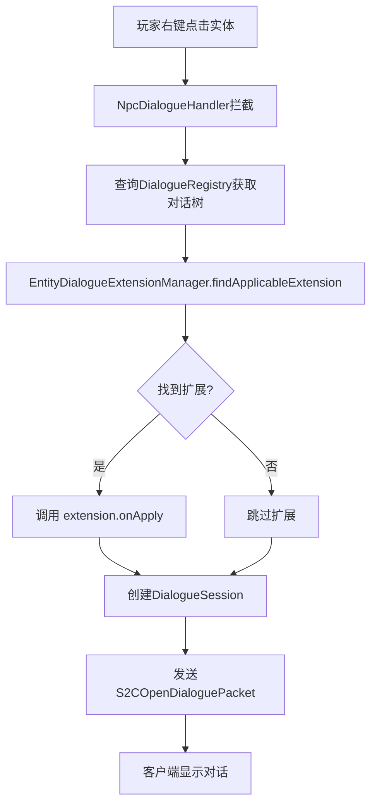

# 对话系统详解

**模块**: dialogue/  
**最后更新**: 2026-04-20  
**版本**: v3.3（修复文档API一致性，新增对话树GAME_TICK冷却）

---

## 📋 目录

1. [对话树设计](#对话树设计)
2. [生命周期管理](#生命周期管理)
3. [NPC交互流程](#npc交互流程)
4. [动作执行机制](#动作执行机制)
5. [上下文变量替换](#上下文变量替换)
6. [条件系统](#条件系统)
7. [权重与优先级系统](#权重与优先级系统)
8. [动态文本与预设动作](#动态文本与预设动作)
9. [IEntityDialogueExtension扩展系统](#ientitydialogueextension扩展系统)
10. [游戏时间刻冷却系统](#游戏时间刻冷却系统)
11. [实战示例](#实战示例)

---

## 对话树设计

### 基本结构

```
DialogueTree (对话树)
├── dialogueId: "villager_greeting"
├── defaultNpc: "村民"
├── startNodeId: "start"
├── nodes: Map<String, DialogueNode>
│   ├── "start" → DialogueNode
│   │   ├── speaker: "村民"
│   │   ├── text: "你好，冒险者！"
│   │   ├── choices: List<DialogueChoice>
│   │   │   ├── choice[0]: "接受任务" → goTo("accept")
│   │   │   └── choice[1]: "离开" → close()
│   │   └── autoNextId: null
│   └── "accept" → DialogueNode
│       ├── speaker: "村民"
│       ├── text: "谢谢你！"
│       ├── choices: []
│       └── autoNextId: null
└── visualConfig: QuestVisualConfig
```

---

### 节点类型

#### 1. 选择节点（有选项）

**特征**: `choices.size() > 0`

**示例**:
```java
.node("start")
    .say("你需要帮助吗？")
    .choice("是的", c -> c.goTo("help"))
    .choice("不需要", c -> c.close())
```

**行为**:
- 客户端显示选项列表
- 等待玩家选择
- 根据选择跳转到不同节点或关闭对话

---

#### 2. 自动推进节点（无选项）

**特征**: `choices.isEmpty() && autoNextId != null`

**示例**:
```java
.node("intro")
    .say("让我给你讲个故事...")
    .autoNext("story_part2")
```

**行为**:
- 显示文本后自动跳转
- 可配置延迟时间（默认1.5秒）
- 适合连续叙述

---

#### 3. 终止节点

**特征**: `choices.isEmpty() && autoNextId == null`

**示例**:
```java
.node("farewell")
    .say("再见！")
```

**行为**:
- 显示文本后自动关闭对话
- 无需额外配置

---

## 生命周期管理

### 三层生命周期配置

对话系统支持在三个层级配置可重复性和冷却时间：

| 层级 | 配置项 | 作用范围 | 数据存储 |
|------|--------|----------|----------|
| **对话树** | `repeatable`, `cooldownSeconds` | 整个对话的启动 | `dialogueHistory` |
| **节点** | `repeatable`, `cooldownSeconds` | 节点的访问 | `nodeVisitHistory` |
| **选项** | `repeatable`, `cooldownSeconds` | 选项的选择 | `choiceSelectionHistory` |

---

### 1. 对话树级别

#### 一次性对话（默认）

```java
DialogueTreeBuilder.create("one_time_intro")
    .npc("神秘老人")
    .repeatable(false)  // 玩家只能进行一次此对话
    
    .node("start")
        .say("我是时间的守护者...")
        .choice("聆听", c -> c.goTo("story"))
    
    .buildAndRegister();
```

**行为**:
- ✅ 玩家首次对话正常进行
- ❌ 第二次尝试对话时被阻止
- 💾 记录到 `dialogueHistory`

---

#### 带冷却的可重复对话

```java
DialogueTreeBuilder.create("daily_greeting")
    .npc("村民")
    .repeatable(true)
    .cooldown(86400)  // 24小时冷却
    
    .node("start")
        .say("早上好！这是今天的奖励。")
        .choice("谢谢", c -> c.giveItem("minecraft:bread", 5).close())
    
    .buildAndRegister();
```

**行为**:
- ✅ 玩家每天可与 NPC 对话一次
- ⏰ 冷却期间尝试对话被阻止
- 💾 记录最后对话时间戳

---

### 2. 节点级别

#### 一次性节点

```java
.node("backstory")
    .say("让我告诉你我的过去...")
    .repeatable(false)  // 此节点只能访问一次
    .choice("明白了", c -> c.goTo("next"))
```

**行为**:
- ✅ 首次访问正常显示
- ❌ 再次到达此节点时被跳过或报错
- 💾 记录到 `nodeVisitHistory`

---

#### 带冷却的节点

```java
.node("daily_hint")
    .say("今天的提示是：去北边的山洞看看。")
    .repeatable(true)
    .cooldown(3600)  // 1小时冷却
    .choice("好的", c -> c.close())
```

**行为**:
- ✅ 每小时可提供一次提示
- ⏰ 冷却期间无法再次访问
- 💾 记录最后访问时间戳

---

### 3. 选项级别

#### 一次性选项

``java
.node("reward_choice")
    .say("选择一个奖励：")
    .choice("金币 x100（仅限一次）", c -> c
        .giveItem("minecraft:gold_ingot", 100)
        .repeatable(false)  // 此选项只能选择一次
        .close())
    .choice("经验瓶 x10（仅限一次）\", c -> c
        .giveXp(100)
        .repeatable(false)
        .close())
```

**行为**:
- ✅ 每个选项只能选择一次
- 👁️ 已选择的选项自动隐藏（需配合条件）
- 💾 记录到 `choiceSelectionHistory`

---

#### 带冷却的选项

```java
.node("shop")
    .say("今日特惠：")
    .choice("购买药水（1小时冷却）", c -> c
        .giveItem("minecraft:potion\", 1)
        .repeatable(true)
        .cooldown(3600)
        .close())
```

**行为**:
- ✅ 每小时可购买一次
- ⏰ 冷却期间选项不可见或禁用
- 💾 记录最后选择时间戳

---

### 配置冲突检测

系统会在注册时自动检测不合理的配置组合：

#### ❌ 冲突1：一次性对话 + 节点冷却

``java
DialogueTreeBuilder.create("invalid_dialogue")
    .repeatable(false)  // 一次性对话
    .node("start")
        .cooldown(3600)  // ❌ 报错：Cooldown is meaningless for one-time dialogue tree
```

**错误信息**:
```
WARN [DialogueRegistry] Dialogue 'invalid_dialogue' has validation errors:
WARN   - Node 'start' has cooldownSeconds=3600 but dialogue tree is one-time (repeatable=false). Cooldown is meaningless.
```

---

#### ❌ 冲突2：一次性节点 + 节点冷却

``java
.node("intro")
    .repeatable(false)  // 一次性节点
    .cooldown(3600)     // ❌ 报错：Cooldown is meaningless for one-time nodes
```

---

#### ❌ 冲突3：一次性选项 + 选项冷却

``java
.choice("Accept Reward", c -> c.giveItem("...").close())
    .repeatable(false)  // 一次性选项
    .cooldown(3600)     // ❌ 报错：Cooldown is meaningless for one-time choices
```

---

### 数据持久化

所有历史记录存储在玩家的 `IQuestCapability` 中，完全独立：

```java
// 每个玩家独立的 HashMap
private final Map<String, Long> dialogueHistory = new HashMap<>();      // dialogueId -> timestamp
private final Map<String, Long> nodeVisitHistory = new HashMap<>();     // nodeId -> timestamp
private final Map<String, Long> choiceSelectionHistory = new HashMap<>(); // choiceKey -> timestamp
```

**特性**:
- ✅ 玩家退出游戏后数据保留
- ✅ 服务器重启后数据保留
- ✅ 跨维度有效
- ✅ 玩家之间互不影响

**NBT 存储**:
```
playerdata/<UUID>.dat
└── ArcQuest
    ├── DialogueHistory
    │   ├── "epic_village_elder": 1712345678901
    │   └── "daily_greeting": 1712432078901
    ├── NodeVisitHistory
    │   ├── "backstory": 1712345678901
    │   └── "daily_hint": 1712432078901
    └── ChoiceSelectionHistory
        ├── "reward_choice:0": 1712345678901
        └── "shop:buy_potion": 1712432078901
```

---

## NPC交互流程

### 完整交互流程

```
graph TD
    A[玩家右键点击实体] --> B{实体是否有对话?}
    B -->|否| C[原版交互]
    B -->|是| D[NpcDialogueHandler拦截]
    D --> E[查询DialogueRegistry]
    E --> F{对话存在?}
    F -->|否| G[记录警告]
    F -->|是| H[创建DialogueSession]
    H --> I[发送S2COpenDialoguePacket]
    I --> J[客户端打开DialogueScreen]
    J --> K[显示起始节点]
    K --> L{节点类型?}
    L -->|选择节点| M[显示选项列表]
    L -->|自动推进| N[延迟后跳转]
    M --> O[玩家选择选项]
    O --> P[发送C2SDialogueChoicePacket]
    P --> Q[服务端执行动作]
    Q --> R[跳转到下一节点]
    R --> K
    N --> K
    K --> S{是否关闭?}
    S -->|是| T[结束会话]
    S -->|否| K
```

---

### NPC绑定方式

#### 方式1：通过Capability绑定

**适用**: 自定义NPC实体

```java
// 在实体初始化时
entity.getCapability(DialogueNpcPatchProvider.DIALOGUE_NPC_CAP)
    .ifPresent(patch -> {
        patch.setDialogueId("villager_greeting");
        patch.setNpcName("老村长");
    });
```

**优点**:
- 灵活，每个实体可独立配置
- 支持运行时动态修改

---

#### 方式2：实现IDialogueNpc接口

**适用**: 自定义NPC类

```java
public class MyNpcEntity extends Villager implements IDialogueNpc {
    @Override
    public String getDialogueId() {
        return "elder_dialogue";
    }
    
    @Override
    public String getNpcName() {
        return "智者";
    }
}
```

**优点**:
- 编译时类型检查
- 代码更清晰

---

#### 方式3：通过注册表绑定

**适用**: 原版实体或无法修改的实体

```java
// 在初始化时
DialogueRegistry.INSTANCE.bindNpc("villager", "villager_greeting");
```

**工作原理**:
```java
@SubscribeEvent
public static void onInteractEntity(PlayerInteractEvent.EntityInteract event) {
    Entity target = event.getTarget();
    
    // 1. 尝试获取Capability
    target.getCapability(DialogueNpcPatchProvider.DIALOGUE_NPC_CAP)
        .ifPresentOrElse(
            patch -> openDialogue(player, patch.getDialogueId()),
            () -> {
                // 2. 尝试IDialogueNpc接口
                if (target instanceof IDialogueNpc npc) {
                    openDialogue(player, npc.getDialogueId());
                } else {
                    // 3. 尝试注册表绑定
                    String entityType = ForgeRegistries.ENTITY_TYPES.getKey(target.getType()).toString();
                    String dialogueId = DialogueRegistry.INSTANCE.getDialogueForNpc(entityType);
                    if (dialogueId != null) {
                        openDialogue(player, dialogueId);
                    }
                }
            }
        );
}
```

---

## 动作执行机制

### DialogueAction 类型

#### 1. StartQuest - 开始任务

**用途**: 从对话中给予任务

**示例**:
```java
.choice("接受任务", c -> c.startQuest("arc_quest:epic_prologue").close())
```

**执行逻辑**:
```java
public record StartQuest(String questId) implements DialogueAction {
    @Override
    public void execute(ServerPlayer player, DialogueSession session) {
        QuestProgressHandler.acceptQuest(player, questId);
        
        // 触发立绘
        QuestDefinition def = QuestRegistry.get(ResourceLocation.parse(questId));
        if (def != null) {
            ClientQuestEvents.handleVisualTrigger(def, SplashType.QUEST_ACQUIRED, null);
        }
    }
}
```

---

#### 2. SetFlag - 设置标志位

**用途**: 记录对话状态，用于条件判断

**示例**:
```java
.choice("询问身世", c -> c.setFlag("knows_backstory").goTo("next"))
```

**执行逻辑**:
```java
public record SetFlag(String flagName) implements DialogueAction {
    @Override
    public void execute(ServerPlayer player, DialogueSession session) {
        IQuestCapability cap = getCapability(player);
        cap.setFlag(flagName);
    }
}
```

---

#### 3. NotifyInteract - 通知NPC交互

**用途**: 完成任务的交互目标

**示例**:
```java
.choice("打招呼", c -> c.notifyInteract("villager_npc").close())
```

**执行逻辑**:
```java
public record NotifyInteract(String npcId) implements DialogueAction {
    @Override
    public void execute(ServerPlayer player, DialogueSession session) {
        // 查找匹配的交互目标
        ObjectiveTracker.INSTANCE.notifyInteraction(
            player.getUUID(),
            npcId
        );
    }
}
```

---

#### 4. Close - 关闭对话

**用途**: 结束对话会话

**示例**:
```java
.choice("再见", c -> c.close())
```

**执行逻辑**:
```java
public record Close() implements DialogueAction {
    @Override
    public void execute(ServerPlayer player, DialogueSession session) {
        session.close();
        DialogueSessionManager.INSTANCE.endDialogue(player);
    }
}
```

---

#### 5. Custom - 自定义动作

**用途**: 扩展模组功能

**注册**:
```java
DialogueActionTypes.register(
    new ResourceLocation("mymod", "give_coins"),
    (player, data) -> {
        int amount = data.getInt("amount");
        EconomyAPI.addCoins(player, amount);
    }
);
```

**使用**:
```java
CompoundTag actionData = new CompoundTag();
actionData.putInt("amount", 500);

.choice("购买物品", c -> c.customAction("mymod:give_coins", actionData).close())
```

---

### 动作执行顺序

**规则**: 按列表中顺序依次执行

**示例**:
```java
.choice("接受任务", c -> c
    .setFlag("accepted_quest")      // 1. 设置flag
    .startQuest("my_quest")          // 2. 开始任务
    .notifyInteract("quest_giver")   // 3. 通知交互
    .close()                         // 4. 关闭对话
)
```

**执行流程**:
```java
for (DialogueAction action : choice.getActions()) {
    try {
        action.execute(player, session);
    } catch (Exception e) {
        LOGGER.error("Error executing dialogue action: {}", e.getMessage());
        // 继续执行下一个动作，不中断
    }
}
```

---

## 上下文变量替换

### DialogueContext 工作原理

**用途**: 在对话文本中动态插入变量

**示例**:
```
// 设置上下文变量
DialogueContext context = new DialogueContext();
context.put("player_name", player.getName().getString());
context.put("quest_name", "史诗序章");
context.put("villager_name", "老约翰");

// 创建对话时使用变量
.node("greeting")
    .say("你好，${player_name}！我是${villager_name}。")
    .build()

// 渲染时替换
String rendered = context.replaceVariables(node.getText());
// 输出：你好，Steve！我是老约翰。
```

---

### 内置变量

| 变量名 | 来源 | 示例值 |
|--------|------|--------|
| `${player_name}` | 玩家名称 | Steve |
| `${quest_name}` | 当前任务名 | 史诗序章 |
| `${phase_name}` | 当前阶段名 | 收集木材 |
| `${npc_name}` | NPC名称 | 老约翰 |

---

### 自定义变量

**在服务端设置**:
```java
// 在 DialogueSession 创建时
DialogueSession session = new DialogueSession(player, tree);
session.getContext().put("reputation", cap.getVariable("reputation"));
session.getContext().put("completed_quests", cap.getCompletedQuests().size());
```

**在对话中使用**:
```java
.node("status_check")
    .say("你的声望值是：${reputation}，已完成${completed_quests}个任务。")
```

---

## 条件系统

### DialogueCondition 类型总览

对话条件用于控制选项的可见性，支持多种判断逻辑：

| 条件类型 | 用途 | 示例 |
|---------|------|------|
| **任务相关** | 检查任务状态 | `HasQuest`, `QuestActive`, `QuestCompleted`, `QuestPhase` |
| **Flag/Variable** | 检查标志位和变量 | `HasFlag`, `VariableCheck` |
| **时间条件** | 检查游戏时间段 | `IsMorning`, `IsAfternoon`, `IsNight`, `GameTimeInRange` |
| **历史记录** | 检查对话/节点/选项历史 | `NodeVisited`, `ChoiceSelected`, `DialogueCompleted` |
| **冷却状态** | 精确检查冷却时间 | `NodeOnCooldown`, `ChoiceOnCooldown`, `DialogueOnCooldown` |
| **逻辑组合** | AND/OR/NOT | `All`, `Any`, `Not` |
| **自定义条件** | Lambda表达式 | `CustomCondition.of((player, npc) -> ...)` |

---

### 1. 任务相关条件

#### HasQuest - 拥有任务（任何状态）

```java
.choice("询问任务进度", c -> c.goTo("quest_status"))
    .onlyIf(new DialogueCondition.HasQuest("arc_quest:epic_prologue"))
```

---

#### QuestActive - 任务进行中

```java
.choice("继续任务", c -> c.goTo("continue"))
    .onlyIf(new DialogueCondition.QuestActive("arc_quest:epic_prologue"))
```

---

#### QuestCompleted - 任务已完成

```java
.choice("领取奖励", c -> c.giveItem("...").close())
    .onlyIf(new DialogueCondition.QuestCompleted("arc_quest:epic_prologue"))
```

---

#### QuestPhase - 任务处于特定阶段

```java
.choice("汇报进度", c -> c.goTo("report"))
    .onlyIf(new DialogueCondition.QuestPhase("arc_quest:epic_prologue", "gather_wood"))
```

---

### 2. 历史状态条件 ⭐ **新增**

#### NodeVisited - 节点是否被访问过

**用途**: 实现一次性剧情节点

```java
// 仅当玩家未访问过 intro_story 节点时显示选项
.choiceIf(
    new DialogueCondition.Not(new DialogueCondition.NodeVisited("intro_story")),
    "介绍故事背景",
    c -> c.goTo("intro_story")
)
```

**应用场景**:
- 新手引导（只显示一次）
- 剧情揭示（避免剧透重复）
- 一次性提示

---

#### ChoiceSelected - 选项是否被选择过

**用途**: 实现一次性奖励选项

```java
// 仅当玩家未选择过该选项时显示
.choiceIf(
    new DialogueCondition.Not(new DialogueCondition.ChoiceSelected("start:reward")),
    "领取新手礼包（仅限一次）",
    c -> c.giveItem("minecraft:diamond", 5).close()
)
```

**选项键格式**:
- 推荐：`nodeId:choiceIndex` （如 `"start:0"`）
- 或自定义唯一键（如 `"daily_reward_2024"`）

---

#### DialogueCompleted - 对话树是否已完成

**用途**: 实现首次见面礼

```java
// 仅当玩家未完成此对话树时显示
.choiceIf(
    new DialogueCondition.Not(new DialogueCondition.DialogueCompleted("epic_village_elder")),
    "首次见面礼",
    c -> c.giveItem("minecraft:bread", 10).close()
)
```

---

### 3. 冷却状态条件 ⭐ **新增**

> ⚠️ **重要**：冷却条件需要手动指定冷却时间，必须与定义中的 `cooldownSeconds` 一致。

#### NodeOnCooldown - 节点是否在冷却中

```java
// 每日任务节点（24小时冷却）
.choiceIf(
    new DialogueCondition.Not(new DialogueCondition.NodeOnCooldown("daily_quest", 86400)),
    "领取每日任务",
    c -> c.goTo("daily_quest_node")
)
```

**工作原理**:
```java
long lastTime = cap.getLastNodeVisit(nodeId);
if (lastTime == 0) return false; // 从未访问过，不在冷却中

long currentTime = System.currentTimeMillis();
long cooldownMs = cooldownSeconds * 1000;
return (currentTime - lastTime) < cooldownMs; // 精确判断
```

---

#### ChoiceOnCooldown - 选项是否在冷却中

```java
// 提示选项（1小时冷却）
.choiceIf(
    new DialogueCondition.Not(new DialogueCondition.ChoiceOnCooldown("start:hint", 3600)),
    "获取提示（1小时冷却）",
    c -> c.goTo("hint_node")
)
```

---

#### DialogueOnCooldown - 对话树是否在冷却中

```java
// NPC 对话冷却（2小时）
.choiceIf(
    new DialogueCondition.Not(new DialogueCondition.DialogueOnCooldown("epic_village_elder", 7200)),
    "再次交谈（2小时后可用）",
    c -> c.goTo("repeat_chat")
)
```

---

### 4. 逻辑组合条件

#### Not - 逻辑取反

```java
// 仅当玩家没有某个任务时显示
.choiceIf(
    new DialogueCondition.Not(new DialogueCondition.HasQuest("arc_quest:epic_prologue")),
    "接受任务",
    c -> c.startQuest("arc_quest:epic_prologue").close()
)
```

---

#### All - 所有条件均满足（AND）

```java
// 需要同时满足多个条件
.choiceIf(
    new DialogueCondition.All(List.of(
        new DialogueCondition.QuestCompleted("arc_quest:epic_prologue"),
        new DialogueCondition.HasFlag("reached_level_10"),
        new DialogueCondition.Not(new DialogueCondition.HasQuest("arc_quest:epic_chapter1"))
    )),
    "开始第一章",
    c -> c.startQuest("arc_quest:epic_chapter1").close()
)
```

---

#### Any - 任一条件满足（OR）

```java
// 满足任一条件即可
.choiceIf(
    new DialogueCondition.Any(List.of(
        new DialogueCondition.QuestCompleted("arc_quest:side_quest_a"),
        new DialogueCondition.QuestCompleted("arc_quest:side_quest_b")
    )),
    "解锁隐藏剧情",
    c -> c.goTo("secret_story")
)
```

---

### 5. 实战：复杂条件组合

#### 示例：分支选择

```java
.node("branch_choice")
    .say("你选择了哪条道路？")
    
    // 战斗路线：需要完成序章且有战斗标记
    .choiceIf(
        new DialogueCondition.All(List.of(
            new DialogueCondition.QuestCompleted("arc_quest:epic_prologue"),
            new DialogueCondition.HasFlag("combat_ready")
        )),
        "战斗之路（需战斗准备）",
        c -> c.setFlag("chose_combat_path").goTo("combat_intro")
    )
    
    // 探索路线：需要完成序章且有特定道具
    .choiceIf(
        new DialogueCondition.All(List.of(
            new DialogueCondition.QuestCompleted("arc_quest:epic_prologue"),
            new DialogueCondition.HasQuest("arc_quest:has_compass")
        )),
        "探索之路（需指南针）",
        c -> c.setFlag("chose_exploration_path").goTo("exploration_intro")
    )
    
    // 默认选项：未达到条件
    .choice("我还没准备好", c -> c.close())
```

---

#### 示例：周期性内容

```java
.node("daily_rewards")
    .say("今日奖励已刷新！")
    
    // 每日签到（24小时冷却）
    .choiceIf(
        new DialogueCondition.Not(new DialogueCondition.NodeOnCooldown("daily_signin", 86400)),
        "签到领取奖励",
        c -> c
            .giveItem("minecraft:gold_ingot", 10)
            .close()
    )
    
    // 每小时提示
    .choiceIf(
        new DialogueCondition.Not(new DialogueCondition.NodeOnCooldown("daily_hint", 3600)),
        "获取今日提示",
        c -> c.goTo("hint_node")
    )
    
    // 总是可见的退出选项
    .choice("离开", c -> c.close())
```

---

## 权重与优先级系统

### 概述

权重系统允许你控制多个条件同时满足时，哪些选项或文本应该显示。通过设置 `priority`（优先级），高优先级的内容会覆盖低优先级的内容。

**核心规则**：
1. ✅ **最高优先级胜出**：只显示优先级最高的选项/文本
2. ✅ **平局处理**：相同优先级时，按定义顺序选择第一个
3. ✅ **默认优先级**：不指定时为 `0`
4. ✅ **支持负数**：可以使用负数优先级

---

### 1. 选项优先级（DialogueChoice）

#### API

```java
// 方式1：简化方法（推荐简单场景）
public DialogueTreeBuilder choice(String text, String nextNodeId, int priority);
public DialogueTreeBuilder choiceIf(DialogueCondition condition, String text, 
                                    String nextNodeId, int priority);

// 方式2：Consumer 模式（推荐复杂配置）
.choice("文本", choice -> {
    choice.goTo("node")
          .priority(100)
          .action(giveItem)
          .cooldown(60);
})
```

---

#### 示例1：基础优先级

```java
.node("greeting")
    .say("你好，旅行者！")
    
    // 默认选项（priority = 0）
    .choice("闲聊", "chat", 0)
    
    // 高优先级：任务相关（priority = 50）
    .choiceIf(
        new DialogueCondition.HasQuest("help_village"),
        "汇报任务进度",
        "quest_report",
        50
    )
    
    // 更高优先级：紧急事件（priority = 100）
    .choiceIf(
        new DialogueCondition.QuestPhase("defend_village", "under_attack"),
        "村庄正在被攻击！",
        "emergency",
        100
    )
```

**效果**：
| 玩家状态 | 显示选项 |
|---------|----------|
| 无特殊状态 | "闲聊" (priority 0) |
| 有任务 | "汇报任务进度" (priority 50) |
| 村庄被攻击 | "村庄正在被攻击！" (priority 100) |

---

#### 示例2：相同优先级

```java
.node("rewards")
    .say("选择一个奖励：")
    
    // 两个选项优先级相同
    .choiceIf(
        new DialogueCondition.HasFlag("vip_member"),
        "金币 x100",
        "reward_gold",
        50
    )
    .choiceIf(
        new DialogueCondition.QuestCompleted("side_quest"),
        "经验瓶 x10",
        "reward_xp",
        50
    )
```

**行为**：如果两个条件都满足，显示**先定义**的选项（"金币 x100"）。

---

#### 示例3：Boss战前对话

```java
.node("boss_taunt")
    .say("你竟敢挑战我？")
    
    // 未做好准备（强制显示警告）
    .choiceIf(
        new DialogueCondition.Not(new DialogueCondition.HasFlag("battle_ready")),
        "回去练练吧，蝼蚁！",
        "dismiss",
        200  // ← 超高优先级
    )
    
    // 已完成前置任务
    .choiceIf(
        new DialogueCondition.QuestCompleted("prepare_battle"),
        "看来你做好了准备...",
        "ready",
        100
    )
    
    // 普通挑战者
    .choiceIf(
        new DialogueCondition.HasFlag("battle_ready"),
        "让我看看你的实力！",
        "challenge",
        50
    )
```

**效果**：
- 未做好准备 → 始终显示 "回去练练吧"（priority 200）
- 完成前置 + 做好准备 → 显示 "做好准备"（priority 100）
- 做好准备 → 显示 "让我看看"（priority 50）

---

### 2. 条件文本优先级（sayIf）

#### API

```java
// 不带优先级（默认 priority = 0）
public DialogueTreeBuilder sayIf(DialogueCondition condition, String text);

// 带优先级
public DialogueTreeBuilder sayIf(DialogueCondition condition, String text, int priority);
```

---

#### 示例1：NPC声望系统

```java
.node("blacksmith")
    .say("需要修理装备吗？")  // priority = 0
    
    // 陌生人
    .sayIf(
        new DialogueCondition.Not(new DialogueCondition.HasQuest("help_blacksmith")),
        "第一次来？先帮我个忙吧。",
        0
    )
    
    // 朋友
    .sayIf(
        new DialogueCondition.QuestCompleted("help_blacksmith"),
        "老朋友，给你打九折！",
        50
    )
    
    // VIP
    .sayIf(
        new DialogueCondition.All(List.of(
            new DialogueCondition.QuestCompleted("help_blacksmith"),
            new DialogueCondition.HasFlag("vip_customer")
        )),
        "大师，您的订单我亲自处理！",
        100
    )
```

**效果**：
- 无特殊状态 → "需要修理装备吗？"
- 完成任务 → "老朋友，给你打九折！"
- 完成任务 + VIP标记 → "大师，您的订单我亲自处理！"

---

#### 示例2：多语言问候

```java
.node("greeting")
    .say("Hello!")  // 默认英语
    
    .sayIf(
        new DialogueCondition.HasFlag("language_french"),
        "Bonjour!",
        10
    )
    
    .sayIf(
        new DialogueCondition.HasFlag("language_japanese"),
        "こんにちは！",
        10
    )
    
    .sayIf(
        new DialogueCondition.HasFlag("language_chinese"),
        "你好！",
        10
    )
```

**行为**：相同优先级时，显示**先定义**的匹配文本。

---

### 3. 工作原理

#### 选项过滤流程

```java
// DialogueSession.evaluateVisibleChoices()

// 步骤1：收集所有满足条件的选项
List<DialogueChoice> passingChoices = new ArrayList<>();
for (DialogueChoice choice : currentNode.choices()) {
    boolean pass = choice.conditions().isEmpty()
            || choice.conditions().stream().allMatch(c -> c.test(player, npc));
    if (pass) {
        passingChoices.add(choice);
    }
}

// 步骤2：找到最高优先级
int maxPriority = passingChoices.stream()
        .mapToInt(DialogueChoice::priority)
        .max()
        .orElse(0);

// 步骤3：只保留最高优先级的选项
List<DialogueChoice> filtered = new ArrayList<>();
for (DialogueChoice choice : passingChoices) {
    if (choice.priority() == maxPriority) {
        filtered.add(choice);
    }
}
visibleChoices = List.copyOf(filtered);
```

---

#### 条件文本评估流程

```java
// ConditionalTextEvaluator.evaluate()

// 步骤1：解析序列化格式 "priority|condition"
for (Map.Entry<String, String> entry : conditionalTexts.entrySet()) {
    String key = entry.getKey();  // "50|HAS_QUEST:quest_id"
    String text = entry.getValue();
    
    // 解析优先级
    int separatorIndex = key.indexOf('|');
    int priority = Integer.parseInt(key.substring(0, separatorIndex));
    String conditionKey = key.substring(separatorIndex + 1);
    
    if (matchesCondition(player, cap, conditionKey)) {
        matches.add(new TextMatch(text, priority));
    }
}

// 步骤2：找到最高优先级
int maxPriority = matches.stream()
        .mapToInt(m -> m.priority)
        .max()
        .orElse(0);

// 步骤3：返回第一个最高优先级的匹配
for (TextMatch match : matches) {
    if (match.priority == maxPriority) {
        return match.text;
    }
}
```

---

### 4. 最佳实践

#### 优先级建议值

| 场景 | 建议优先级 | 说明 |
|------|-----------|------|
| **默认/兜底** | 0 | 无条件显示的选项 |
| **普通条件** | 10-50 | 任务状态、等级等 |
| **重要条件** | 50-100 | 关键剧情、分支选择 |
| **紧急/强制** | 100-200 | 警告、错误提示 |
| **系统级** | 200+ | 权限检查、封禁提示 |

---

#### 设计原则

1. **保持简洁**：不要过度使用优先级，尽量让逻辑清晰
2. **文档化**：在代码注释中说明为什么设置某个优先级
3. **测试边界**：确保相同优先级时的行为符合预期
4. **避免冲突**：不同层级的优先级应该有明显的差距

---

#### 常见错误

❌ **错误1：优先级差距太小**
```java
.choice("选项A", "node_a", 50)
.choice("选项B", "node_b", 51)  // 难以维护
```

✅ **正确：使用明显的间隔**
```java
.choice("选项A", "node_a", 50)
.choice("选项B", "node_b", 100)  // 清晰的层级
```

---

❌ **错误2：忘记默认选项**
```java
.choiceIf(condition, "条件选项", "node", 100)
// 如果条件不满足，没有任何选项显示！
```

✅ **正确：提供兜底选项**
```java
.choiceIf(condition, "条件选项", "node", 100)
.choice("默认选项", "default_node", 0)  // 总是可见
```

---

## 动态文本与预设动作

### sayIf() - 条件文本

**用途**: 根据条件动态显示不同的对话文本

**API**:
```java
public DialogueTreeBuilder sayIf(DialogueCondition condition, String text)
```

**工作原理**:
1. 在服务端评估所有 `sayIf()` 条件
2. 第一个满足条件的文本被选中
3. 如果都不满足，使用最后的 `say()` 作为兜底

---

#### 示例1：根据任务状态显示不同文本

```java
.node("start")
    // 情况1：完全新手
    .sayIf(
        new DialogueCondition.Not(new DialogueCondition.HasQuest("arc_quest:epic_prologue")),
        "你好，冒险者！我是村庄长老。"
    )
    
    // 情况2：序章进行中
    .sayIf(
        new DialogueCondition.QuestPhase("arc_quest:epic_prologue", "gather_wood"),
        "木材收集得怎么样了？"
    )
    
    // 情况3：序章已完成
    .sayIf(
        new DialogueCondition.QuestCompleted("arc_quest:epic_prologue"),
        "感谢你保护了村庄！"
    )
    
    // 默认文本（兜底）
    .say("欢迎回到村庄。")
```

**执行流程**:
```
玩家打开对话
  ↓
服务端评估条件（按顺序）
  ↓
找到第一个满足的条件 → 返回对应文本
  ↓
发送到客户端显示
```

---

#### 示例2：复杂条件组合

```java
.node("greeting")
    // 传奇英雄
    .sayIf(
        new DialogueCondition.QuestCompleted("arc_quest:epic_finale"),
        "向您致敬，传奇英雄！"
    )
    
    // 第一章完成，等待分支选择
    .sayIf(
        new DialogueCondition.All(List.of(
            new DialogueCondition.QuestCompleted("arc_quest:epic_chapter1"),
            new DialogueCondition.Not(new DialogueCondition.HasQuest("arc_quest:epic_branch_choice"))
        )),
        "你已准备好做出选择了。"
    )
    
    // 默认
    .say("你好，旅行者。")
```

---

### choiceIf() - 条件选项

**用途**: 根据条件动态显示/隐藏选项

**API**:
```java
public DialogueTreeBuilder choiceIf(
    DialogueCondition condition, 
    String text,
    Consumer<ChoiceBuilder> configurator
)
```

**示例**:
```java
.node("main_menu")
    .say("你想做什么？")
    
    // 仅当未接受任务时显示
    .choiceIf(
        new DialogueCondition.Not(new DialogueCondition.HasQuest("quest_id")),
        "接受任务",
        c -> c.startQuest("quest_id").close()
    )
    
    // 仅当任务进行中时显示
    .choiceIf(
        new DialogueCondition.QuestActive("quest_id"),
        "汇报进度",
        c -> c.goTo("report")
    )
    
    // 仅当任务完成后显示
    .choiceIf(
        new DialogueCondition.QuestCompleted("quest_id"),
        "领取奖励",
        c -> c.giveItem("...").close()
    )
    
    // 总是显示
    .choice("离开", c -> c.close())
```

---

### PresetActions - 预设动作

**位置**: `org.com.arc_quest.dialogue.action.PresetActions`

**用途**: 提供常用的物品给予、效果施加等快捷方法

---

#### 内置预设动作（ChoiceBuilder 方法）

| 方法 | 说明 | 等效操作 |
|------|------|----------|
| `presetStoneSword()` | 给予石剑 x1 | `giveItem("minecraft:stone_sword", 1)` |
| `presetIronArmorSet()` | 给予铁甲全套 | 4个 giveItem 调用 |
| `presetDiamondArmorSet()` | 给予钻石甲全套 | 4个 giveItem 调用 |
| `presetNetheriteIngot()` | 给予下界合金锭 x1 | `giveItem("minecraft:netherite_ingot", 1)` |
| `presetTorches()` | 给予火把 x32 | `giveItem("minecraft:torch", 32)` |
| `presetBread()` | 给予面包 x4 | `giveItem("minecraft:bread", 4)` |
| `presetStrength()` | 给予力量效果60秒 | `runCommand("effect give @p minecraft:strength 60 0")` |
| `presetHeroOfVillage()` | 给予村庄英雄30分钟 | `runCommand("effect give @p minecraft:hero_of_the_village 1800 0")` |

---

#### 使用示例

```java
.choice("领取新手礼包", c -> c
    .presetStoneSword()           // 石剑
    .presetBread()                // 面包
    .presetTorches()              // 火把
    .close()
)

.choice("领取高级装备", c -> c
    .presetIronArmorSet()         // 铁甲全套
    .presetStrength()             // 力量效果
    .close()
)

.choice("传奇奖励", c -> c
    .presetDiamondArmorSet()      // 钻石甲全套
    .presetNetheriteIngot()       // 下界合金锭
    .presetHeroOfVillage()        // 村庄英雄
    .close()
)
```

---

#### 自定义预设动作

你可以在自己的代码中创建类似的预设方法：

```java
public class MyPresetActions {
    
    /** 给予玩家探险家套装 */
    public static void applyExplorerKit(ChoiceBuilder builder) {
        builder
            .giveItem("minecraft:leather_helmet", 1)
            .giveItem("minecraft:compass", 1)
            .giveItem("minecraft:map", 1)
            .giveItem("minecraft:torch", 16);
    }
}

// 使用
.choice("领取探险家套装", c -> {
    MyPresetActions.applyExplorerKit(c);
    c.close();
})
```

---

#### PresetActions 工具类

**位置**: `org.com.arc_quest.dialogue.action.PresetActions`

**提供的静态方法**:

| 方法 | 参数 | 说明 |
|------|------|------|
| `awardItem()` | ServerPlayer, Item, int | 玩家获得物品 |
| `giveItem()` | ServerPlayer, Item | 玩家失去物品 |
| `exChangeItem()` | ServerPlayer, Item, Item | 玩家交换物品 |
| `addEffects()` | ServerPlayer, MobEffect, int, int | 玩家获得效果 |
| `triggerInteraction()` | ServerPlayer, String | 触发任务交互标识 |
| `addEvents()` | ServerPlayer, Entity, BiConsumer | 添加自定义事件处理器 |

**使用场景**:
- 在自定义 DialogueAction 中调用
- 在 Lambda 回调中使用
- 扩展模组功能时复用

---

#### 示例：使用 addEvents Lambda 回调

```java
.choice("特殊互动", c -> c
    .addEvents((player, target) -> {
        // 自定义逻辑
        PresetActions.addEffects(player, MobEffects.SPEED, 1200, 1);
        player.sendMessage(
            Component.literal("你获得了速度提升！"), 
            Util.NIL_UUID
        );
    })
    .close()
)
```

---

## IEntityDialogueExtension扩展系统

### 概述

`IEntityDialogueExtension` 是一个强大的扩展系统，允许你为不同类型的实体（村民、流浪商人、自定义NPC等）添加**专属的对话行为**。通过注解驱动的方式，系统会自动扫描并注册扩展。

**核心优势**：
- ✅ **自动发现**：使用 `@EntityDialogueExtension` 注解，无需手动注册
- ✅ **类型安全**：泛型约束确保扩展与实体类型匹配
- ✅ **灵活扩展**：可以为任何实体类型添加自定义逻辑
- ✅ **优先级控制**：支持多个扩展冲突时的优先级选择

---

### 1. 核心接口

#### IEntityDialogueExtension<T>

```java
public interface IEntityDialogueExtension<T extends Entity> {
    /**
     * 获取支持的实体类型
     */
    Class<T> getSupportedEntityType();
    
    /**
     * 检查实体是否可以使用此扩展
     */
    boolean canApply(T entity);
    
    /**
     * 应用扩展（在对话开始前调用）
     */
    void onApply(T entity, ServerPlayer player, DialogueSession session);
    
    /**
     * 获取扩展优先级（数值越大优先级越高）
     */
    default int getPriority() {
        return 0;
    }
}
```

---

### 2. 注解驱动

#### @EntityDialogueExtension

```java
@Target(ElementType.TYPE)
@Retention(RetentionPolicy.RUNTIME)
public @interface EntityDialogueExtension {
    /**
     * 扩展名称（唯一标识）
     */
    String value();
    
    /**
     * 优先级（默认 0）
     */
    int priority() default 0;
}
```

---

### 3. 内置扩展示例

#### 示例1：村民长老扩展

**文件**: `dialogue/extension/VillageElderExtension.java`

```java
@EntityDialogueExtension(value = "village_elder", priority = 100)
public class VillageElderExtension implements IEntityDialogueExtension<Villager> {
    
    @Override
    public Class<Villager> getSupportedEntityType() {
        return Villager.class;
    }
    
    @Override
    public boolean canApply(Villager entity) {
        // 只应用于带有 "elder" 标签的村民
        return entity.getTags().contains("elder");
    }
    
    @Override
    public void onApply(Villager entity, ServerPlayer player, DialogueSession session) {
        // 设置上下文变量
        session.getContext().put("elder_name", entity.getCustomName() != null 
            ? entity.getCustomName().getString() 
            : "村长");
        
        // 给予玩家村庄英雄效果
        if (player != null) {
            player.addEffect(new MobEffectInstance(
                MobEffects.HERO_OF_THE_VILLAGE, 
                6000,  // 5分钟
                0
            ));
        }
        
        Arc_quest.LOGGER.info("[VillageElder] Applied elder extension to villager at {}", 
            entity.blockPosition());
    }
}
```

---

#### 示例2：流浪商人扩展

**文件**: `dialogue/extension/TraderExtension.java`

```java
@EntityDialogueExtension(value = "wandering_trader", priority = 50)
public class TraderExtension implements IEntityDialogueExtension<WanderingTrader> {
    
    @Override
    public Class<WanderingTrader> getSupportedEntityType() {
        return WanderingTrader.class;
    }
    
    @Override
    public boolean canApply(WanderingTrader entity) {
        return true;  // 应用于所有流浪商人
    }
    
    @Override
    public void onApply(WanderingTrader entity, ServerPlayer player, DialogueSession session) {
        // 随机折扣（50% - 80%）
        double discount = 0.5 + Math.random() * 0.3;
        session.getContext().put("discount", String.format("%.0f%%", discount * 100));
        
        // 记录交易次数
        int tradeCount = entity.getPersistentData().getInt("trade_count");
        session.getContext().put("trade_count", String.valueOf(tradeCount));
        
        Arc_quest.LOGGER.info("[Trader] Applied trader extension with discount: {}", discount);
    }
}
```

---

#### 示例3：铁匠扩展

**文件**: `dialogue/extension/BlacksmithExtension.java`

```java
@EntityDialogueExtension(value = "blacksmith", priority = 75)
public class BlacksmithExtension implements IEntityDialogueExtension<Villager> {
    
    @Override
    public Class<Villager> getSupportedEntityType() {
        return Villager.class;
    }
    
    @Override
    public boolean canApply(Villager entity) {
        // 只应用于职业为铁匠的村民
        return entity.getVillagerData().getProfession() == VillagerProfession.ARMORER
            || entity.getVillagerData().getProfession() == VillagerProfession.TOOLSMITH
            || entity.getVillagerData().getProfession() == VillagerProfession.WEAPONSMITH;
    }
    
    @Override
    public void onApply(Villager entity, ServerPlayer player, DialogueSession session) {
        // 检查玩家装备耐久度
        ItemStack mainHand = player.getMainHandItem();
        if (!mainHand.isEmpty() && mainHand.isDamageableItem()) {
            int durabilityPercent = (int) ((1.0 - (double) mainHand.getDamageValue() / mainHand.getMaxDamage()) * 100);
            session.getContext().put("weapon_durability", String.valueOf(durabilityPercent));
        }
        
        Arc_quest.LOGGER.info("[Blacksmith] Applied blacksmith extension");
    }
}
```

---

### 4. 扩展管理器

#### EntityDialogueExtensionManager

**位置**: `dialogue/registry/EntityDialogueExtensionManager.java`

**职责**：
- 自动扫描并注册所有带 `@EntityDialogueExtension` 注解的类
- 管理扩展的优先级和冲突解决
- 提供扩展查询接口

**核心方法**：

```java
// 初始化（在 FMLCommonSetupEvent 中调用）
public static void init() {
    // 自动扫描并注册
    List<IEntityDialogueExtension<?>> extensions = 
        AnnotatedInstanceUtil.getInstances(EntityDialogueExtension.class);
    
    for (IEntityDialogueExtension<?> ext : extensions) {
        register(ext);
    }
}

// 注册扩展
public static void register(IEntityDialogueExtension<?> extension);

// 查找适用的扩展
public static Optional<IEntityDialogueExtension<?>> findApplicableExtension(Entity entity);

// 应用扩展
public static void applyExtension(Entity entity, ServerPlayer player, DialogueSession session);
```

---

### 5. 工作流程



---

### 6. 实战示例

#### 示例1：动态对话内容

```java
@EntityDialogueExtension(value = "quest_giver", priority = 100)
public class QuestGiverExtension implements IEntityDialogueExtension<Villager> {
    
    @Override
    public Class<Villager> getSupportedEntityType() {
        return Villager.class;
    }
    
    @Override
    public boolean canApply(Villager entity) {
        return entity.getPersistentData().contains("quest_id");
    }
    
    @Override
    public void onApply(Villager entity, ServerPlayer player, DialogueSession session) {
        String questId = entity.getPersistentData().getString("quest_id");
        session.getContext().put("available_quest", questId);
        
        // 检查任务状态
        IQuestCapability cap = player.getCapability(QuestCapabilityProvider.QUEST_CAP).orElse(null);
        if (cap != null) {
            if (cap.hasQuest(questId)) {
                session.getContext().put("quest_status", "active");
            } else if (cap.isQuestCompleted(questId)) {
                session.getContext().put("quest_status", "completed");
            } else {
                session.getContext().put("quest_status", "available");
            }
        }
    }
}
```

**在对话中使用**：
```java
.node("start")
    .sayIf(
        new DialogueCondition.QuestPhase("${available_quest}", "active"),
        "你的任务进展如何？"
    )
    .sayIf(
        new DialogueCondition.QuestPhase("${available_quest}", "completed"),
        "太棒了！来领取奖励吧。"
    )
    .say("我有一个任务给你，要接受吗？")
```

---

#### 示例2：声望系统

```java
@EntityDialogueExtension(value = "reputation_npc", priority = 80)
public class ReputationExtension implements IEntityDialogueExtension<Villager> {
    
    @Override
    public Class<Villager> getSupportedEntityType() {
        return Villager.class;
    }
    
    @Override
    public boolean canApply(Villager entity) {
        return entity.getPersistentData().contains("faction_id");
    }
    
    @Override
    public void onApply(Villager entity, ServerPlayer player, DialogueSession session) {
        String factionId = entity.getPersistentData().getString("faction_id");
        IQuestCapability cap = player.getCapability(QuestCapabilityProvider.QUEST_CAP).orElse(null);
        
        if (cap != null) {
            int reputation = cap.getVariable(factionId + "_reputation");
            session.getContext().put("reputation", String.valueOf(reputation));
            
            // 根据声望设置称呼
            String title;
            if (reputation >= 100) {
                title = "尊敬的英雄";
            } else if (reputation >= 50) {
                title = "朋友";
            } else if (reputation >= 0) {
                title = "旅行者";
            } else {
                title = "陌生人";
            }
            session.getContext().put("player_title", title);
        }
    }
}
```

**在对话中使用**：
```java
.node("greeting")
    .say("你好，${player_title}！你的声望值是：${reputation}")
```

---

### 7. 高级用法

#### 冲突解决

当多个扩展都适用于同一个实体时，系统会选择**优先级最高**的扩展：

```java
@EntityDialogueExtension(value = "generic_villager", priority = 10)
public class GenericVillagerExtension implements IEntityDialogueExtension<Villager> {
    // 通用村民扩展（低优先级）
}

@EntityDialogueExtension(value = "elder_villager", priority = 100)
public class ElderVillagerExtension implements IEntityDialogueExtension<Villager> {
    // 长老村民扩展（高优先级）
    
    @Override
    public boolean canApply(Villager entity) {
        return entity.getTags().contains("elder");
    }
}
```

**结果**：
- 普通村民 → 使用 `GenericVillagerExtension`（priority 10）
- 带 "elder" 标签的村民 → 使用 `ElderVillagerExtension`（priority 100）

---

#### 扩展组合

你可以在一个扩展中调用其他扩展的逻辑：

```java
@Override
public void onApply(Villager entity, ServerPlayer player, DialogueSession session) {
    // 先应用基础逻辑
    applyBaseLogic(entity, player, session);
    
    // 再应用特殊逻辑
    if (entity.getTags().contains("vip")) {
        applyVipLogic(entity, player, session);
    }
}
```

---

### 8. 最佳实践

#### 1. 保持扩展单一职责

❌ **错误**：一个扩展处理太多逻辑
```java
@Override
public void onApply(...) {
    // 设置上下文
    // 给予物品
    // 修改实体属性
    // 发送消息
    // ... 太多职责
}
```

✅ **正确**：拆分为多个小扩展
```java
@EntityDialogueExtension(value = "context_setter", priority = 100)
public class ContextSetterExtension { ... }

@EntityDialogueExtension(value = "item_granter", priority = 90)
public class ItemGranterExtension { ... }
```

---

#### 2. 使用合理的优先级

| 场景 | 建议优先级 | 说明 |
|------|-----------|------|
| **通用扩展** | 10-50 | 适用于大多数实体 |
| **特定职业** | 50-100 | 如铁匠、农民 |
| **特殊NPC** | 100-200 | 如村长、任务发布者 |
| **事件限定** | 200+ | 如节日活动NPC |

---

#### 3. 性能优化

```java
@Override
public boolean canApply(Villager entity) {
    //快速失败：先检查简单的条件
    if (!entity.getPersistentData().contains("key")) {
        return false;
    }
    
    //缓存结果（如果需要复杂计算）
    // ❌ 避免在 canApply 中进行耗时操作
    return true;
}
```

---

#### 4. 日志记录

```java
@Override
public void onApply(Villager entity, ServerPlayer player, DialogueSession session) {
    Arc_quest.LOGGER.debug("[MyExtension] Applied to villager at {}", 
        entity.blockPosition());
    
    // 只在调试模式下记录详细信息
    if (Arc_quest.DEBUG_MODE) {
        Arc_quest.LOGGER.trace("[MyExtension] Context variables: {}", 
            session.getContext().getAll());
    }
}
```

---

## 游戏时间刻冷却系统

### 概述

游戏时间刻冷却系统（v3.2新增）允许对话节点、选项和对话树在**每天固定的游戏时间刻**重置，而不是基于现实时间或简单的天数计算。

**核心优势**:
- ✅ 使用 `Level.getGameTime()` 获取世界总运行时间
- ✅ 精确到 tick 级别（1 tick = 1/20 秒）
- ✅ 不受 TPS 波动、玩家离线、世界暂停影响
- ✅ 支持跨天区间（如 12000-0，晚上6点到早上6点）

---

### Minecraft 时间系统

Minecraft 使用 **tick** 作为时间单位：

```
1 tick = 1/20 秒（理想情况下）
1 游戏日 = 24000 ticks = 20 分钟（现实时间）
```

**时间刻对应关系**:

| Tick 值 | 游戏时间 | 说明 |
|---------|---------|------|
| **0** | 早上 6:00 | 日出，一天开始 |
| **1000** | 早上 7:00 | `/time set day` 默认值 |
| **6000** | 中午 12:00 | 正午 |
| **12000** | 晚上 6:00 | 日落开始 |
| **13000** | 晚上 7:00 | `/time set night` 默认值 |
| **18000** | 午夜 12:00 | 深夜 |

---

### CooldownType 枚举

```java
public enum CooldownType {
    NONE,           // 无冷却
    SECONDS,        // 现实时间秒（System.currentTimeMillis）
    GAME_DAY,       // 游戏日（按天计算）
    GAME_TICK       // ⭐ 游戏时间刻（Level.getGameTime）
}
```

---

### 配置示例

#### 1. 节点级别的 GAME_TICK 冷却

```java
.node("daily_hint")
    .say("今天的提示是：去北边的山洞看看。")
    .choice("好的", c -> c.close())
    .repeatable(true)
    .nodeCooldownGameTick(0)  // ⭐ 每天早上6点重置
```

**行为**:
- ✅ 每天早上6:00自动重置
- ✅ 所有玩家在同一游戏时刻看到新提示
- ✅ 不受服务器 TPS 波动影响

---

#### 2. 选项级别的 GAME_TICK 冷却

```java
.node("shop")
    .say("今日特惠：")
    .choice("购买药水（每天限购）", c -> c
        .giveItem("minecraft:potion", 1)
        .repeatable(true)
        .cooldownGameTick(1000)  // ⭐ 每天早上7点重置
        .close())
```

---

#### 3. 对话树级别的 GAME_TICK 冷却

```java
DialogueTreeBuilder.create("elder_advice")
    .npc("智者")
    .repeatable(true)
    .cooldownGameTick(6000)  // ⭐ 每天中午12点重置
    
    .node("start")
        .say("让我给你一些建议...")
        .choice("聆听", c -> c.goTo("advice"))
    
    .buildAndRegister();
```

---

### 时间段条件

配合 GAME_TICK 冷却，可以使用时间段条件动态显示不同内容：

#### 内置时间段条件

| 条件类 | 时间范围 | Tick 范围 | 说明 |
|--------|---------|----------|------|
| `IsMorning()` | 6:00-12:00 | 0-6000 | 早晨 |
| `IsAfternoon()` | 12:00-18:00 | 6000-12000 | 下午 |
| `IsNight()` | 18:00-次日6:00 | 12000-0 | 夜晚（跨天） |

---

#### 使用示例

```java
.node("time_based_greeting")
    .sayIf(
        Map.of(
            "morning", "早上好！新的一天开始了。",
            "afternoon", "下午好！工作顺利吗？",
            "night", "晚上好！注意安全。"
        ),
        new DialogueCondition.IsMorning()   // 6:00-12:00
    )
    .sayIf(
        Map.of(
            "afternoon", "下午好！工作顺利吗？",
            "night", "晚上好！注意安全。"
        ),
        new DialogueCondition.IsAfternoon() // 12:00-18:00
    )
    .sayIf(
        Map.of(
            "night", "晚上好！注意安全。"
        ),
        new DialogueCondition.IsNight()     // 18:00-次日6:00（跨天）
    )
```

---

#### 自定义时间区间

```java
// 黄昏时段（17:00-19:00）
new DialogueCondition.GameTimeInRange(11000, 13000)

// 深夜时段（23:00-凌晨4:00，跨天）
new DialogueCondition.GameTimeInRange(20000, 4000)

// 工作时间（9:00-17:00）
new DialogueCondition.GameTimeInRange(3000, 11000)
```

---

### 数据存储

所有游戏时间刻记录存储在玩家的 `IQuestCapability` 中：

```java
// 每个玩家独立的 HashMap
private final Map<String, Long> nodeVisitGameTime = new HashMap<>();       // nodeId -> worldGameTime
private final Map<String, Long> choiceSelectionGameTime = new HashMap<>(); // choiceKey -> worldGameTime
private final Map<String, Long> dialogueGameTime = new HashMap<>();        // dialogueId -> worldGameTime
```

**NBT 存储**:
```
playerdata/<UUID>.dat
└── ArcQuest
    ├── NodeVisitGameTime
    │   ├── "daily_hint": 1234567890      // worldGameTime
    │   └── "blacksmith_work": 1234591890
    ├── ChoiceSelectionGameTime
    │   ├── "shop:buy_potion": 1234567890
    │   └── "reward:daily": 1234591890
    └── DialogueGameTime
        ├── "elder_advice": 1234567890
        └── "daily_npc": 1234591890
```

---

### 实现原理

```java
/**
 * 检查自上次访问后是否经过了指定的重置时间刻。
 */
private boolean hasPassedResetTick(ServerPlayer player, String nodeId, int resetTick) {
    if (player.level() == null) return true;
    
    var cap = player.getCapability(QuestCapabilityProvider.QUEST_CAP).orElse(null);
    if (cap == null) return true;
    
    long lastGameTime = cap.getLastNodeVisitGameTime(nodeId);
    if (lastGameTime < 0) return true;  // 从未访问过
    
    long currentTotalGameTime = player.level().getGameTime();
    long currentDayTime = currentTotalGameTime % 24000;
    long lastDayTime = lastGameTime % 24000;
    
    // 计算经过了多少天
    long daysElapsed = (currentTotalGameTime - lastGameTime) / 24000;
    
    if (daysElapsed > 0) {
        return true;  // 已过至少一天
    }
    
    // 同一天内，检查是否跨过了重置点
    if (lastDayTime <= resetTick && currentDayTime >= resetTick) {
        return true;
    }
    
    return false;
}
```

---

### 最佳实践

#### 1. 选择合适的重置时间点

```java
//推荐：整点重置，便于记忆
.nodeCooldownGameTick(0)      // 6:00
.nodeCooldownGameTick(1000)   // 7:00
.nodeCooldownGameTick(6000)   // 12:00

// ❌ 避免：奇怪的时间点
.nodeCooldownGameTick(1237)   // 难以记忆
```

---

#### 2. 配合时间段条件使用

```java
//推荐：冷却 + 时间段双重控制
.node("night_guard")
    .sayIf(
        Map.of("night", "夜晚危险，小心行事。"),
        new DialogueCondition.IsNight()
    )
    .repeatable(true)
    .nodeCooldownGameTick(12000)  // ⭐ 每天18:00重置
```

---

#### 3. 考虑玩家体验

```java
//友好：给予足够的时间窗口
.nodeCooldownGameTick(0)  // 早上6点，玩家刚上线

// ❌ 不友好：重置时间在深夜
.nodeCooldownGameTick(18000)  // 午夜12点，大多数玩家在睡觉
```

---

### 常见问题

#### Q1: GAME_TICK 和 GAME_DAY 有什么区别？

**A**: 
- `GAME_DAY`: 按完整的天数计算，不考虑具体时间点
- `GAME_TICK`: 精确到 tick，支持在每天的特定时刻重置

**示例**:
```java
// GAME_DAY: 只要过了一天就重置，不管几点
.cooldownGameDay()
// 昨天6:00访问 → 今天6:01访问 ✅ 已重置
// 昨天23:00访问 → 今天0:01访问 ✅ 已重置

// GAME_TICK: 必须跨过重置点才重置
.cooldownGameTick(0)  // ⭐ 6:00重置
// 昨天6:00访问 → 今天5:59访问 ❌ 未重置
// 昨天6:00访问 → 今天6:01访问 ✅ 已重置
```

---

#### Q2: 如果服务器 TPS 不稳定怎么办？

**A**: `Level.getGameTime()` 返回的是世界总运行 tick 数，不受 TPS 影响。即使服务器卡顿，游戏时间刻仍然准确累计。

---

#### Q3: 玩家离线期间时间如何计算？

**A**: 游戏时间刻是世界级别的，玩家离线期间世界仍在运行（除非服务器关闭）。重新登录时，`getGameTime()` 会返回当前的世界总 tick 数，自动计算经过的时间。

---

#### Q4: 如何处理跨天区间？

**A**: 当 `startTick > endTick` 时，系统自动识别为跨天区间：

```java
// 夜晚：18:00-次日6:00
new DialogueCondition.GameTimeInRange(12000, 0)
// 内部逻辑：worldTime >= 12000 OR worldTime < 0
```

---

**详细文档**: 请参阅 [GAME_TICK_COOLDOWN.md](GAME_TICK_COOLDOWN.md) 获取更详细的指南。

---

## 实战示例

### 示例1：简单问候对话

``java
DialogueTreeBuilder.create("simple_greeting")
    .npc("村民")

    .node("start")
        .say("你好，旅行者！欢迎来到我们的村庄。")
        .choice("谢谢！", c -> c.goTo("thanks"))
        .choice("再见", c -> c.close())

    .node("thanks")
        .say("不客气！如果需要帮助，随时找我。")
        .choice("好的", c -> c.close())

    .buildAndRegister();
```

**流程**:
```
玩家右键村民
  ↓
显示："你好，旅行者！..."
  ↓
选项：["谢谢！", "再见"]
  ↓
选择"谢谢！" → 显示："不客气！..." → 关闭
选择"再见" → 直接关闭
```

---

### 示例2：任务给予对话

``java
DialogueTreeBuilder.create("quest_giver")
    .npc("村长")

    .node("start")
        .say("冒险者，村庄正面临危机！你能帮助我们吗？")
        .choice("发生了什么事？", c -> c.goTo("explain"))
        .choice("我没兴趣", c -> c.close())

    .node("explain")
        .say("僵尸每晚袭击村庄，我们需要有人清理它们。")
        .choice("我来帮忙！", c -> c
            .startQuest("arc_quest:zombie_clearance")
            .setFlag("accepted_zombie_quest")
            .close())
        .choice("让我考虑一下", c -> c.goTo("consider"))

    .node("consider")
        .say("好吧，如果你改变主意，随时回来找我。")
        .choice("好的", c -> c.close())

    .visualConfig(QuestVisualConfig.builder()
        .splash(SplashType.DIALOGUE_START, 
            ResourceLocation.fromNamespaceAndPath(MOD_ID, "textures/gui/splash/village_elder.png"),
            1.2f)
        .themeColor(ChatFormatting.GOLD)
        .build())

    .buildAndRegister();
```

**流程**:
```
开始对话 → 显示立绘
  ↓
"发生了什么事？" / "我没兴趣"
  ↓
选择"发生了什么事？"
  ↓
"僵尸每晚袭击..."
  ↓
"我来帮忙！" / "让我考虑一下"
  ↓
选择"我来帮忙！"
  ↓
执行动作：
  1. startQuest("zombie_clearance")
  2. setFlag("accepted_zombie_quest")
  3. close()
  ↓
任务已接受，对话关闭
```

---

### 示例3：条件分支对话

``java
DialogueTreeBuilder.create("shopkeeper")
    .npc("商人")

    .node("start")
        .say("欢迎光临！${player_name}，今天想看点什么？")
        .choice("查看商品", c -> c.goToIf("show_goods", "has_met_before"))
        .choice("首次见面", c -> c.goTo("first_meeting"))

    .node("first_meeting")
        .say("哦，你是新面孔！我叫老杰克，是这个村的商人。")
        .setFlagOnEnter("has_met_before")
        .choice("很高兴认识你", c -> c.goTo("show_goods"))

    .node("show_goods")
        .say("这是我的商品清单...")
        .choice("购买药水", c -> c
            .customAction("mymod:buy_potion", buyData)
            .close())
        .choice("只是看看", c -> c.close())

    .buildAndRegister();
```

**条件判断逻辑**:
``java
// goToIf 内部实现
public NodeBuilder goToIf(String nodeId, String requiredFlag) {
    this.choices.add(new DialogueChoice(
        text,
        nodeId,
        List.of(new FlagSetCondition(requiredFlag)),  // 可见性条件
        List.of()
    ));
    return this;
}

// 客户端过滤可见选项
List<DialogueChoice> visibleChoices = node.getChoices().stream()
    .filter(choice -> choice.isVisible(player))
    .toList();
```

---

### 示例4：多语言对话

**定义翻译键**:
```
# assets/arc_quest/lang/en_us.json
{
  "dialogue.shopkeeper.start.text": "Welcome, ${player_name}!",
  "dialogue.shopkeeper.start.choice1": "Show me your wares",
  "dialogue.shopkeeper.start.choice2": "Goodbye"
}

# assets/arc_quest/lang/zh_cn.json
{
  "dialogue.shopkeeper.start.text": "欢迎，${player_name}！",
  "dialogue.shopkeeper.start.choice1": "看看你的商品",
  "dialogue.shopkeeper.start.choice2": "再见"
}
```

**使用翻译**:
``java
DialogueTreeBuilder.create("shopkeeper")
    .npc(Component.translatable("npc.shopkeeper.name").getString())

    .node("start")
        .say(Component.translatable("dialogue.shopkeeper.start.text").getString())
        .choice(Component.translatable("dialogue.shopkeeper.start.choice1").getString(),
                c -> c.goTo("goods"))
        .choice(Component.translatable("dialogue.shopkeeper.start.choice2").getString(),
                c -> c.close())

    .buildAndRegister();
```

---

## 附录

### 调试技巧

#### 1. 强制打开对话

```
/quest dialogue @p villager_greeting
```

#### 2. 查看对话注册表

```
/quest registry
# 输出所有注册的对话ID
```

#### 3. 日志监控

```
// 在 log4j2.xml 中添加
<Logger name="org.com.arc_quest.dialogue" level="DEBUG"/>
```

**关键日志**:
```
[ArcQuest] Player Steve started dialogue: villager_greeting
[ArcQuest] Executing action: StartQuest{questId=arc_quest:test}
[ArcQuest] Player Steve ended dialogue
```

---

### 常见问题

#### Q1: 对话为什么不显示？

**A**: 检查以下几点：
1. 对话是否正确注册到 DialogueRegistry
2. NPC 是否正确绑定了 dialogueId
3. 网络包是否正常发送（查看日志）
4. 客户端是否正确接收并打开 DialogueScreen

---

#### Q2: 选项为什么不可见？

**A**: 检查可见性条件：
```java
// 确保条件正确
.choice("隐藏选项", c -> c.goTo("secret"))
    .onlyIf(new FlagSetCondition("unlocked_secret"))  // 需要此flag

// 或者无条件显示
.choice("始终可见", c -> c.goTo("normal"))
```

---

#### Q3: 如何重置对话进度？

**A**: 清除相关flag
```bash
# 手动清除flag
/quest flag @p remove has_met_before

# 或重置所有数据
/quest resetall @p
```

---

#### Q4: 如何实现打字机效果？

**A**: DialogueScreen 已内置打字机效果

**配置**:
```java
// 在 DialogueScreen 中
private static final int TYPEWRITER_SPEED = 50;  // 每字符延迟(ms)
private static final boolean ENABLE_TYPEWRITER = true;
```

**禁用**:
```java
// 对于重要信息，可跳过动画
session.skipTypewriter();
```

---

**文档结束**

*本文档详细讲解了Arc Quest对话系统的设计原理、交互流程、权重系统、NPC条件支持和IEntityDialogueExtension扩展系统。*

**版本历史**：
- **v3.3** (2026-04-20): 修复文档API一致性，删除虚假的NPC条件（NpcExists等）和MinLevel条件，新增对话树GAME_TICK冷却
- **v3.2** (2026-04-20): 新增游戏时间刻冷却系统（GAME_TICK）、时间段条件、跨天区间支持
- **v3.0** (2026-04-20): 新增权重与优先级系统、IEntityDialogueExtension扩展系统
- **v2.0** (2026-04-16): 新增生命周期管理、冷却状态检查、节点/选项历史记录
- **v1.0** (2026-04-15): 初始版本，基础对话树、条件系统、动作执行
