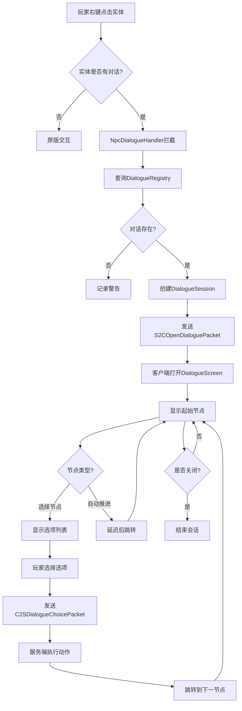

# 对话系统详解

**模块**: dialogue/  
**最后更新**: 2026-04-17

---

## 📋 目录

1. [对话树设计](#对话树设计)
2. [NPC交互流程](#npc交互流程)
3. [动作执行机制](#动作执行机制)
4. [上下文变量替换](#上下文变量替换)
5. [实战示例](#实战示例)

---

## 对话树设计

### 基本结构

```
DialogueTree (对话树)
├── dialogueId: "villager_greeting"
├── defaultNpc: "村民"
├── startNodeId: "start"
├── nodes: Map<String, DialogueNode>
│   ├── "start" → DialogueNode
│   │   ├── speaker: "村民"
│   │   ├── text: "你好，冒险者！"
│   │   ├── choices: List<DialogueChoice>
│   │   │   ├── choice[0]: "接受任务" → goTo("accept")
│   │   │   └── choice[1]: "离开" → close()
│   │   └── autoNextId: null
│   └── "accept" → DialogueNode
│       ├── speaker: "村民"
│       ├── text: "谢谢你！"
│       ├── choices: []
│       └── autoNextId: null
└── visualConfig: QuestVisualConfig
```

---

### 节点类型

#### 1. 选择节点（有选项）

**特征**: `choices.size() > 0`

**示例**:
```java
.node("start")
    .say("你需要帮助吗？")
    .choice("是的", c -> c.goTo("help"))
    .choice("不需要", c -> c.close())
```

**行为**:
- 客户端显示选项列表
- 等待玩家选择
- 根据选择跳转到不同节点或关闭对话

---

#### 2. 自动推进节点（无选项）

**特征**: `choices.isEmpty() && autoNextId != null`

**示例**:
```java
.node("intro")
    .say("让我给你讲个故事...")
    .autoNext("story_part2")
```

**行为**:
- 显示文本后自动跳转
- 可配置延迟时间（默认1.5秒）
- 适合连续叙述

---

#### 3. 终止节点

**特征**: `choices.isEmpty() && autoNextId == null`

**示例**:
```java
.node("farewell")
    .say("再见！")
```

**行为**:
- 显示文本后自动关闭对话
- 无需额外配置

---

## NPC交互流程

### 完整交互流程



---

### NPC绑定方式

#### 方式1：通过Capability绑定

**适用**: 自定义NPC实体

```java
// 在实体初始化时
entity.getCapability(DialogueNpcPatchProvider.DIALOGUE_NPC_CAP)
    .ifPresent(patch -> {
        patch.setDialogueId("villager_greeting");
        patch.setNpcName("老村长");
    });
```

**优点**:
- 灵活，每个实体可独立配置
- 支持运行时动态修改

---

#### 方式2：实现IDialogueNpc接口

**适用**: 自定义NPC类

```java
public class MyNpcEntity extends Villager implements IDialogueNpc {
    @Override
    public String getDialogueId() {
        return "elder_dialogue";
    }
    
    @Override
    public String getNpcName() {
        return "智者";
    }
}
```

**优点**:
- 编译时类型检查
- 代码更清晰

---

#### 方式3：通过注册表绑定

**适用**: 原版实体或无法修改的实体

```java
// 在初始化时
DialogueRegistry.INSTANCE.bindNpc("villager", "villager_greeting");
```

**工作原理**:
```java
@SubscribeEvent
public static void onInteractEntity(PlayerInteractEvent.EntityInteract event) {
    Entity target = event.getTarget();
    
    // 1. 尝试获取Capability
    target.getCapability(DialogueNpcPatchProvider.DIALOGUE_NPC_CAP)
        .ifPresentOrElse(
            patch -> openDialogue(player, patch.getDialogueId()),
            () -> {
                // 2. 尝试IDialogueNpc接口
                if (target instanceof IDialogueNpc npc) {
                    openDialogue(player, npc.getDialogueId());
                } else {
                    // 3. 尝试注册表绑定
                    String entityType = ForgeRegistries.ENTITY_TYPES.getKey(target.getType()).toString();
                    String dialogueId = DialogueRegistry.INSTANCE.getDialogueForNpc(entityType);
                    if (dialogueId != null) {
                        openDialogue(player, dialogueId);
                    }
                }
            }
        );
}
```

---

## 动作执行机制

### DialogueAction 类型

#### 1. StartQuest - 开始任务

**用途**: 从对话中给予任务

**示例**:
```java
.choice("接受任务", c -> c.startQuest("arc_quest:epic_prologue").close())
```

**执行逻辑**:
```java
public record StartQuest(String questId) implements DialogueAction {
    @Override
    public void execute(ServerPlayer player, DialogueSession session) {
        QuestProgressHandler.acceptQuest(player, questId);
        
        // 触发立绘
        QuestDefinition def = QuestRegistry.get(ResourceLocation.parse(questId));
        if (def != null) {
            ClientQuestEvents.handleVisualTrigger(def, SplashType.QUEST_ACQUIRED, null);
        }
    }
}
```

---

#### 2. SetFlag - 设置标志位

**用途**: 记录对话状态，用于条件判断

**示例**:
```java
.choice("询问身世", c -> c.setFlag("knows_backstory").goTo("next"))
```

**执行逻辑**:
```java
public record SetFlag(String flagName) implements DialogueAction {
    @Override
    public void execute(ServerPlayer player, DialogueSession session) {
        IQuestCapability cap = getCapability(player);
        cap.setFlag(flagName);
    }
}
```

---

#### 3. NotifyInteract - 通知NPC交互

**用途**: 完成任务的交互目标

**示例**:
```java
.choice("打招呼", c -> c.notifyInteract("villager_npc").close())
```

**执行逻辑**:
```java
public record NotifyInteract(String npcId) implements DialogueAction {
    @Override
    public void execute(ServerPlayer player, DialogueSession session) {
        // 查找匹配的交互目标
        ObjectiveTracker.INSTANCE.notifyInteraction(
            player.getUUID(),
            npcId
        );
    }
}
```

---

#### 4. Close - 关闭对话

**用途**: 结束对话会话

**示例**:
```java
.choice("再见", c -> c.close())
```

**执行逻辑**:
```java
public record Close() implements DialogueAction {
    @Override
    public void execute(ServerPlayer player, DialogueSession session) {
        session.close();
        DialogueSessionManager.INSTANCE.endDialogue(player);
    }
}
```

---

#### 5. Custom - 自定义动作

**用途**: 扩展模组功能

**注册**:
```java
DialogueActionTypes.register(
    new ResourceLocation("mymod", "give_coins"),
    (player, data) -> {
        int amount = data.getInt("amount");
        EconomyAPI.addCoins(player, amount);
    }
);
```

**使用**:
```java
CompoundTag actionData = new CompoundTag();
actionData.putInt("amount", 500);

.choice("购买物品", c -> c.customAction("mymod:give_coins", actionData).close())
```

---

### 动作执行顺序

**规则**: 按列表中顺序依次执行

**示例**:
```java
.choice("接受任务", c -> c
    .setFlag("accepted_quest")      // 1. 设置flag
    .startQuest("my_quest")          // 2. 开始任务
    .notifyInteract("quest_giver")   // 3. 通知交互
    .close()                         // 4. 关闭对话
)
```

**执行流程**:
```java
for (DialogueAction action : choice.getActions()) {
    try {
        action.execute(player, session);
    } catch (Exception e) {
        LOGGER.error("Error executing dialogue action: {}", e.getMessage());
        // 继续执行下一个动作，不中断
    }
}
```

---

## 上下文变量替换

### DialogueContext 工作原理

**用途**: 在对话文本中动态插入变量

**示例**:
```java
// 设置上下文变量
DialogueContext context = new DialogueContext();
context.put("player_name", player.getName().getString());
context.put("quest_name", "史诗序章");
context.put("villager_name", "老约翰");

// 创建对话时使用变量
.node("greeting")
    .say("你好，${player_name}！我是${villager_name}。")
    .build()

// 渲染时替换
String rendered = context.replaceVariables(node.getText());
// 输出：你好，Steve！我是老约翰。
```

---

### 内置变量

| 变量名 | 来源 | 示例值 |
|--------|------|--------|
| `${player_name}` | 玩家名称 | Steve |
| `${quest_name}` | 当前任务名 | 史诗序章 |
| `${phase_name}` | 当前阶段名 | 收集木材 |
| `${npc_name}` | NPC名称 | 老约翰 |

---

### 自定义变量

**在服务端设置**:
```java
// 在 DialogueSession 创建时
DialogueSession session = new DialogueSession(player, tree);
session.getContext().put("reputation", cap.getVariable("reputation"));
session.getContext().put("completed_quests", cap.getCompletedQuests().size());
```

**在对话中使用**:
```java
.node("status_check")
    .say("你的声望值是：${reputation}，已完成${completed_quests}个任务。")
```

---

## 实战示例

### 示例1：简单问候对话

```java
DialogueTreeBuilder.create("simple_greeting")
    .npc("村民")

    .node("start")
        .say("你好，旅行者！欢迎来到我们的村庄。")
        .choice("谢谢！", c -> c.goTo("thanks"))
        .choice("再见", c -> c.close())

    .node("thanks")
        .say("不客气！如果需要帮助，随时找我。")
        .choice("好的", c -> c.close())

    .buildAndRegister();
```

**流程**:
```
玩家右键村民
  ↓
显示："你好，旅行者！..."
  ↓
选项：["谢谢！", "再见"]
  ↓
选择"谢谢！" → 显示："不客气！..." → 关闭
选择"再见" → 直接关闭
```

---

### 示例2：任务给予对话

```java
DialogueTreeBuilder.create("quest_giver")
    .npc("村长")

    .node("start")
        .say("冒险者，村庄正面临危机！你能帮助我们吗？")
        .choice("发生了什么事？", c -> c.goTo("explain"))
        .choice("我没兴趣", c -> c.close())

    .node("explain")
        .say("僵尸每晚袭击村庄，我们需要有人清理它们。")
        .choice("我来帮忙！", c -> c
            .startQuest("arc_quest:zombie_clearance")
            .setFlag("accepted_zombie_quest")
            .close())
        .choice("让我考虑一下", c -> c.goTo("consider"))

    .node("consider")
        .say("好吧，如果你改变主意，随时回来找我。")
        .choice("好的", c -> c.close())

    .visualConfig(QuestVisualConfig.builder()
        .splash(SplashType.DIALOGUE_START, 
            ResourceLocation.fromNamespaceAndPath(MOD_ID, "textures/gui/splash/village_elder.png"),
            1.2f)
        .themeColor(ChatFormatting.GOLD)
        .build())

    .buildAndRegister();
```

**流程**:
```
开始对话 → 显示立绘
  ↓
"发生了什么事？" / "我没兴趣"
  ↓
选择"发生了什么事？"
  ↓
"僵尸每晚袭击..."
  ↓
"我来帮忙！" / "让我考虑一下"
  ↓
选择"我来帮忙！"
  ↓
执行动作：
  1. startQuest("zombie_clearance")
  2. setFlag("accepted_zombie_quest")
  3. close()
  ↓
任务已接受，对话关闭
```

---

### 示例3：条件分支对话

```java
DialogueTreeBuilder.create("shopkeeper")
    .npc("商人")

    .node("start")
        .say("欢迎光临！${player_name}，今天想看点什么？")
        .choice("查看商品", c -> c.goToIf("show_goods", "has_met_before"))
        .choice("首次见面", c -> c.goTo("first_meeting"))

    .node("first_meeting")
        .say("哦，你是新面孔！我叫老杰克，是这个村的商人。")
        .setFlagOnEnter("has_met_before")
        .choice("很高兴认识你", c -> c.goTo("show_goods"))

    .node("show_goods")
        .say("这是我的商品清单...")
        .choice("购买药水", c -> c
            .customAction("mymod:buy_potion", buyData)
            .close())
        .choice("只是看看", c -> c.close())

    .buildAndRegister();
```

**条件判断逻辑**:
```java
// goToIf 内部实现
public NodeBuilder goToIf(String nodeId, String requiredFlag) {
    this.choices.add(new DialogueChoice(
        text,
        nodeId,
        List.of(new FlagSetCondition(requiredFlag)),  // 可见性条件
        List.of()
    ));
    return this;
}

// 客户端过滤可见选项
List<DialogueChoice> visibleChoices = node.getChoices().stream()
    .filter(choice -> choice.isVisible(player))
    .toList();
```

---

### 示例4：多语言对话

**定义翻译键**:
```properties
# assets/arc_quest/lang/en_us.json
{
  "dialogue.shopkeeper.start.text": "Welcome, ${player_name}!",
  "dialogue.shopkeeper.start.choice1": "Show me your wares",
  "dialogue.shopkeeper.start.choice2": "Goodbye"
}

# assets/arc_quest/lang/zh_cn.json
{
  "dialogue.shopkeeper.start.text": "欢迎，${player_name}！",
  "dialogue.shopkeeper.start.choice1": "看看你的商品",
  "dialogue.shopkeeper.start.choice2": "再见"
}
```

**使用翻译**:
```java
DialogueTreeBuilder.create("shopkeeper")
    .npc(Component.translatable("npc.shopkeeper.name").getString())

    .node("start")
        .say(Component.translatable("dialogue.shopkeeper.start.text").getString())
        .choice(Component.translatable("dialogue.shopkeeper.start.choice1").getString(),
                c -> c.goTo("goods"))
        .choice(Component.translatable("dialogue.shopkeeper.start.choice2").getString(),
                c -> c.close())

    .buildAndRegister();
```

---

## 附录

### 调试技巧

#### 1. 强制打开对话

```bash
/quest dialogue @p villager_greeting
```

#### 2. 查看对话注册表

```bash
/quest registry
# 输出所有注册的对话ID
```

#### 3. 日志监控

```java
// 在 log4j2.xml 中添加
<Logger name="org.com.arc_quest.dialogue" level="DEBUG"/>
```

**关键日志**:
```
[ArcQuest] Player Steve started dialogue: villager_greeting
[ArcQuest] Executing action: StartQuest{questId=arc_quest:test}
[ArcQuest] Player Steve ended dialogue
```

---

### 常见问题

#### Q1: 对话为什么不显示？

**A**: 检查以下几点：
1. 对话是否正确注册到 DialogueRegistry
2. NPC 是否正确绑定了 dialogueId
3. 网络包是否正常发送（查看日志）
4. 客户端是否正确接收并打开 DialogueScreen

---

#### Q2: 选项为什么不可见？

**A**: 检查可见性条件：
```java
// 确保条件正确
.choice("隐藏选项", c -> c.goTo("secret"))
    .visibleIf(new FlagSetCondition("unlocked_secret"))  // 需要此flag

// 或者无条件显示
.choice("始终可见", c -> c.goTo("normal"))
```

---

#### Q3: 如何重置对话进度？

**A**: 清除相关flag
```bash
# 手动清除flag
/quest flag @p remove has_met_before

# 或重置所有数据
/quest resetall @p
```

---

#### Q4: 如何实现打字机效果？

**A**: DialogueScreen 已内置打字机效果

**配置**:
```java
// 在 DialogueScreen 中
private static final int TYPEWRITER_SPEED = 50;  // 每字符延迟(ms)
private static final boolean ENABLE_TYPEWRITER = true;
```

**禁用**:
```java
// 对于重要信息，可跳过动画
session.skipTypewriter();
```

---

**文档结束**

*本文档详细讲解了Arc Quest对话系统的设计原理、交互流程和实战示例。*
