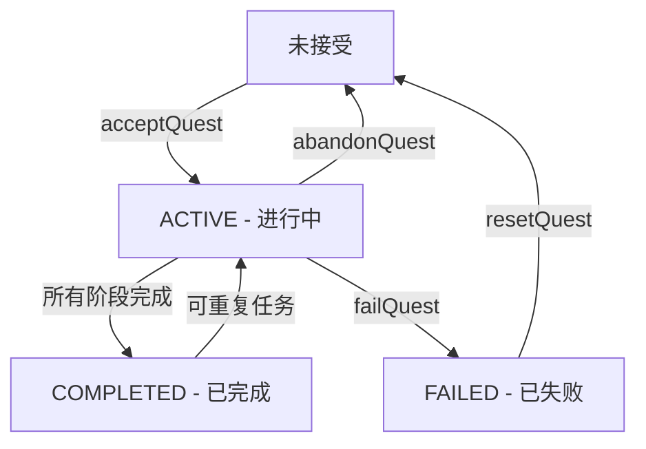

# 任务系统详解

**模块**: quest/  
**最后更新**: 2026-04-17

---

## 📋 目录

1. [任务生命周期](#任务生命周期)
2. [目标追踪机制](#目标追踪机制)
3. [阶段流转逻辑](#阶段流转逻辑)
4. [条件判断系统](#条件判断系统)
5. [奖励发放流程](#奖励发放流程)
6. [实战示例](#实战示例)

---

## 任务生命周期

### 完整状态机



### 关键方法说明

#### 1. 接受任务 (acceptQuest)

**位置**: `QuestProgressHandler.acceptQuest()`

**执行流程**:
```java
1. 从 QuestRegistry 查询任务定义
2. 检查是否已在进行或已完成
3. 验证解锁条件（ICondition）
4. 确定起始阶段（getInitialPhase()）
5. 创建 QuestRuntimeData
6. 添加到玩家 Capability
7. 设置接受时的 flag
8. 注册目标到追踪器
9. 同步到客户端
10. 触发 QuestChangeEvent
```

**代码示例**:
```java
// 服务端调用
boolean success = QuestProgressHandler.acceptQuest(player, "arc_quest:epic_prologue");

if (success) {
    player.sendSystemMessage(Component.literal("任务已接受！"));
}
```

---

#### 2. 推进目标进度 (incrementObjective)

**位置**: `QuestProgressHandler.incrementObjective()`

**触发方式**:
- 自动：ObjectiveTracker 监听游戏事件
- 手动：管理员命令 `/quest progress`

**执行流程**:
```java
1. 验证玩家是否有该活跃任务
2. 验证当前阶段一致性
3. 检查目标索引有效性
4. 计算新进度（不超过requiredCount）
5. 增量同步到客户端（S2CDeltaProgressPacket）
6. 触发 objectiveProgressed 事件
7. 检查阶段是否完成
```

**性能优化**:
- ✅ 使用增量同步而非全量同步
- ✅ 已达标的目标直接返回，避免重复计算
- ✅ 早期验证失败快速退出

---

#### 3. 完成任务 (completeQuest)

**位置**: `QuestProgressHandler.completeQuest()`

**执行流程**:
```java
1. 发放最终奖励（IReward列表）
2. 设置完成时的 flag
3. 更新状态为 COMPLETED
4. 从活跃任务移除，加入完成集合
5. 清理目标追踪器
6. 全量同步到客户端
7. 触发 questCompleted 事件
```

---

## 目标追踪机制

### ObjectiveTracker 工作原理

**位置**: `org.com.arc_quest.quest.tracking.ObjectiveTracker`

**监听的游戏事件**:

| 事件 | 目标类型 | 处理方法 |
|------|---------|----------|
| `ItemPickupEvent` | COLLECT | 检查物品匹配，累加进度 |
| `LivingDeathEvent` | KILL | 检查实体类型，累加击杀数 |
| `ItemCraftedEvent` | CRAFT | 检查合成物品，累加次数 |
| `BlockEvent.BreakEvent` | INTERACT | 检查方块类型，累加交互数 |
| `PlayerTickEvent` | VISIT | 检查玩家位置，判断是否在范围内 |

---

### 追踪器注册流程

```java
// 1. 接受任务时注册
registerPhaseObjectives(player, def, firstPhase);

// 2. 内部实现
private static void registerPhaseObjectives(ServerPlayer player,
                                            QuestDefinition def,
                                            PhaseDefinition phase) {
    List<ObjectiveEntry> objectives = phase.getObjectives();
    for (int i = 0; i < objectives.size(); i++) {
        ObjectiveEntry obj = objectives.get(i);
        
        // 创建追踪键
        TrackedObjective tracked = new TrackedObjective(
            def.getId().toString(),
            phase.getPhaseId(),
            i,
            obj.getType(),
            obj.getProperties()
        );
        
        // 注册到追踪器
        ObjectiveTracker.INSTANCE.register(
            player.getUUID(),
            tracked
        );
    }
}
```

---

### 事件处理示例

**收集目标处理**:
```java
@SubscribeEvent
public static void onItemPickup(ItemEntityPickupEvent.Pre event) {
    Player player = event.getPlayer();
    ItemStack stack = event.getItemStack();
    
    // 查找匹配的追踪目标
    List<TrackedObjective> matching = ObjectiveTracker.INSTANCE
        .findMatching(player.getUUID(), ObjectiveType.COLLECT, stack.getItem());
    
    for (TrackedObjective tracked : matching) {
        // 推进进度
        QuestProgressHandler.incrementObjective(
            (ServerPlayer) player,
            tracked.getQuestId(),
            tracked.getPhaseId(),
            tracked.getObjectiveIndex(),
            stack.getCount()
        );
    }
}
```

---

## 阶段流转逻辑

### 三种流转方式

#### 1. 无条件自动流转

**配置**:
```java
PhaseBuilder.create("step1")
    .objective(...)
    .thenGoTo("step2")  // 完成后自动跳转
    .build()
```

**逻辑**:
```java
if (transitions.size() == 1 && !transitions.get(0).requiresChoice()) {
    PhaseTransition auto = transitions.get(0);
    
    // 检查条件（如果有）
    boolean conditionsMet = auto.getCondition() == null ||
        auto.getCondition().test(...);
    
    if (conditionsMet) {
        advanceToPhase(player, cap, data, def, auto.getTargetPhaseId());
    }
}
```

---

#### 2. 条件流转

**配置**:
```java
PhaseBuilder.create("step1")
    .objective(...)
    .thenGoToIf("step2a", new FlagSetCondition("has_key"))
    .thenGoToIf("step2b", new FlagNotSetCondition("has_key"))
    .build()
```

**逻辑**:
```java
for (PhaseTransition transition : transitions) {
    ICondition condition = transition.getCondition();
    
    if (condition == null || condition.test(completedQuests, flags, variables)) {
        advanceToPhase(player, cap, data, def, transition.getTargetPhaseId());
        break;  // 选择第一个满足条件的
    }
}
```

---

#### 3. 分支选择流转

**配置**:
```java
PhaseBuilder.create("decision_point")
    .objective(...)
    .choice(Component.literal("选择A"), "flag_a", "path_a")
    .choice(Component.literal("选择B"), "flag_b", "path_b")
    .build()
```

**逻辑**:
```java
if (phase.hasChoices()) {
    // 不自动推进，等待玩家选择
    // 客户端显示 PhaseChoiceScreen
    // 玩家选择后发送 C2SRequestQuestActionPacket
    return;
}

// 玩家选择后调用
QuestProgressHandler.handlePlayerChoice(player, questId, choiceIndex);
```

---

### 阶段完成检测

**检测方法**: `checkPhaseCompletion()`

```java
private static void checkPhaseCompletion(...) {
    List<ObjectiveEntry> objectives = phase.getObjectives();
    
    // 检查所有目标是否达标
    for (int i = 0; i < objectives.size(); i++) {
        if (data.getObjectiveProgress(i) < objectives.get(i).getRequiredCount()) {
            return;  // 至少有一个未完成
        }
    }
    
    // 所有目标完成 → 进入流转逻辑
    // 1. 发放阶段奖励
    // 2. 注销旧阶段目标
    // 3. 根据 transitions/choices 决定下一步
}
```

---

## 条件判断系统

### ICondition 接口

**定义**:
```java
public interface ICondition {
    boolean test(Set<ResourceLocation> completedQuests,
                 Set<String> flags,
                 Map<String, Integer> variables);
}
```

---

### 内置条件实现

#### 1. FlagSetCondition

**用途**: 检查flag是否已设置

**示例**:
```java
new FlagSetCondition("talked_to_villager")
```

**实现**:
```java
@Override
public boolean test(Set<ResourceLocation> completedQuests,
                    Set<String> flags,
                    Map<String, Integer> variables) {
    return flags.contains(flagName);
}
```

---

#### 2. QuestCompletedCondition

**用途**: 检查任务是否已完成

**示例**:
```java
new QuestCompletedCondition("arc_quest:prologue")
```

**实现**:
```java
@Override
public boolean test(Set<ResourceLocation> completedQuests, ...) {
    return completedQuests.contains(questId);
}
```

---

#### 3. VariableCondition

**用途**: 检查变量值

**示例**:
```java
new VariableCondition("reputation", value -> value >= 50)
```

**实现**:
```java
private final Predicate<Integer> predicate;

@Override
public boolean test(..., Map<String, Integer> variables) {
    int value = variables.getOrDefault(variableName, 0);
    return predicate.test(value);
}
```

---

### 自定义条件

**示例**: 经济条件

```java
public class EconomyCondition implements ICondition {
    private final int requiredCoins;
    
    public EconomyCondition(int requiredCoins) {
        this.requiredCoins = requiredCoins;
    }
    
    @Override
    public boolean test(Set<ResourceLocation> completedQuests,
                        Set<String> flags,
                        Map<String, Integer> variables) {
        // 假设外部模组提供经济API
        return EconomyAPI.getPlayerBalance(null) >= requiredCoins;
    }
}

// 使用
.unlockCondition(new EconomyCondition(1000))
```

---

## 奖励发放流程

### IReward 接口

**定义**:
```java
public interface IReward {
    void grant(ServerPlayer player);
}
```

---

### 内置奖励实现

#### 1. ItemReward - 物品奖励

**构造**:
```java
new ItemReward(Items.DIAMOND, 5)
```

**实现**:
```java
@Override
public void grant(ServerPlayer player) {
    player.getInventory().add(new ItemStack(item, count));
    player.sendSystemMessage(
        Component.translatable("reward.item.received", count, item.getName())
    );
}
```

---

#### 2. FlagReward - Flag奖励

**构造**:
```java
new FlagReward("quest_completed")
```

**实现**:
```java
@Override
public void grant(ServerPlayer player) {
    IQuestCapability cap = getCapability(player);
    cap.setFlag(flagName);
}
```

---

#### 3. CommandReward - 命令奖励

**构造**:
```java
new CommandReward("/give @p experience_bottle 10")
```

**实现**:
```java
@Override
public void grant(ServerPlayer player) {
    MinecraftServer server = player.getServer();
    if (server != null) {
        server.getCommands().performPrefixedCommand(
            server.createCommandSourceStack(),
            command
        );
    }
}
```

---

#### 4. VariableReward - 变量奖励

**构造**:
```java
new VariableReward("reputation", 100)
```

**实现**:
```java
@Override
public void grant(ServerPlayer player) {
    IQuestCapability cap = getCapability(player);
    cap.incrementVariable(variableName, value);
}
```

---

### 奖励发放时机

**两个发放点**:

1. **阶段完成奖励** (`PhaseDefinition.phaseRewards`)
   ```java
   // 在 checkPhaseCompletion() 中
   for (IReward reward : phase.getPhaseRewards()) {
       reward.grant(player);
   }
   ```

2. **任务完成奖励** (`QuestDefinition.completionRewards`)
   ```java
   // 在 completeQuest() 中
   for (IReward reward : def.getCompletionRewards()) {
       reward.grant(player);
   }
   ```

---

## 实战示例

### 示例1：简单收集任务

```java
QuestBuilder.create("simple_collect")
    .category(QuestCategory.ADVENTURE)
    .displayName(Component.translatable("quest.simple_collect.title"))
    .description(Component.translatable("quest.simple_collect.desc"))
    
    .phase(PhaseBuilder.create("collect_wood")
        .displayName(Component.literal("收集木材"))
        .objective(ObjectiveBuilder.collect(Items.OAK_LOG, 10)
            .display(Component.literal("收集10个橡木原木")))
        .build())
    
    .reward(new ItemReward(Items.STICK, 5))
    .buildAndRegister();
```

**流程**:
```
1. 玩家接受任务
2. ObjectiveTracker 监听 ItemPickupEvent
3. 玩家拾取橡木原木 → 进度+1
4. 收集满10个 → 阶段完成
5. 发放5个木棍奖励
6. 任务标记为 COMPLETED
```

---

### 示例2：多阶段任务链

```java
QuestBuilder.create("epic_quest")
    .category(QuestCategory.MAIN)
    .displayName(Component.translatable("quest.epic.title"))
    
    // 阶段1：收集
    .phase(PhaseBuilder.create("gather_resources")
        .displayName(Component.literal("收集资源"))
        .objective(ObjectiveBuilder.collect(Items.IRON_INGOT, 20))
        .objective(ObjectiveBuilder.collect(Items.GOLD_INGOT, 10))
        .thenGoTo("craft_sword")
        .build())
    
    // 阶段2：合成
    .phase(PhaseBuilder.create("craft_sword")
        .displayName(Component.literal("合成武器"))
        .objective(ObjectiveBuilder.craft(Items.IRON_SWORD, 1))
        .thenGoToIf("fight_boss", new FlagSetCondition("has_armor"))
        .thenGoTo("prepare_armor")
        .build())
    
    // 阶段3a：准备护甲（条件分支）
    .phase(PhaseBuilder.create("prepare_armor")
        .displayName(Component.literal("准备护甲"))
        .objective(ObjectiveBuilder.craft(Items.IRON_CHESTPLATE, 1))
        .setFlagOnComplete("has_armor")
        .thenGoTo("fight_boss")
        .build())
    
    // 阶段4：战斗
    .phase(PhaseBuilder.create("fight_boss")
        .displayName(Component.literal("击败Boss"))
        .objective(ObjectiveBuilder.kill(EntityType.WITHER, 1))
        .build())
    
    .reward(new ItemReward(Items.NETHERITE_INGOT, 3))
    .reward(new FlagReward("hero_of_village"))
    .buildAndRegister();
```

**流程**:
```
阶段1 → 阶段2 → 检查flag
                  ├─ has_flag → 阶段4
                  └─ no_flag → 阶段3 → 设置flag → 阶段4
```

---

### 示例3：分支选择任务

```java
QuestBuilder.create("moral_choice")
    .category(QuestCategory.SIDE)
    .displayName(Component.translatable("quest.moral.title"))
    
    .phase(PhaseBuilder.create("investigate")
        .displayName(Component.literal("调查真相"))
        .objective(ObjectiveBuilder.interact(Blocks.LEVER, 1))
        .choice(Component.literal("帮助村民"), "help_villagers", "path_good")
        .choice(Component.literal("帮助强盗"), "help_bandits", "path_evil")
        .build())
    
    // 善良路线
    .phase(PhaseBuilder.create("path_good")
        .displayName(Component.literal("守护村庄"))
        .objective(ObjectiveBuilder.kill(EntityType.PILLAGER, 10))
        .reward(new VariableReward("reputation", 50))
        .build())
    
    // 邪恶路线
    .phase(PhaseBuilder.create("path_evil")
        .displayName(Component.literal("掠夺村庄"))
        .objective(ObjectiveBuilder.kill(EntityType.VILLAGER, 5))
        .reward(new VariableReward("reputation", -50))
        .build())
    
    .buildAndRegister();
```

**流程**:
```
调查阶段完成
  ↓
客户端显示 PhaseChoiceScreen
  ↓
玩家选择"帮助村民"或"帮助强盗"
  ↓
发送 C2SRequestQuestActionPacket
  ↓
服务端 handlePlayerChoice()
  ↓
设置对应flag + 推进到对应阶段
```

---

## 附录

### 常见问题

#### Q1: 如何调试任务进度？

**A**: 使用管理员命令
```bash
# 查看任务状态
/quest list @p

# 手动推进进度
/quest progress @p arc_quest:test 0 5

# 跳转到指定阶段
/quest phase @p arc_quest:test gather_wood

# 查看详细调试信息
/quest debug @p
```

---

#### Q2: 目标进度为什么不更新？

**A**: 检查以下几点：
1. 任务是否处于 ACTIVE 状态
2. 当前阶段是否正确
3. ObjectiveTracker 是否注册了该目标
4. 游戏事件是否正确触发
5. 查看日志中的 `[ArcQuest]` 前缀消息

---

#### Q3: 如何重置任务？

**A**: 
```bash
# 重置单个任务
/quest reset @p arc_quest:test

# 重置所有任务
/quest resetall @p
```

---

#### Q4: 如何添加自定义目标类型？

**A**: 
1. 在 `ObjectiveType` 枚举中添加新类型
2. 在 `ObjectiveTracker` 中添加对应的事件监听
3. 在 `ObjectiveBuilder` 中添加工厂方法

```java
// 1. 添加枚举
enum ObjectiveType {
    ...,
    FISH  // 新增钓鱼目标
}

// 2. 添加监听
@SubscribeEvent
public static void onFishCaught(ItemFishedEvent event) {
    // 处理钓鱼目标
}

// 3. 添加工厂方法
public static ObjectiveBuilder fish(ItemLike fish, int count) {
    return new ObjectiveBuilder(ObjectiveType.FISH, ...)
        .property("fish_type", fish);
}
```

---

**文档结束**

*本文档详细讲解了Arc Quest任务系统的核心机制、工作流程和实战示例。*
