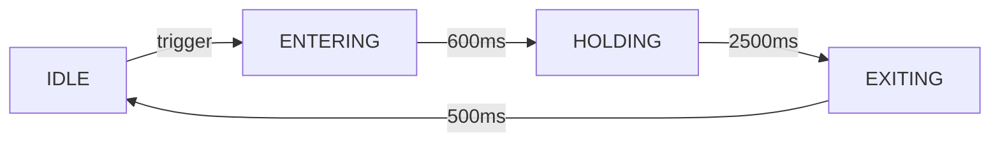

# 视觉系统详解

**模块**: client/gui/render/  
**最后更新**: 2026-04-20

---

## 📋 目录

1. [立绘动画系统](#立绘动画系统)
2. [图标配置指南](#图标配置指南)
3. [主题色定制](#主题色定制)
4. [渲染器工作原理](#渲染器工作原理)
5. [实战配置示例](#实战配置示例)

---

## 立绘动画系统

### SplashType 类型说明

| 类型 | 触发时机 | 动画时长 | 使用场景 |
|------|---------|---------|----------|
| QUEST_DETAIL | 打开任务详情 | 静态显示 | 任务日志界面背景 |
| QUEST_ACQUIRED | 获得新任务 | 600ms入场+2500ms停留+500ms退场 | 弹窗通知 |
| PHASE_START | 阶段开始 | 同上 | 阶段推进提示 |
| PHASE_COMPLETE | 阶段完成 | 同上 | 阶段完成庆祝 |
| QUEST_COMPLETED | 任务完全完成 | 同上 | 任务完成庆祝 |
| DIALOGUE_START | 对话开始 | 同上 | 对话界面背景 |
| DIALOGUE_END | 对话结束 | 同上 | 对话结束过渡 |

---

### 动画状态机



**各状态说明**:

#### 1. ENTERING（入场）

**时长**: 600ms  
**缓动函数**: `easeOutQuint`  
**效果**: 从透明(α=0)到完全不透明(α=1)，同时轻微放大

**代码**:
```java
float progress = elapsedTime / 600f;
float alpha = QuestAnimUtil.easeOutQuintic(progress);
float scale = 1.0f + (0.05f * (1f - alpha));  // 从1.05缩小到1.0
```

---

#### 2. HOLDING（停留）

**时长**: 2500ms  
**效果**: 呼吸动画（轻微缩放波动）

**代码**:
```java
float breathProgress = (elapsedTime % 1000f) / 1000f;
float breathScale = 1.0f + 0.02f * Math.sin(breathProgress * Math.PI * 2);
float alpha = 1.0f;
```

---

#### 3. EXITING（退场）

**时长**: 500ms  
**缓动函数**: `easeInQuart`  
**效果**: 快速淡出并缩小

**代码**:
```java
float progress = elapsedTime / 500f;
float alpha = 1f - QuestAnimUtil.easeInQuartic(progress);
float scale = 1.0f - (0.1f * progress);  // 从1.0缩小到0.9
```

---

### 触发机制

#### 自动触发（网络包驱动）

**流程**:
```
服务端任务状态变更
  ↓
发送 S2CSyncQuestStatePacket
  ↓
客户端接收处理
  ↓
ClientQuestEvents.handleVisualTrigger()
  ↓
QuestSplashRenderer.trigger()
  ↓
加入队列等待播放
```

**代码示例**:
```java
// 在 S2CSyncQuestStatePacket.handle() 中
case ACTIVE -> {
    boolean isNewQuest = !ClientQuestCache.INSTANCE.isQuestActive(questId);
    
    if (isNewQuest) {
        // 获得新任务 → 触发 QUEST_ACQUIRED 立绘
        ClientQuestEvents.handleVisualTrigger(def, SplashType.QUEST_ACQUIRED, null);
    } else {
        // 阶段推进 → 触发 PHASE_START 立绘
        String phaseName = def.getPhase(currentPhaseId).getDisplayName().getString();
        ClientQuestEvents.handleVisualTrigger(def, SplashType.PHASE_START, phaseName);
    }
}

case COMPLETED -> {
    // 任务完成 → 触发 QUEST_COMPLETED 立绘
    ClientQuestEvents.handleVisualTrigger(def, SplashType.QUEST_COMPLETED, null);
}
```

---

#### 手动触发

**示例**:
```java
// 在任何客户端代码中
QuestDefinition quest = QuestRegistry.get(ResourceLocation.parse("arc_quest:test"));
if (quest != null) {
    QuestSplashRenderer.INSTANCE.trigger(
        quest,
        SplashType.QUEST_ACQUIRED,
        "自定义文本"
    );
}
```

---

### 队列管理

**特性**: 支持多个立绘排队播放

**逻辑**:
```java
private final Queue<SplashRequest> pendingQueue = new LinkedList<>();
private SplashRequest currentSplash = null;

public void trigger(QuestDefinition def, SplashType type, String text) {
    // 检查是否已有相同类型的立绘在队列中
    for (SplashRequest req : pendingQueue) {
        if (req.type() == type && req.questId().equals(def.getId())) {
            return;  // 去重，避免重复播放
        }
    }
    
    pendingQueue.offer(new SplashRequest(def, type, text));
    
    // 如果当前没有播放，立即开始
    if (currentSplash == null) {
        playNext();
    }
}

private void playNext() {
    currentSplash = pendingQueue.poll();
    if (currentSplash != null) {
        startTime = System.currentTimeMillis();
        state = SplashState.ENTERING;
    }
}
```

---

## 图标配置指南

### IconPosition 位置说明

| 位置 | 尺寸 | 用途 | 示例 |
|------|------|------|------|
| QUEST_LIST | 16x16 | 任务列表缩略图 | 列表项左侧图标 |
| QUEST_TITLE | 20x20 | 任务标题装饰 | 标题旁徽章 |
| QUEST_DETAIL_PANEL | 32x32 | 详情面板主图标 | 详情页顶部大图标 |
| PHASE_LABEL | 12x12 | 阶段标签图标 | 阶段名称前小图标 |
| HUD_TRACKER | 12x12 | HUD追踪栏图标 | 右上角追踪面板 |
| DIALOGUE_NPC_AVATAR | 48x48 | 对话NPC头像 | 对话框左侧头像 |

---

### VisualAsset 属性详解

```java
public record VisualAsset(
    ResourceLocation texture,   // 纹理路径
    float scale,                // 缩放比例（默认1.0）
    float offsetX,              // X轴偏移（像素）
    float offsetY,              // Y轴偏移（像素）
    int tintColor,              // 染色颜色（ARGB）
    boolean enabled             // 是否启用
)
```

**参数说明**:

#### texture（纹理路径）

**格式**: `namespace:path/to/texture.png`

**示例**:
```java
ResourceLocation.fromNamespaceAndPath(
    "arc_quest",
    "textures/gui/icons/wood_icon.png"
)
```

**文件位置**:
```
src/main/resources/assets/arc_quest/textures/gui/icons/wood_icon.png
```

---

#### scale（缩放比例）

**范围**: 0.5 ~ 2.0  
**默认值**: 1.0

**示例**:
```java
new VisualAsset(texture, 1.5f)  // 放大1.5倍
new VisualAsset(texture, 0.8f)  // 缩小到80%
```

---

#### offsetX / offsetY（偏移量）

**单位**: 像素  
**正值**: 向右/向下偏移  
**负值**: 向左/向上偏移

**示例**:
```java
new VisualAsset(texture, 1.0f, 5f, -3f, 0xFFFFFFFF, true)
// X轴右移5px，Y轴上移3px
```

---

#### tintColor（染色颜色）

**格式**: ARGB（Alpha-Red-Green-Blue）  
**默认值**: `0xFFFFFFFF`（不染色）

**常用颜色**:
```java
0xFFFFFFFF  // 白色（无染色）
0xFFFF0000  // 红色
0xFF00FF00  // 绿色
0xFF0000FF  // 蓝色
0x80FFFFFF  // 半透明白色
```

**示例**:
```java
// 染成金色
new VisualAsset(texture, 1.0f, 0, 0, 0xFFFFD700, true)
```

---

#### enabled（启用标志）

**用途**: 临时禁用图标而不删除配置

**示例**:
```java
// 禁用图标
.icon(IconPosition.HUD_TRACKER, new VisualAsset(texture, 1.0f, 0, 0, 0xFFFFFFFF, false))
```

---

### 图标渲染方法

#### QuestIconRenderer.renderIcon()

**简单渲染**:
```java
QuestIconRenderer.renderIcon(guiGraphics, iconTexture, x, y, 16, 16);
```

**带配置渲染**:
```java
VisualAsset asset = new VisualAsset(texture, 1.2f, 0, 0, 0xFFFFD700, true);
QuestIconRenderer.renderIcon(guiGraphics, asset, x, y, 20, 20);
```

**内部实现**:
```java
public static void renderIcon(GuiGraphics g, VisualAsset asset, 
                               int x, int y, int width, int height) {
    if (!asset.enabled()) return;
    
    PoseStack poseStack = g.pose();
    poseStack.pushPose();
    
    // 应用偏移
    poseStack.translate(asset.offsetX(), asset.offsetY(), 0);
    
    // 应用缩放
    float scale = asset.scale();
    poseStack.scale(scale, scale, 1.0f);
    
    // 应用染色
    int color = asset.tintColor();
    
    // 渲染纹理
    g.blit(
        asset.texture(),
        x, y,
        0, 0,
        (int)(width * scale),
        (int)(height * scale),
        width, height
    );
    
    poseStack.popPose();
}
```

---

## 主题色定制

### themeColor 作用范围

**影响元素**:
1. ✅ 任务追踪面板强调条
2. ✅ 进度条填充色
3. ✅ 高亮效果
4. ✅ Toast 边框色
5. ✅ 按钮悬停色

**不影响**:
- ❌ 文本颜色（始终为白色/灰色）
- ❌ 背景色（固定为半透明黑色）

---

### 设置方式

#### 方式1：使用 ChatFormatting

```java
QuestBuilder.create("my_quest")
    .themeColor(ChatFormatting.GOLD)  // 金色
    .buildAndRegister();
```

**可用枚举值**:
```java
ChatFormatting.RED      // 红色
ChatFormatting.GREEN    // 绿色
ChatFormatting.BLUE     // 蓝色
ChatFormatting.YELLOW   // 黄色
ChatFormatting.AQUA     // 青色
ChatFormatting.LIGHT_PURPLE  // 紫色
ChatFormatting.WHITE    // 白色
ChatFormatting.GRAY     // 灰色
```

---

#### 方式2：使用 ARGB 整数

```java
QuestBuilder.create("my_quest")
    .themeColor(0xFFFFD700)  // 金色
    .themeColor(0xFF4FC3F7)  // 天蓝色
    .themeColor(0xFF66FF66)  // 浅绿色
    .buildAndRegister();
```

**颜色选择工具**:
- 在线取色器：https://htmlcolorcodes.com/
- 格式：`0xAARRGGBB`
  - AA: Alpha透明度（FF=完全不透明）
  - RR: 红色通道
  - GG: 绿色通道
  - BB: 蓝色通道

---

### 主题色提取与应用

**提取逻辑**:
```java
// 从任务定义获取
int themeColor = quest.getThemeColor();

// 应用到UI元素
int accentColor = themeColor;  // 强调条
int progressBarFill = themeColor;  // 进度条
int highlightColor = QuestAnimUtil.lerpColor(themeColor, 0xFFFFFFFF, 0.3f);  // 高亮
```

**默认值**:
```java
// 如果未设置，使用默认天蓝色
private static final int DEFAULT_THEME_COLOR = 0xFF4FC3F7;
```

---

## 渲染器工作原理

### QuestSplashRenderer 架构

**核心组件**:
```java
public class QuestSplashRenderer {
    private enum SplashState { IDLE, ENTERING, HOLDING, EXITING }
    
    private SplashState state = SplashState.IDLE;
    private QuestDefinition currentQuest;
    private SplashType currentType;
    private long startTime;
    
    private static final long TIME_ENTER = 600;
    private static final long TIME_HOLD = 2500;
    private static final long TIME_EXIT = 500;
}
```

---

### 每帧渲染流程

```java
@Override
public void render(GuiGraphics g, float partialTick, int screenWidth, int screenHeight) {
    if (state == SplashState.IDLE || currentQuest == null) return;
    
    long currentTime = System.currentTimeMillis();
    long elapsedTime = currentTime - startTime;
    
    // 计算alpha和scale
    float alpha, scale;
    
    switch (state) {
        case ENTERING -> {
            float progress = Math.min(elapsedTime / (float)TIME_ENTER, 1f);
            alpha = QuestAnimUtil.easeOutQuintic(progress);
            scale = 1.0f + (0.05f * (1f - alpha));
            
            if (elapsedTime >= TIME_ENTER) {
                state = SplashState.HOLDING;
                startTime = currentTime;
            }
        }
        case HOLDING -> {
            float breathProgress = (elapsedTime % 1000f) / 1000f;
            alpha = 1.0f;
            scale = 1.0f + 0.02f * Math.sin(breathProgress * Math.PI * 2);
            
            if (elapsedTime >= TIME_HOLD) {
                state = SplashState.EXITING;
                startTime = currentTime;
            }
        }
        case EXITING -> {
            float progress = Math.min(elapsedTime / (float)TIME_EXIT, 1f);
            alpha = 1f - QuestAnimUtil.easeInQuartic(progress);
            scale = 1.0f - (0.1f * progress);
            
            if (elapsedTime >= TIME_EXIT) {
                state = SplashState.IDLE;
                currentQuest = null;
                playNext();  // 播放下一个
                return;
            }
        }
        default -> { return; }
    }
    
    // 渲染立绘
    RenderSystem.enableBlend();
    RenderSystem.setShaderColor(1f, 1f, 1f, alpha);
    
    ResourceLocation texture = getTextureForType(currentQuest, currentType);
    if (texture != null) {
        int w = (int)(screenWidth * 0.8f * scale);
        int h = (int)(w * 0.6f);  // 保持宽高比
        int x = (screenWidth - w) / 2;
        int y = (screenHeight - h) / 2;
        
        g.blit(texture, x, y, 0, 0, w, h, w, h);
    }
    
    RenderSystem.setShaderColor(1f, 1f, 1f, 1f);
    RenderSystem.disableBlend();
}
```

---

## 实战配置示例

### 示例1：完整任务视觉配置

```java
QuestBuilder.create("epic_prologue")
    .category(QuestCategory.ARCHON)
    .displayName(Component.translatable("quest.epic.title"))
    
    // 任务级视觉配置
    .acquisitionSplash(
        ResourceLocation.fromNamespaceAndPath(MOD_ID, "textures/gui/splash/prologue_acquire.png"),
        1.2f
    )
    .completionSplash(
        ResourceLocation.fromNamespaceAndPath(MOD_ID, "textures/gui/splash/prologue_complete.png"),
        1.3f
    )
    .listIcon(
        ResourceLocation.fromNamespaceAndPath(MOD_ID, "textures/gui/icons/prologue_list.png")
    )
    .themeColor(ChatFormatting.GOLD)
    
    // 阶段级视觉配置
    .phase(PhaseBuilder.create("gather_wood")
        .displayName(Component.literal("收集木材"))
        .startSplash(
            ResourceLocation.fromNamespaceAndPath(MOD_ID, "textures/gui/splash/gather_start.png"),
            1.1f
        )
        .completeSplash(
            ResourceLocation.fromNamespaceAndPath(MOD_ID, "textures/gui/splash/gather_complete.png"),
            1.1f
        )
        .labelIcon(
            ResourceLocation.fromNamespaceAndPath(MOD_ID, "textures/gui/icons/wood_icon.png")
        )
        .trackerIcon(
            ResourceLocation.fromNamespaceAndPath(MOD_ID, "textures/gui/icons/wood_tracker.png"),
            1.0f, 0, 0
        )
        .objective(ObjectiveBuilder.collect(Items.OAK_LOG, 10))
        .build())
    
    .buildAndRegister();
```

---

### 示例2：对话视觉配置

```java
DialogueTreeBuilder.create("villager_greeting")
    .npc("村民")
    
    .node("start")
        .say("你好！")
        .choice("你好", c -> c.close())
    
    .visualConfig(QuestVisualConfig.builder()
        .splash(SplashType.DIALOGUE_START,
            ResourceLocation.fromNamespaceAndPath(MOD_ID, "textures/gui/splash/villager.png"),
            1.0f)
        .icon(IconPosition.DIALOGUE_NPC_AVATAR,
            ResourceLocation.fromNamespaceAndPath(MOD_ID, "textures/gui/icons/villager_avatar.png"),
            1.0f, 0, 0, 0xFFFFFFFF, true)
        .themeColor(ChatFormatting.GREEN)
        .build())
    
    .buildAndRegister();
```

---

### 示例3：动态主题色

**根据任务分类自动设置主题色**:

```java
public static int getThemeColorForCategory(QuestCategory category) {
    return switch (category) {
        case MAIN -> 0xFFFFD700;      // 金色
        case SIDE -> 0xFF4FC3F7;      // 天蓝色
        case ADVENTURE -> 0xFF66FF66; // 浅绿色
        case ARCHON -> 0xFFFF66CC;    // 粉色
        case DAILY -> 0xFFFFFF66;     // 浅黄色
        case HIDDEN -> 0xFF999999;    // 灰色
    };
}

// 使用
QuestBuilder.create("my_quest")
    .category(QuestCategory.MAIN)
    .themeColor(getThemeColorForCategory(QuestCategory.MAIN))
    .buildAndRegister();
```

---

## 附录

### 性能优化建议

#### 1. 纹理预加载

**问题**: 首次触发展示时卡顿

**解决**: 在游戏启动时预加载常用纹理

```java
@SubscribeEvent
public static void onClientSetup(FMLClientSetupEvent event) {
    // 预加载立绘纹理
    Minecraft.getInstance().getTextureManager()
        .register(ResourceLocation.fromNamespaceAndPath(MOD_ID, "textures/gui/splash/prologue.png"));
}
```

---

#### 2. 纹理尺寸优化

**推荐尺寸**:
- 立绘: 1920x1080 (16:9) 或 1280x720
- 图标: 16x16, 32x32, 64x64（2的幂次方）

**压缩格式**: PNG-8（索引颜色）而非 PNG-24

---

#### 3. 队列限流

**防止立绘轰炸**:
```java
private static final int MAX_QUEUE_SIZE = 5;

public void trigger(...) {
    if (pendingQueue.size() >= MAX_QUEUE_SIZE) {
        LOGGER.warn("Splash queue full, dropping request");
        return;
    }
    // ...
}
```

---

### 常见问题

#### Q1: 立绘为什么不显示？

**A**: 检查以下几点：
1. 纹理文件是否存在于正确路径
2. ResourceLocation 是否正确
3. 是否在客户端调用（服务端无法渲染）
4. 查看日志中的纹理加载错误

---

#### Q2: 图标模糊不清？

**A**: 确保图标尺寸为2的幂次方（16x16, 32x32等），并使用PNG格式。

---

#### Q3: 如何禁用立绘动画？

**A**: 
```java
// 在配置文件中
enable_splash_animation=false

// 或在代码中
QuestSplashRenderer.INSTANCE.setEnabled(false);
```

---

**文档结束**

*本文档详细讲解了Arc Quest视觉系统的配置方法、动画原理和最佳实践。*
